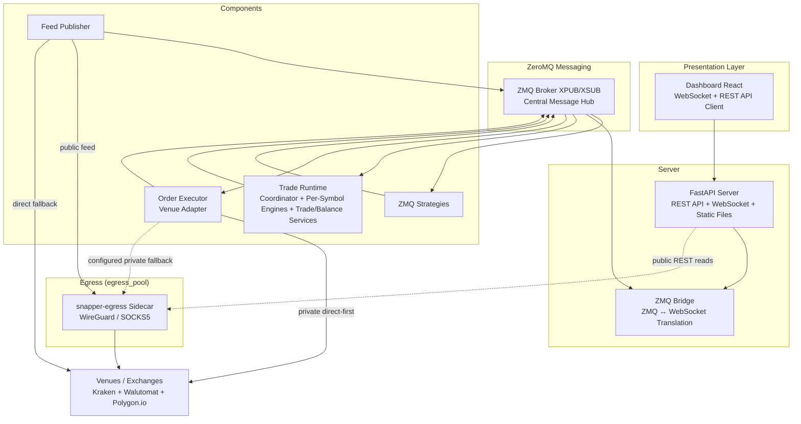

# Snapper

Trading platform with market data collection, trade runtime, and backtester.
Supports Kraken (WebSocket; spot + futures + equities), Walutomat
(REST polling), and Polygon.io (REST) market data.

## Quick Steps

From a fresh checkout:

```bash
# One-time bootstrap.
make system-deps
make setup
cp .env.example .env
make ui-setup

# Build the static UI so the FastAPI server can serve the dashboard at `/`.
make ui-build

# Initialize the database + seed dev data, then refresh the verified
# symbol mappings, underlying mappings, and non-Polygon market snapshots
# so the dashboard has data to show.
make migrate-dev run-static

# Start the server
make run-server
```

Open <http://localhost:8000/> and log in with the dev seed credentials —
the default values are defined in the bundled seed file
`src/snapper/data/seed/dev.toml` (`admin` / `change-me-after-first-login`);
maintainers with the proprietary submodule get
`proprietary/data/seed/dev.toml` via the three-tier seed lookup. Override
per-environment by editing the seed file before running `make migrate-dev`,
or rotate after first login via
`POST /api/auth/users/{user_id}/change-password` (self-service) or
`POST /api/auth/users/{user_id}/admin-reset-password` (admin reset).

## Features

- **Market data collection** — Kraken (WebSocket; spot + futures +
  equities), Walutomat (REST polling), Polygon.io (REST)
- **Candle synthesis** — Multi-timeframe candle synthesis from the 1m base
    stream (in-process per-publisher rollups) with provenance tagging
    (`native` / `calculated` / `synthesized`), controlled by the `timeframes`,
    `candle_forward_fill`, and `persist_intermediate_candles` settings
- **Egress routing** — Per-venue VPN egress routing via the WireGuard/SOCKS5
    `snapper-egress` sidecar. `feed_egress_enabled` gates feed-publisher
    pools; the API process initializes its own pool from `egress_pool`, so
    API-side Kraken public REST reads may route through it independently.
    Private/executor traffic stays direct-first, with
    `private_fallback_route_id` used only when direct is unavailable; private
    mutations remain direct-only
- **Symbol correlation** — Underlying asset model linking instruments across
    exchanges (e.g., SPY, ESM6-CME, SPYX-USD-PERP all map to S&P 500).
    YAML-driven pattern matching, front-month rollover, contract ladder API
- **Trade runtime** — Facts-canonical live and paper trading with canonical
    Order and Execution facts, rebuildable Position and Balance projections,
    dispatched via a durable outbox
- **Strategies** — Framework for creating strategies based on RSI, MACD,
  cointegration, and TA-Lib indicators
- **ZeroMQ messaging** — Pub/sub architecture for market data and signals
- **Provenance and audit** — Every payload item carries `session_id` and
  `sequence_id` for gap detection. Control table (always-on) and telemetry
  table (toggleable) record all commands and operational events
- **Web dashboard** — FastAPI + React with real-time WebSocket
- **CLI** — Full system management via Typer CLI
- **Backtesting** — Strategy testing on historical data

## Quick Start

### Requirements

- Python 3.14+
- Poetry
- Node.js 26+ and pnpm 11+ (for frontend)
- Build tools for Python packages. The TA-Lib adapter uses TA-Lib when
  importable and falls back to pure Python indicators otherwise; install
  the native TA-Lib C library only if your local wheel build requires it.

### Installation

```bash
# Clone repository
git clone https://github.com/mateusz-klatt/snapper.git
cd snapper

# Install system dependencies
make system-deps

# Install Python dependencies
make setup

# Install frontend dependencies
make ui-setup

# Copy and configure environment variables
cp .env.example .env
```

### Configuration

Edit `.env` file:

```bash
# Database (SQLite dev, PostgreSQL prod)
DB_URL=sqlite+aiosqlite:///./data/snapper.db

# Deployment environment — production/prod/staging refuse the placeholder
# MASTER_PASSWORD (the only secret; all internal keys derive from it)
SNAPPER_ENV=development

# Settings encryption in database
MASTER_PASSWORD=your_master_password

# HTTP Server
SERVER_HOST=0.0.0.0
SERVER_PORT=8000
SERVER_RELOAD=false
SERVER_API_ONLY=false
SERVER_PROXY_HEADERS=true
SERVER_FORWARDED_ALLOW_IPS=127.0.0.1,172.17.0.1

# Telemetry recording (pings, heartbeats, GET reads)
TELEMETRY_RECORDING_ENABLED=false

# ZeroMQ broker
ZMQ_BROKER_XSUB=tcp://127.0.0.1:7500
ZMQ_BROKER_XPUB=tcp://127.0.0.1:7501

# Max command age before the outbox expires stale create/submit
# commands instead of publishing them (<= 0 disables)
TRADE_COMMAND_DISPATCH_TTL_S=30.0
```

### Running

```bash
# Initialize database and seed data
make migrate-dev

# Start server
make run-server
```

Two ways to bring up the dashboard:

- **Backend-served (production / single port).** Run `make ui-setup` +
  `make ui-build` to produce `frontend/dist/`, then start the
  server. The FastAPI app mounts the static UI at `/` only when
  `frontend/dist/` exists; the dashboard is then at
  `http://localhost:8000/`.
- **Vite dev server (hot reload).** Run `make ui-dev` in a separate
  terminal — Vite serves the dashboard at `http://localhost:3000/`
  with a backend proxy for `/api` and `/api/ws`. This does NOT
  produce `frontend/dist/`, so `http://localhost:8000/` will still
  return 404 for the UI until the build step is run.

CLI snippets below use bare `snapper` for readability. In this repository,
Makefile targets run the CLI as `.venv/bin/python -m snapper`; use that
form unless your virtual environment is activated or the Poetry console
script is already on `PATH`.

### Trade Runtime Dispatch

The trade runtime always uses durable, outbox-driven dispatch: commands
are persisted as `TradeCommand` rows and published by the outbox
dispatcher. On the accepted/fill paths, executor `VenueEvent`
persistence is fail-closed — a failed write raises before the
corresponding `orders.events.*` publish. An ambiguous submit failure
never fabricates a rejection: the executor verifies venue truth via
`find_order_by_client_id` and, when the venue cannot answer, parks the
order in the non-terminal UNKNOWN state — the engine holds its
in-flight guard, the recon loop re-verifies the order each cycle until
resolved, and the `order_unknown` notification rule alerts the
operator.

Replayed submits of an already-evidenced `client_order_id` (outbox
re-publishes after a crash between publish and the dispatched commit)
are dropped by a duplicate-submit guard; its durable venue-evidence
probe is fail-closed — a failed check drops the command rather than
risk double-placing a market order. Dispatch is also bounded by a
max-age TTL (`TRADE_COMMAND_DISPATCH_TTL_S`, default 30 s): the outbox
CAS-expires stale CREATED create/submit commands to EXPIRED instead of
publishing them, so an outage backlog cannot fire orders priced off
old signals. Cancels are exempt — expiring a stale cancel would strand
a live order. A submit refused by an open venue circuit breaker is
neither left ambiguous nor blind-retried: the executor records durable
breaker-open evidence (counted as duplicate-submit evidence), marks
the command FAILED, and publishes a rejection with reason
`circuit_breaker_open` so the engine releases its in-flight intent;
if any step fails, the order is parked and the reconciliation loop
reruns the disposition.

Private fill streams are supervised: a dead venue execution stream is
respawned with capped backoff, each respawn reconciles fills missed
during the dark window before resubscribing, and executor startup
recovery emits corrective fills for anything filled while the executor
was down instead of re-baselining to the venue's current cumulative.
Corrective fills carry venue-reported fees rather than fabricating
fee-less executions; when the venue's fee source is transiently
unavailable, the corrective is deferred for a bounded number of
reconciliation cycles before degrading to a fee-less emission with a
critical alert.
The same supervision wraps every executor core loop (order handling,
reconciliation, heartbeat): a died loop respawns with capped backoff,
and a persistent death streak escalates by crashing the executor so
the process launcher rebuilds a fresh instance. Executor heartbeats
report status derived from actual loop health — death streaks,
reconciliation progress, stuck in-flight commands — instead of a
hardcoded healthy, and an executor parked after exhausting its restart
budget is alerted through launcher-published synthetic error
heartbeats rather than vanishing silently.

Execution-plan decision events (`plans.decisions.*`) get the same
durability: each decision row the plan executor logs commits together
with an outbox row in one transaction, the plan executor publishes
immediately, and a background drain loop replays unsent rows with
capped exponential backoff after broker outages.

### Process-Managed Executors

Process-managed deployments run one executor per `(exchange, wallet)`
credential row. Bare `executor_<exchange>` process configs are templates
only; the launcher expands active `wallet_credentials` rows into
`executor_<exchange>_w<wallet_short>` instances, where `wallet_short` is
the last 12 lowercase hex characters of the wallet UUID7. Each instance
loads only its wallet credentials and filters incoming command frames by
`wallet_public_id`.

## System Overview



## CLI Commands

This is a quick command map, not the full inventory. Run
`.venv/bin/python -m snapper --help` or see [docs/cli.md](docs/cli.md)
for complete options and examples.

### Server and Infrastructure

```bash
snapper server              # Start FastAPI server
snapper broker              # Start ZMQ broker
snapper trade-zmq           # Trade runtime / coordinator (pass --instance-id + --instance-count for N>=2, see docs/operations.md)
snapper executor            # Standalone order executor helper
snapper feed                # Direct Kraken market data publisher helper
snapper feed-engine         # Dedicated feed container entrypoint
snapper notify              # iOS Push Foundation sidecar
snapper egress              # WireGuard + SOCKS5 egress sidecar entrypoint
```

### Database

```bash
snapper db-init             # Initialize schema
snapper db-upgrade          # Alembic migrations
snapper db-downgrade        # Rollback migrations
snapper db-seed             # Seed profile data
```

### Configuration and Maintenance

```bash
snapper settings-rotate-encryption  # Rotate encrypted settings rows
snapper reconcile-symbol-aliases    # Close stale SCD2 alias rows
```

### Users

```bash
snapper init-admin          # Create admin user
snapper list-users          # List users
snapper reset-password      # Reset password
```

### Local AI delegate PAT (for `@mateusz-klatt/snapper-mcp` bridge)

After `make dev-backend` is running and the seed has provisioned the `admin`
user (per `dev.toml`), mint a long-lived AI delegate PAT into a JSON file
the bridge consumes via `--config=PATH`:

```bash
snapper dev-mint-pat        # writes data/dev-pat.json (mode 0600)
```

Wire your `~/.claude.json` mcpServers entry once with the file path:

```json
"snapper-local": {
  "command": "node",
  "args": [
    "/path/to/snapper-mcp/dist/index.js",
    "--config=/path/to/snapper/data/dev-pat.json"
  ]
}
```

After running, in this order, (a) `rm data/snapper.db`, (b)
`make migrate-dev`, (c) `make dev-backend` (in a separate terminal —
it blocks the foreground with the live backend), and (d)
`snapper dev-mint-pat`, the
bridge picks up the refreshed token automatically — no manual edits to
`~/.claude.json` per DB wipe. CLI flags + environment overrides:

```text
--base-url URL        SNAPPER_DEV_BASE_URL          (default http://localhost:8000)
--admin-username USER SNAPPER_DEV_ADMIN_USERNAME    (default None → resolved from seed profiles, mcp then dev)
--admin-password PASS SNAPPER_DEV_ADMIN_PASSWORD    (default None → resolved from seed profiles, mcp then dev)
--output PATH         SNAPPER_DEV_PAT_OUTPUT        (default data/dev-pat.json)
--label LABEL                                         (default "Local Dev MCP")
```

The script drives production REST endpoints (`POST /api/auth/login` +
`POST /api/ai-delegates`) so the seeded delegate exercises the same code
path the AI Integration UI uses. Tokens never appear in stderr — HTTP
error bodies are passed through a JWT-shape redaction helper before
printing.

### Market Data

```bash
snapper update-kraken-symbols        # Sync Kraken symbols
snapper update-kraken-futures-symbols
snapper update-kraken-equities-symbols
snapper update-walutomat-symbols
snapper update-polygon-symbols       # Sync Polygon symbols
snapper update-underlyings           # Sync underlying asset mappings from YAML
snapper update-kraken-market-snapshot
snapper update-kraken-futures-market-snapshot
snapper update-kraken-equities-market-snapshot
snapper update-walutomat-market-snapshot
snapper polygon-backfill-aggregates  # Step 1: download history to CSV cache (no DB write)
snapper polygon-load-csv --all       # Step 2: load the CSV cache into the database
snapper polygon-backfill-grouped
snapper polygon-load-grouped-candles
snapper verify-candle-coverage
snapper kraken-futures-backfill-candles
snapper kraken-equities-backfill-candles
snapper update-kraken-futures-funding-rates
snapper build-continuous
snapper archive --day 2024-01-15     # Export candle cache to CSV
snapper archive --from 2024-01-01 --to 2024-01-31 --exchange polygon
snapper archive --table ticks --day 2024-01-15 --exchange polygon
snapper archive --table candles-audit --day 2024-01-15 --closed-only --purge
snapper restore --table candles --dir data/archive/candles/polygon/BTC-USD/
```

### Backtests

```bash
snapper backtest-run
snapper backtest-list
snapper backtest-cancel
snapper backtest-rerun
```

See [docs/cli.md](docs/cli.md) for full options and examples.

## Strategies

Creating your own strategy:

```python
from snapper.strategies.base import BaseStrategy, StrategySignal, StrategyConfig
from snapper.strategies.decorators import register_strategy, create_strategy_process
from snapper.messaging.schemas.data import CandleData

@register_strategy("MyStrategy")
@create_strategy_process(
    process_name="my_strategy",
    default_config={
        "name": "my_strategy",
        "inputs": ["market.kraken.BTC-USD.candles.1h"],
        "outputs": ["BTC-USD"],
        "exchange": "paper",
        "params": {"threshold": 0.5},
    },
)
class MyStrategy(BaseStrategy):
    def __init__(self, config: StrategyConfig) -> None:
        super().__init__(config)
        self.threshold = self.params.get("threshold", 0.5)

    async def reset(self) -> None:
        """Clear any per-instrument indicator/state buffers."""

    async def on_candle(self, instrument: str, candle: CandleData) -> StrategySignal | None:
        if some_condition:
            return StrategySignal(
                instrument=instrument,
                side="buy",
                strength=1.0,
                price=candle.close,
                reason="Condition met",
            )
        return None
```

`reset()` is abstract on `BaseStrategy` — every subclass must
implement it so the runtime can recycle per-instrument state on
restart / replay.

## Development

### Quality Gates

```bash
make check-all   # Full quality gate (backend + frontend + tests + 100% coverage)
make fix-all     # Automatic formatting and linting fixes
```

### Individual Steps

```bash
make fmt         # Check formatting
make lint        # Linting (ruff)
make typecheck   # Type checking (mypy)
make test        # Unit tests
make cov         # Tests with coverage (100% required)
```

Generated contracts are split by target: `make ui-gen-types` refreshes
frontend OpenAPI/WebSocket/Zod/entity/permission types,
`make ios-gen-types` refreshes Swift models, and `make ts-bridge` (or
`make bridge-regen`) refreshes the opt-in snapper-mcp bridge wire
contract.

### Frontend

```bash
make ui-dev      # Vite development server
make ui-build    # Production build
make ui-lint     # ESLint
make ui-format   # Prettier
```

## Docker

```bash
make docker-build-dev    # Build dev image (backend + caddy binary baked in)
make docker-build-prod   # Build production image
make docker-migrate-dev  # Initialize and seed the Docker SQLite database
make docker-run          # Run container
make docker-stop         # Stop containers
```

Or with docker compose:

```bash
make docker-migrate-dev
docker compose up -d
```

### Compose topology

The compose stack runs four application services on the internal
`snapper-internal` bridge network, all from a **single image**
(`klattm/snapper:latest`) that bundles the python runtime + the Caddy
binary. Each service overrides `entrypoint` / `command` to launch the
right process. The optional `postgres` service is gated behind the
`dev` compose profile.

- `snapper-broker` — dedicated ZeroMQ XPUB/XSUB broker container
  (`command: ["broker", "--xsub", "tcp://0.0.0.0:7500", "--xpub",
  "tcp://0.0.0.0:7501"]`, `expose: 7500/7501` internally). Every other
  service connects to it via `tcp://snapper-broker:7500/7501`, so
  restarting the backend no longer bounces the bus.
- `snapper` — FastAPI backend, strategy/process control, and
  non-publisher runtime processes. `PROCESS_AUTOSTART_PROFILE=api`,
  `ZMQ_BROKER_EMBEDDED=false` (the dedicated broker container owns the
  bus), `command: ["server"]`, `expose: 8000` internally.
- `snapper-feed` — dedicated market-data publisher container.
  `PROCESS_AUTOSTART_PROFILE=feed`, `command: ["feed-engine"]`; it
  connects to the broker via `tcp://snapper-broker:7500/7501` and
  uses reduced DB pool settings so publisher subprocesses do not
  overrun PostgreSQL connection limits.
- `snapper-strategies` — dedicated strategies container
  (`PROCESS_AUTOSTART_PROFILE=strategy`, `command: ["strategies-engine"]`).
  Runs role-STRATEGY processes THREAD-mode with the same boot scope
  enforcement and watchdog they had in the backend; mounts
  `./proprietary` read-only and imports `STRATEGY_EXTRA_PACKAGES` so
  out-of-tree strategies register. The backend sets
  `STRATEGIES_EMBEDDED=false` so the same strategy can never run twice.
- `snapper-egress` — WireGuard + SOCKS5 sidecar for outbound publisher
  traffic. `command: ["egress"]`, `cap_add: NET_ADMIN`, kernel module bind.
- `snapper-notify` — alert-rule evaluator + iOS Push Foundation sidecar
  (`command: ["notify"]`). Subscribes to the rule registry's ZMQ
  prefixes (heartbeats, order events), evaluates the alert rules,
  records `alert_events`, republishes `alerts.{user}.{type}` for the
  WebSocket bridge, and fans deliveries out to APNs using the
  `apns_*` settings. Without this container the ENTIRE alert chain is
  dark — no alert rows, no UI alerts, no push.
- `snapper-web` — Caddy serving the React SPA from `/srv/dist` and
  reverse-proxying `/api/*`, `/api/ws`, `/api/mcp`, `/docs`, `/redoc`,
  `/openapi.json` to `snapper:8000`. `entrypoint: ["/usr/bin/caddy"]`,
  `command: ["run", "--config", "/etc/caddy/Caddyfile"]`. Owns the host
  `127.0.0.1:8000:8000` bind.

All four application services are `restart: unless-stopped` so they come back automatically
after a host reboot (assuming `systemctl is-enabled docker` returns
`enabled`). Services explicitly stopped via `docker compose stop` stay
stopped.

### Targeted restarts (no tick-stream drop)

Restart targets are now strictly recreate-only — they use whatever
image tag exists locally. Rebuild explicitly first if you need new
code baked in:

```bash
# Build (explicit, when you want new code in the image):
make docker-build-dev    # caller UID (host user)
make docker-build-prod   # UID 888 (matches log file ownership)

# Recreate containers (uses current image, no rebuild):
make restart-frontend    # Recreate Caddy sidecar [does NOT touch backend]
make restart-backend     # Recreate backend [drops ticks 30-90s]
make restart-all         # Recreate full stack [drops ticks]

# Common idiom — build + restart in one shot:
make docker-build-prod restart-backend
```

`make restart-frontend` is the fast path for shipping UI changes
without restarting publishers. Only the Caddy container is recreated;
WS clients reconnect within ~3 s but the backend snapper container's
PID is unchanged and the Kraken / Walutomat tick streams continue
uninterrupted.

**Footgun**: a plain `docker compose up -d` (without `--no-deps`)
follows `depends_on` edges and may recreate the backend too. Use the
targeted Makefile commands for selective restarts, and reserve
`docker compose up -d` for full-stack restarts when both should
restart anyway.

## Documentation

Detailed documentation in [docs/](docs/) directory:

- [Architecture](docs/architecture.md) — System structure and layers
- [Configuration](docs/configuration.md) — Environment variables and settings
- [CLI](docs/cli.md) — Full command documentation
- [Strategies](docs/strategies.md) — Creating trading strategies
- [Backtesting](docs/backtesting.md) — Backtest engines and artifacts
- [API](docs/api.md) — REST API and WebSocket
- [Messaging](docs/messaging.md) — ZeroMQ architecture
- [Operations](docs/operations.md) — Multi-instance coordinator runbook
- [Observability](docs/observability.md) — Process, notification, retention, and DB table metrics surface
- [AI integration](docs/ai-integration.md) — MCP endpoint and AI delegate tokens
- [Development](docs/development.md) — Developer guidelines (incl. [Internationalization](docs/development.md#internationalization))
- [Paired execution](docs/paired-execution.md) — Multi-leg guard operator runbook
- [Egress](docs/snapper-egress.md) — WireGuard + SOCKS5 egress sidecar runbook

Regenerate the bundled frontend documentation PDF with `make docs-pdf`.

## License

MIT License — see [LICENSE](LICENSE) file.
