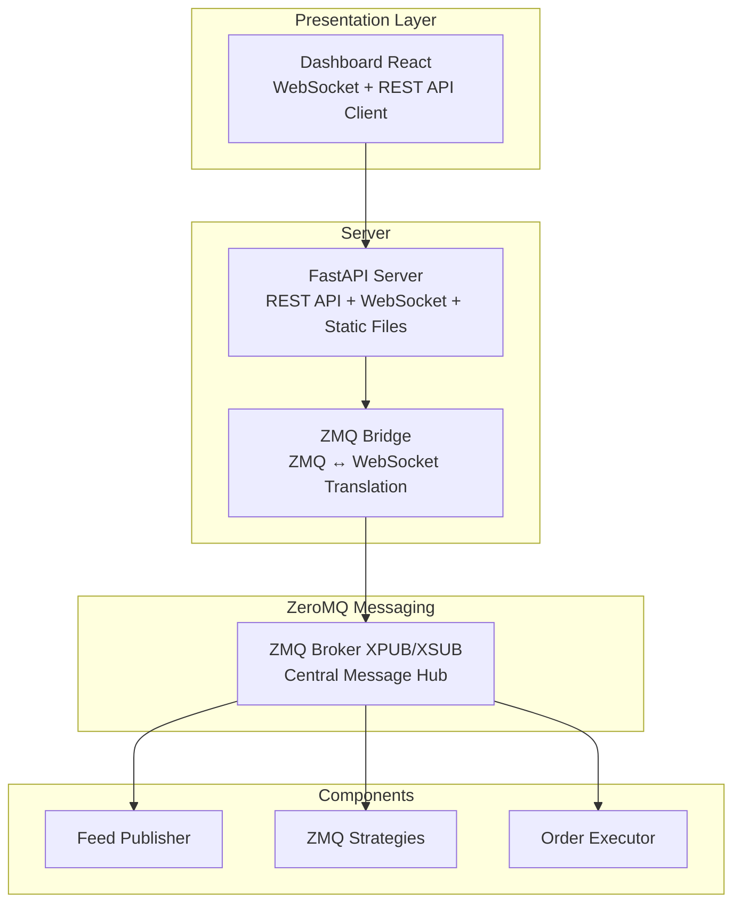

# Snapper

Trading platform with market data collection, trading engine, and backtester.
Supports Kraken, Zonda, Walutomat exchanges and Polygon.io data.

## Quick Steps

```bash
# Initialize database with seed data and build static assets
make migrate-dev run-static

# Start the server
make run-server
```

Open <http://localhost:8000/> and log in:

- **Username:** `admin`
- **Password:** `AdminSnapper2026!`

## Features

- **Market data collection** — WebSocket and REST API from Kraken, Zonda,
  Walutomat, Polygon.io
- **Trading engine** — Order execution in live and paper trading modes
- **Strategies** — Framework for creating strategies based on RSI, MACD,
  cointegration, and TA-Lib indicators
- **ZeroMQ messaging** — Pub/sub architecture for market data and signals
- **Web dashboard** — FastAPI + React with real-time WebSocket
- **CLI** — Full system management via Typer CLI
- **Backtesting** — Strategy testing on historical data

## Quick Start

### Requirements

- Python 3.14+
- Poetry
- Node.js 25+ and pnpm (for frontend)
- TA-Lib (C library)

### Installation

```bash
# Clone repository
git clone https://github.com/mateusz-klatt/snapper.git
cd snapper

# Install system dependencies (macOS)
brew install ta-lib

# Install Python dependencies
make setup

# Install frontend dependencies
make ui-setup

# Copy and configure environment variables
cp .env.example .env
```

### Configuration

Edit `.env` file:

```bash
# Database (SQLite dev, PostgreSQL prod)
DB_URL=sqlite+aiosqlite:///./data/snapper.db

# Settings encryption in database
MASTER_PASSWORD=your_master_password

# HTTP Server
SERVER_HOST=127.0.0.1
SERVER_PORT=8000
SERVER_API_ONLY=false
SERVER_PROXY_HEADERS=true
SERVER_FORWARDED_ALLOW_IPS=127.0.0.1

# ZeroMQ broker
ZMQ_BROKER_XSUB=tcp://127.0.0.1:7500
ZMQ_BROKER_XPUB=tcp://127.0.0.1:7501
```

### Running

```bash
# Initialize database and seed data
make migrate-dev

# Start server
snapper server
```

Dashboard available at `http://localhost:8000/`.

## System Overview



## CLI Commands

### Server and Infrastructure

```bash
snapper server              # Start FastAPI server
snapper broker              # Start ZMQ broker
snapper trade-zmq           # Trading coordinator
snapper executor            # Order executor
snapper feed                # Market data publisher
```

### Database

```bash
snapper db-init             # Initialize schema
snapper db-upgrade          # Alembic migrations
snapper db-downgrade        # Rollback migrations
```

### Users

```bash
snapper init-admin          # Create admin user
snapper list-users          # List users
snapper reset-password      # Reset password
```

### Market Data

```bash
snapper update-kraken-symbols        # Sync Kraken symbols
snapper update-polygon-symbols       # Sync Polygon symbols
snapper polygon-backfill-aggregates  # Backfill historical data
```

## Strategies

Creating your own strategy:

```python
from snapper.strategies.base import BaseStrategy, StrategySignal, StrategyConfig
from snapper.strategies.decorators import register_strategy, create_strategy_process
from snapper.messaging.schemas.data import CandleData

@register_strategy("MyStrategy")
@create_strategy_process(
    process_name="my_strategy",
    default_config={
        "name": "my_strategy",
        "inputs": ["market.kraken.BTC-USD.candles.1h"],
        "outputs": ["BTC-USD"],
        "exchange": "paper",
        "params": {"threshold": 0.5},
    },
)
class MyStrategy(BaseStrategy):
    def __init__(self, config: StrategyConfig) -> None:
        super().__init__(config)
        self.threshold = self.params.get("threshold", 0.5)

    async def on_candle(self, instrument: str, candle: CandleData) -> StrategySignal | None:
        if some_condition:
            return StrategySignal(
                instrument=instrument,
                side="buy",
                strength=1.0,
                price=candle.close,
                reason="Condition met",
            )
        return None
```

## Development

### Quality Gates

```bash
make check-all   # Full quality gate (backend + frontend + tests + 100% coverage)
make fix-all     # Automatic formatting and linting fixes
```

### Individual Steps

```bash
make fmt         # Check formatting
make lint        # Linting (ruff)
make typecheck   # Type checking (mypy)
make test        # Unit tests
make cov         # Tests with coverage (100% required)
```

### Frontend

```bash
make ui-dev      # Vite development server
make ui-build    # Production build
make ui-lint     # ESLint
make ui-format   # Prettier
```

## Docker

```bash
make docker-build-dev    # Build dev image
make docker-build-prod   # Build production image
make docker-run          # Run container
make docker-stop         # Stop container
```

Or with docker compose:

```bash
docker compose up -d
```

## Documentation

Detailed documentation in [docs/](docs/) directory:

- [Architecture](docs/architecture.md) — System structure and layers
- [Configuration](docs/configuration.md) — Environment variables and settings
- [CLI](docs/cli.md) — Full command documentation
- [Strategies](docs/strategies.md) — Creating trading strategies
- [API](docs/api.md) — REST API and WebSocket
- [Messaging](docs/messaging.md) — ZeroMQ architecture
- [Development](docs/development.md) — Developer guidelines

## License

MIT License — see [LICENSE](LICENSE) file.
