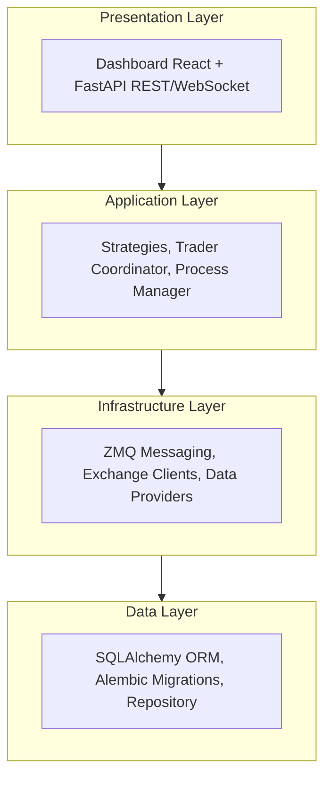
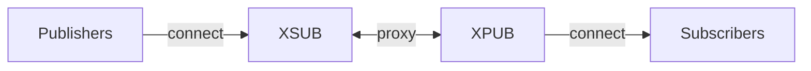
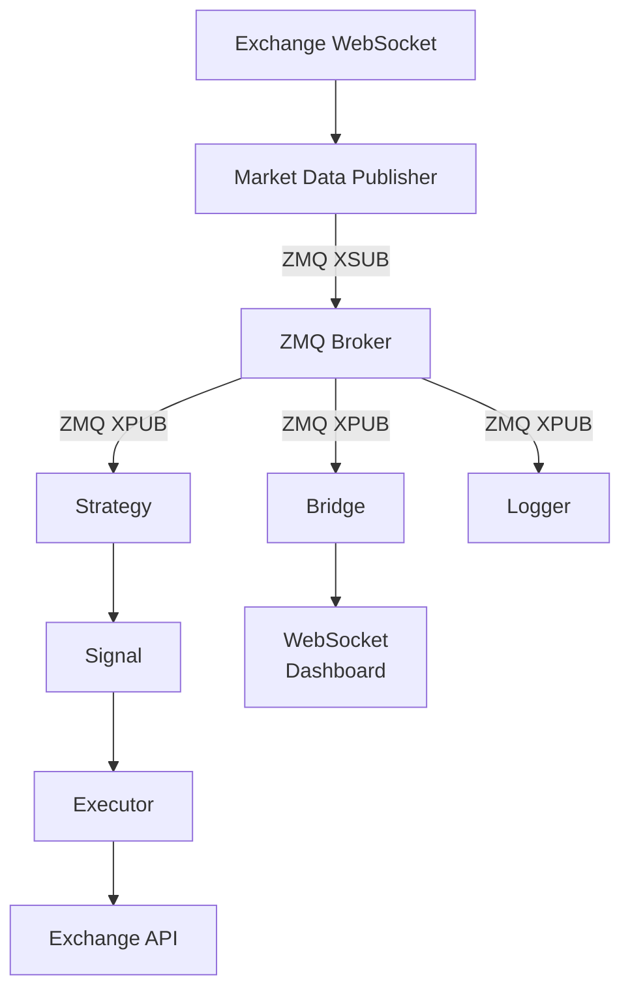
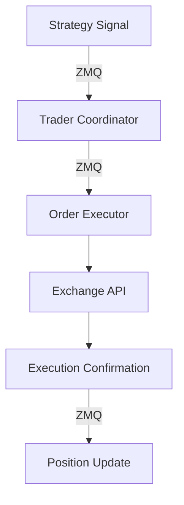
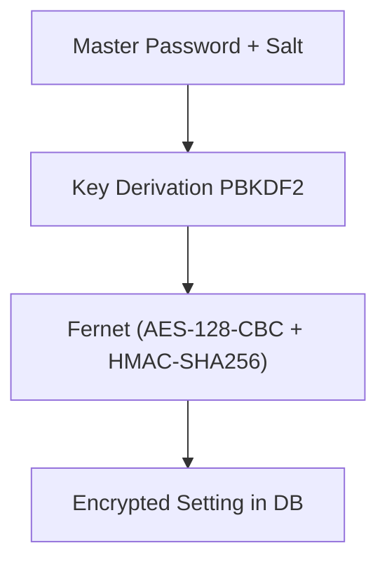

# Architecture

Snapper is a trading platform built with a layered architecture
using asynchronous processing and ZeroMQ messaging.

## System Layers



## Components

### Core (`src/snapper/core/`)

Fundamental types and aliases used throughout the application:

- `TradeSide` — Trade direction (`buy`, `sell`)
- `OrderType` — Order type (`market`, `limit`, `stop`, `stop_limit`)
- `OrderStatus` — Order status in lifecycle
- `ExecutionMode` — Execution mode (`live`, `paper`)
- `OrderExchange` — Order-capable exchanges (`paper`, `kraken`, `zonda`, `walutomat`)

### Config (`src/snapper/config/`)

Two-layer configuration:

1.  **Bootstrap Settings** (`bootstrap.py`)

    Settings from environment variables required before database connection:

    - Database URL
    - Master password for encryption
    - HTTP and ZMQ server endpoints

2.  **App Settings** (`app.py`)

    Settings from database (encrypted):

    - Exchange API keys
    - Trading parameters
    - Authentication configuration

### Data (`src/snapper/data/`)

Persistence layer with SQLAlchemy:

- **ORM Models** (`models.py`):

    - `Instrument` — Financial instruments
    - `Candle` — OHLCV candles
    - `Trade` — Transactions
    - `Order` — Order history
    - `Execution` — Order executions
    - `Position` — Portfolio positions
    - `Signal` — Signal events
    - `User` — System users
    - `Setting` — Settings (encrypted)
    - `Symbol` — Symbol identity with versioned attributes (native_symbol, base, quote, asset_type) via SCD Type 2
    - `SymbolAlias` — Exchange-specific symbol aliases (one row per native/exchange/channel)
    - `SymbolExchangeCapability` — Exchange-specific symbol capabilities
    - `ProcessRun` — Background process execution records
    - `InstrumentSpec` — Instrument trading specifications
    - `MarketSnapshot` — Real-time market data snapshots
    - `UserLoginEvent` — Authentication event log
    - `Control` — Always-on audit for commands, auth events, subscribe/unsubscribe,
      REST mutations. Includes redacted payload, outcome, and client causation linkage
      (`client_session_id`, `client_public_id`)
    - `Telemetry` — Toggleable high-volume table for pings, heartbeats, pongs, and
      GET read requests. Recording gated by `TELEMETRY_RECORDING_ENABLED` setting

    All ORM models carry provenance via `TemporalMixin`:

    - `session_id` (str, required) — producer session identity
    - `sequence_id` (int, required) — per-table monotonic counter for gap detection

    `StrictDataSchema` (Pydantic base) requires these fields at construction.
    Producers must obtain values from a `SequenceTracker` before creating
    the event, ensuring every payload is complete and identifiable from birth.

    All ORM models use a dual-key identity pattern:

    - `id` (INTEGER, internal PK) — row/version identifier for SCD2 close
        operations: SELECT → lock → close by id → INSERT new version.
        Never exposed outside the repository layer.
    - `public_id` (UUID7 string) — logical entity identifier for domain
        joins and external references. Stable across SCD2 versions.
    - `timestamp` (DateTime, system time / known_from)
    - `known_to` (DateTime NOT NULL, default KNOWN_TO_MAX = 9999-12-31T23:59:59 UTC, active rows have known_to == KNOWN_TO_MAX; query pattern: `WHERE timestamp <= :t AND known_to > :t`)

    No hard foreign keys between temporal entities. All domain joins use
    `child.instrument_public_id == Instrument.public_id` (or
    `Execution.order_public_id == Order.public_id`) with temporal filters.
    This enables future archival of closed SCD2 rows without breaking
    referential integrity.

- **SQLAlchemyRepository** (`repository.py`) — Async CRUD for SQLite/PostgreSQL
- **DatabaseRepository** (`repository.py`) — Sync access for scripts and background updaters

### Strategies (`src/snapper/strategies/`)

Trading strategies framework:

- **BaseStrategy** (`base.py`) — Base class for all strategies
- **StrategySignal** — Trading signal structure
- **StrategyConfig** — Strategy configuration

Built-in strategies:

- `RSIReversion` (`rsi.py`) — Mean reversion on RSI
- `MACDCrossover` (`macd.py`) — MACD crossover
- `CointegrationPairs` (`cointegration.py`) — Pairs trading

### Indicators (`src/snapper/indicators/`)

Technical indicators:

- `rsi` — Relative Strength Index (Python implementation)
- `macd` — Moving Average Convergence Divergence
- `ta_lib_adapter` — TA-Lib library adapter

### Messaging (`src/snapper/messaging/`)

ZeroMQ pub/sub architecture:



Components:

- **Broker** (`infrastructure/broker.py`) — XPUB/XSUB proxy
- **Publishers** (`publishers/`) — Market data publication
- **Executors** (`executors/`) — Order execution on exchanges
- **Schemas** (`schemas/`) — Pydantic message models
- **Topics** (`topics/`) — ZMQ topic definitions

Message types (in `messaging.schemas.data`):

- `TickData` — Price tick
- `CandleData` — OHLCV candle
- `SignalData` — Trading signal
- `TradeData` — Trade execution
- `OrderData` — Order status
- `ExecutionData` — Order execution
- `OrderRequestData` — Order request
- `HeartbeatData` — Component heartbeat

Every Data class carries `public_id: str` (UUID7), `type: Literal[...]`, and `timestamp: datetime`.

### Application (`src/snapper/application/`)

Business logic:

- **Engine** (`engine/`) — Trader Coordinator
- **Process Manager** (`process_manager/`) — Process management
- **Services** (`services/`) — Application services
- **Updaters** (`updaters/`) — Data updates (symbols, historical)
- **Risk** (`risk/`) — Risk management
- **Portfolio** (`portfolio/`) — Portfolio management

### Infrastructure (`src/snapper/infrastructure/`)

External integrations:

- **Exchanges** (`exchanges/`) — Exchange clients (Kraken, Zonda, Walutomat)
- **Market Data** (`market_data/`) — WebSocket feeds
- **Symbols** (`symbols/`) — Symbol mapping
- **Security** (`security/`) — Settings encryption
- **Logging** (`logging/`) — Logging configuration

### Server (`src/snapper/server/`)

FastAPI application:

- **App Factory** (`app.py`) — `create_app()` with lifespan management
- **REST API** — HTTP endpoints
- **WebSocket** — Real-time streaming via ZMQ bridge
- **Static Files** — Frontend dashboard
- **ClientProvenanceMiddleware** (`provenance_middleware.py`) — Extracts client
  provenance from mutation requests, runs per-session gap detection, records
  mutations to `control` table and GET reads to `telemetry` table

### API (`src/snapper/api/`)

Shared API schemas and WebSocket auth helpers (not route definitions):

- **Schemas** (`schemas/`) — Pydantic request/response models (health, process, settings).

    Schema class hierarchy:

    ```text
    BaseModel
    ├── PartialBody           — extra="ignore", strict=True (GapEnvelope, WsTokenPayload)
    ├── StrictBody            — extra="forbid", strict=True (request bodies, nested DTOs)
    │   └── StrictDataSchema  — + provenance (all event payloads, REST/WS/ZMQ)
    │       ├── PayloadRequest[T]
    │       ├── PayloadResponse[T]
    │       └── PayloadListResponse[T]
    ├── ExchangeResponse      — extra="allow", strict=True (exchange API parsing)
    ├── ExchangeRequest       — extra="forbid", strict=True (outgoing exchange requests)
    └── BaseSettings          — BootstrapSettingsLoader (env var config)
    ```

- **Auth** (`auth/`) — WebSocket token service and schemas

Route modules live closer to their domains: `server/app.py` (assembly and
data endpoints), `server/process_routes.py`, `server/strategy_routes.py`,
`config/settings_routes.py`, and `auth/routes.py`.

REST endpoints return the same Data schemas used by WebSocket messaging
(`messaging.schemas.data`): `OrderData`, `SignalData`, `ExecutionData`,
`PositionData`, `CandleData`. Old REST-specific schema modules were removed.

### Auth (`src/snapper/auth/`)

Authentication system:

- JWT tokens with access/refresh via HTTP-only cookies
- CSRF protection
- Role-based access (viewer, operator, admin)
- WebSocket authentication

### CLI (`src/snapper/cli/`)

Command-line interface (Typer):

- Server and infrastructure management
- Database operations
- User management
- Market data updates

## Data Flow

### Market Data Flow



### Order Flow



## Database

SQLite for development, PostgreSQL for production.

### Schema

```sql
-- Market data (joined to instruments via instrument_public_id)
instruments         -- Financial instruments (logical key: symbol_public_id + exchange)
candles             -- OHLCV data
ticks               -- Real-time price snapshots
trades              -- Transaction history
market_snapshots    -- Denormalized market data snapshots

-- Trading (joined to instruments via instrument_public_id)
orders              -- Order history
executions          -- Order executions (joined to orders via order_public_id)
positions           -- Portfolio positions
signals             -- Strategy signals

-- Symbol management
symbols             -- Symbol identity + versioned attributes (SCD2)
symbol_aliases      -- Exchange-specific symbol mappings
symbol_exchange_capabilities -- Exchange-specific capabilities

-- Instrument specifications
instrument_specs    -- Trading specifications (tick_size, lot_size, limits)

-- System
users               -- User accounts
settings            -- Settings (encrypted)
user_login_events   -- Authentication event log
process_runs        -- Background process execution records
control             -- Audit log (commands, auth events, mutations)
telemetry           -- High-volume operational events (toggleable)
```

### Migrations

Alembic manages migrations:

```bash
snapper db-upgrade    # Apply migrations
snapper db-downgrade  # Rollback
```

## Bitemporal Model

All entity tables inherit `TemporalMixin` which provides `id`, `public_id`,
`timestamp` (bus-time / known_from), and `known_to` columns.

Key concepts:

- **SCD Type 2** — No in-place UPDATE or DELETE. Mutations use a close+insert
    pattern: the current row is closed (known_to set to now) and a new row is
    inserted with the updated values and known_to = KNOWN_TO_MAX.
- **KNOWN_TO_MAX** — Sentinel value (9999-12-31T23:59:59 UTC) marking the
    active version of a row.
- **Point-in-time queries** — REST endpoints accept an `as_of` query parameter
    to retrieve the state of data at a specific moment.
- **Helpers**:
    - `where_active(model, at)` — SQLAlchemy filter for temporal queries
    - `close_and_insert()` / `close_and_insert_sync()` — Repository helpers
        that atomically close the current row and insert a new version

## Processes

The system manages processes through Process Manager:

- **Core** — Broker, Feed, Bridge (required)
- **Strategy** — Trading strategies
- **Task** — One-time tasks
- **Backtest** — Backtesting processes

Processes can be:

- `long_running` — Run continuously (services)
- `one_shot` — Execute once (tasks)

### Deployment Modes

By default, the FastAPI lifespan starts all enabled processes (all-in-one
dev mode).  Set `SERVER_API_ONLY=true` to skip process autostart -- the
ZMQ-WebSocket bridge still starts, so the frontend receives live data from
a separately-running engine.  Useful for multi-worker uvicorn or when
broker/strategies/executors run on different hosts.

## Security

### Settings Encryption

Sensitive data (API keys) are encrypted in the database:



### Authentication

- JWT tokens via HTTP-only cookies (access: 15min, refresh: 7 days)
- CSRF tokens for mutating requests
- WebSocket tokens (one-time)
- Bcrypt password hashing
