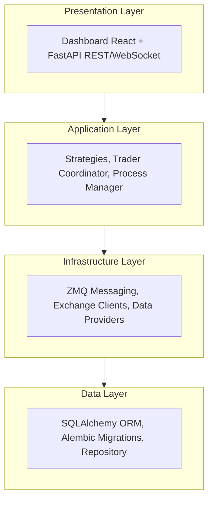
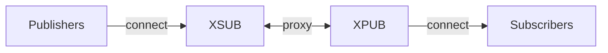
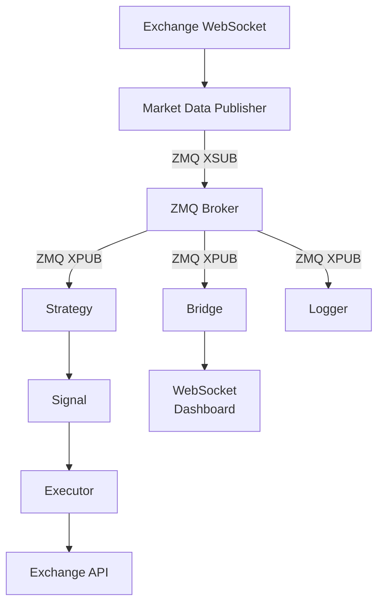
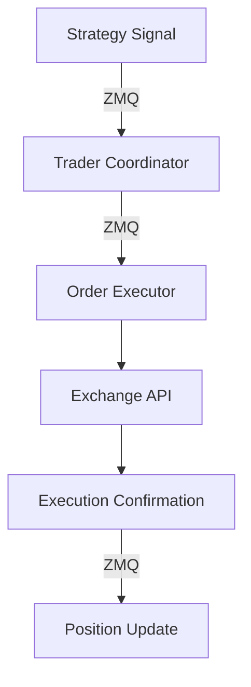
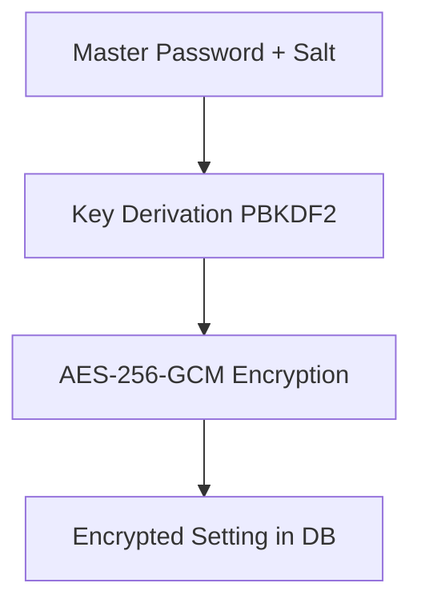

# Architecture

Snapper is a trading platform built with a layered architecture
using asynchronous processing and ZeroMQ messaging.

## System Layers



## Components

### Core (`src/snapper/core/`)

Fundamental types and aliases used throughout the application:

- `TradeSide` — Trade direction (`buy`, `sell`)
- `OrderType` — Order type (`market`, `limit`, `stop`, `stop_limit`)
- `OrderStatus` — Order status in lifecycle
- `ExecutionMode` — Execution mode (`live`, `paper`)
- `OrderExchange` — Order-capable exchanges (`paper`, `kraken`, `zonda`, `walutomat`)

### Config (`src/snapper/config/`)

Two-layer configuration:

1.  **Bootstrap Settings** (`bootstrap.py`)

    Settings from environment variables required before database connection:

    - Database URL
    - Master password for encryption
    - HTTP and ZMQ server endpoints

2.  **App Settings** (`app.py`)

    Settings from database (encrypted):

    - Exchange API keys
    - Trading parameters
    - Authentication configuration

### Data (`src/snapper/data/`)

Persistence layer with SQLAlchemy:

- **ORM Models** (`models.py`):

    - `Instrument` — Financial instruments
    - `Candle` — OHLCV candles
    - `Trade` — Transactions
    - `OrderRecord` — Order history
    - `Execution` — Order executions
    - `Position` — Portfolio positions
    - `SignalEvent` — Signal events
    - `User` — System users
    - `Setting` — Settings (encrypted)
    - `SymbolCatalog` — Native symbol registry (base, quote, asset_type)
    - `SymbolAlias` — Exchange-specific symbol aliases (one row per native/exchange/channel)

- **Repository** (`repository.py`) — Async CRUD operations

### Strategies (`src/snapper/strategies/`)

Trading strategies framework:

- **BaseStrategy** (`base.py`) — Base class for all strategies
- **Signal** — Trading signal structure
- **StrategyConfig** — Strategy configuration

Built-in strategies:

- `RSIReversion` (`rsi.py`) — Mean reversion on RSI
- `MACDCrossover` (`macd.py`) — MACD crossover
- `Cointegration` (`cointegration.py`) — Pairs trading

### Indicators (`src/snapper/indicators/`)

Technical indicators:

- `rsi` — Relative Strength Index (Python implementation)
- `macd` — Moving Average Convergence Divergence
- `ta_lib_adapter` — TA-Lib library adapter

### Messaging (`src/snapper/messaging/`)

ZeroMQ pub/sub architecture:



Components:

- **Broker** (`infrastructure/broker.py`) — XPUB/XSUB proxy
- **Publishers** (`publishers/`) — Market data publication
- **Executors** (`executors/`) — Order execution on exchanges
- **Schemas** (`schemas/`) — Pydantic message models
- **Topics** (`topics/`) — ZMQ topic definitions

Message types:

- `TickEnvelope` — Price tick
- `BarEnvelope` — OHLCV candle
- `SignalEnvelope` — Trading signal
- `TradeEnvelope` — Trade execution
- `HeartbeatEnvelope` — Component heartbeat

### Application (`src/snapper/application/`)

Business logic:

- **Engine** (`engine/`) — Trader Coordinator
- **Process Manager** (`process_manager/`) — Process management
- **Services** (`services/`) — Application services
- **Updaters** (`updaters/`) — Data updates (symbols, historical)
- **Risk** (`risk/`) — Risk management
- **Portfolio** (`portfolio/`) — Portfolio management

### Infrastructure (`src/snapper/infrastructure/`)

External integrations:

- **Exchanges** (`exchanges/`) — Exchange clients (Kraken, Zonda, Walutomat)
- **Market Data** (`market_data/`) — WebSocket feeds
- **Symbols** (`symbols/`) — Symbol mapping
- **Security** (`security/`) — Settings encryption
- **Logging** (`logging/`) — Logging configuration

### Server (`src/snapper/server/`)

FastAPI application:

- **App Factory** (`app.py`) — `create_app()` with lifespan management
- **REST API** — HTTP endpoints
- **WebSocket** — Real-time streaming via ZMQ bridge
- **Static Files** — Frontend dashboard

### API (`src/api/`)

API schemas:

- **Schemas** (`schemas/`) — Pydantic request/response models
- **Auth** (`auth/`) — Authentication services

### Auth (`src/snapper/auth/`)

Authentication system:

- JWT tokens with access/refresh via HTTP-only cookies
- CSRF protection
- Role-based access (admin, user, viewer)
- WebSocket authentication

### CLI (`src/snapper/cli/`)

Command-line interface (Typer):

- Server and infrastructure management
- Database operations
- User management
- Market data updates

## Data Flow

### Market Data Flow



### Order Flow



## Database

SQLite by default, with PostgreSQL and Azure SQL support.

### Schema

```sql
-- Main tables
instruments     -- Financial instruments
candles         -- OHLCV data
trades          -- Transaction history
order_records   -- Orders
executions      -- Executions
positions       -- Positions

-- Strategies
signal_events   -- Signals

-- System
users           -- Users
settings        -- Settings (encrypted)
symbol_catalog  -- Symbol catalog (native symbols, base/quote, asset type)
symbol_aliases  -- Symbol aliases (exchange-specific symbol mappings)
process_runs    -- Process history
```

### Migrations

Alembic manages migrations:

```bash
snapper db-upgrade    # Apply migrations
snapper db-downgrade  # Rollback
```

## Processes

The system manages processes through Process Manager:

- **Core** — Broker, Feed, Bridge (required)
- **Strategy** — Trading strategies
- **Task** — One-time tasks
- **Backtest** — Backtesting processes

Processes can be:

- `long_running` — Run continuously (services)
- `one_shot` — Execute once (tasks)

## Security

### Settings Encryption

Sensitive data (API keys) are encrypted in the database:



### Authentication

- JWT tokens via HTTP-only cookies (access: 15min, refresh: 7 days)
- CSRF tokens for mutating requests
- WebSocket tokens (one-time)
- Bcrypt password hashing
