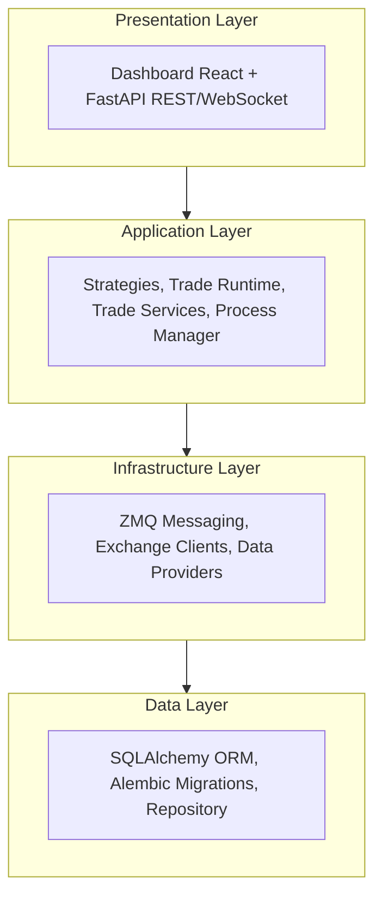
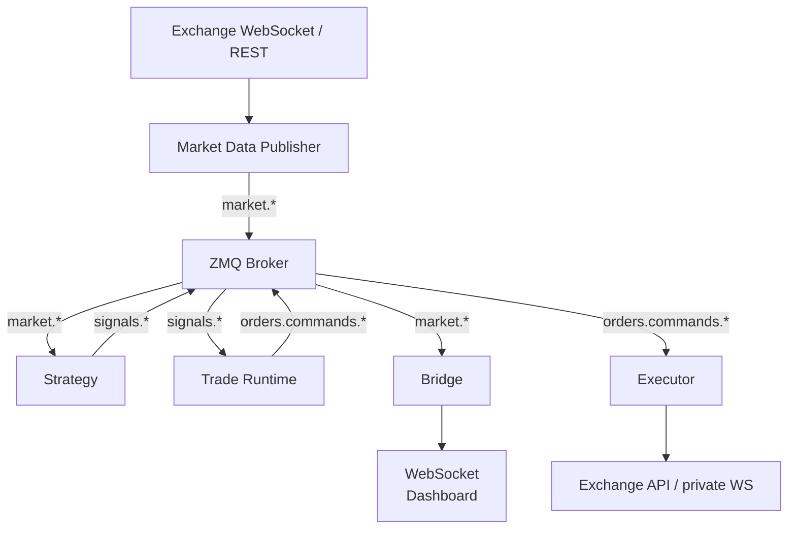
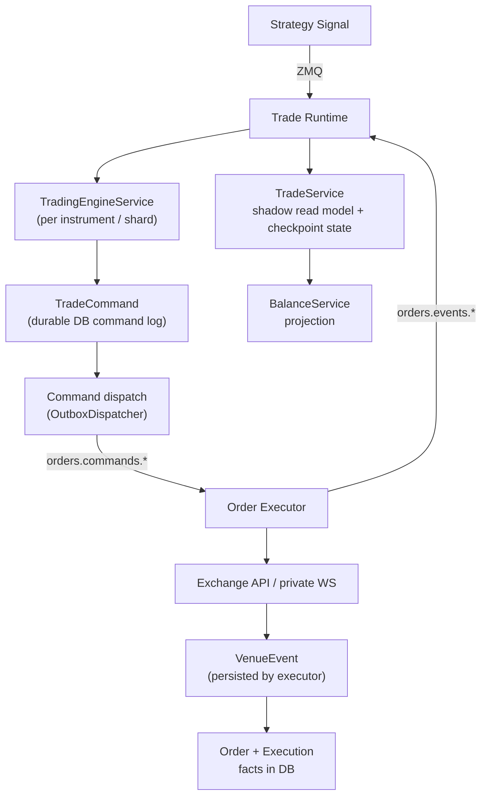
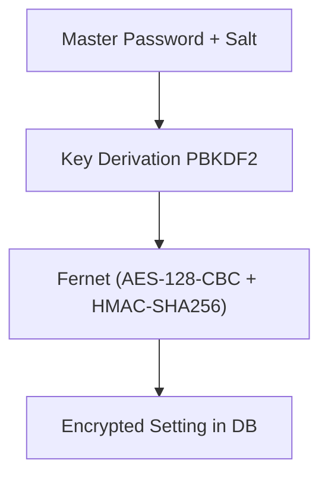

# Architecture

Snapper is a trading platform built with a layered architecture
using asynchronous processing and ZeroMQ messaging.

The trading path is facts-canonical: `Order` and `Execution` are the
canonical business facts, while `Position`, `Balance`, and equity are
derived projections that can be rebuilt from facts plus checkpoints.

## System Layers



## Components

### Core (`src/snapper/core/`)

Fundamental types and aliases used throughout the application:

- `TradeSide` — Trade direction (`buy`, `sell`)
- `OrderType` — Order type (`market`, `limit`, `stop`, `stop_limit`)
- `OrderStatus` — Order status in lifecycle
- `ExecutionMode` — Execution mode (`live`, `paper`)
- `OrderExchange` — Order-capable exchanges (`paper`, `kraken`, `kraken_futures`, `walutomat`)

### Config (`src/snapper/config/`)

Two-layer configuration:

1.  **Bootstrap Settings** (`bootstrap.py`)

    Settings from environment variables required before database connection:

    - Database URL
    - Master password for encryption
    - HTTP and ZMQ server endpoints

2.  **App Settings** (`app.py`)

    Settings from database (encrypted):

    - Exchange API keys
    - Trading parameters
    - Authentication configuration

### Data (`src/snapper/data/`)

Persistence layer with SQLAlchemy:

- **ORM Models** (`models.py`):

    - `Instrument` — Financial instruments (natural key: symbol_public_id + exchange).
        `Instrument.public_id` is the stable identity used by fact tables (orders,
        executions, positions, signals, candles). The versioned business attributes
        `symbol_public_id` and `exchange` are resolved via `ensure_instrument()`
    - `Candle` — OHLCV candles
    - `Trade` — Transactions
    - `Order` — Canonical order lifecycle facts (includes `mode`: `"live"` or `"paper"`)
    - `Execution` — Canonical confirmed fills
    - `Position` — Derived position projection (includes `mode`: `"live"` or `"paper"`)
    - `TradeCommand` — Durable trade intent written by the engine before execution
    - `VenueEvent` — Durable venue observations and acknowledgements persisted by executors
    - `TradeProjectionCheckpoint` — Materialized position/balance snapshot for fast recovery
    - `PairedExecutionGroup`, `PairedExecutionLeg`, `PairedExecutionHalt` —
      durable arming, compensation, and halt state for multi-leg paired execution
    - `Signal` — Signal events
    - `User` — System users
    - `Setting` — Settings (encrypted)
    - `Symbol` — Symbol identity with versioned attributes (native_symbol, base, quote, asset_type) via SCD Type 2.
      Archive symbols for filesystem paths are derived from the anchor row (first version per public_id)
    - `SymbolAlias` — Exchange-specific symbol aliases (one row per (symbol_public_id, exchange, channel))
    - `SymbolExchangeCapability` — Exchange-specific symbol capabilities
    - `ProcessRun` — Background process execution records
    - `InstrumentSpec` — Instrument trading specifications (tick_size, margins, expiry_at, instrument_kind)
    - `UnderlyingAsset` — Canonical asset identity (e.g., S&P 500, Gold) linking instruments across exchanges
    - `InstrumentUnderlyingMapping` — Temporal link from instrument to underlying (exact/derivative/proxy)
    - `MarketSnapshot` — Real-time market data snapshots
    - `InstrumentFeedHealth` — Current per-symbol feed-health snapshot
      keyed by coordinator, exchange, native symbol, stream kind, and timeframe
    - `UserLoginEvent` — Authentication event log
    - `Control` — Always-on audit for commands, auth events, subscribe/unsubscribe,
      REST mutations. Includes redacted payload, outcome, and client causation linkage
      (`client_session_id`, `client_public_id`)
    - `Telemetry` — Toggleable high-volume table for pings, heartbeats, pongs, and
      GET read requests. Recording gated by `TELEMETRY_RECORDING_ENABLED` setting

    Most ORM models carry provenance via `TemporalMixin` (the few
    exceptions — `UserActiveToken`, `AiDelegate`, `AiReview`,
    `AiReviewEvent`, `InstrumentFeedHealth` — opt out because they manage their own
    lifecycle / revocation semantics):

    - `session_id` (str, required) — producer session identity
    - `sequence_id` (int, required) — per-table monotonic counter for gap detection

    `StrictDataSchema` (Pydantic base) requires these fields at construction.
    Producers must obtain values from a `SequenceTracker` before creating
    the event, ensuring every payload is complete and identifiable from birth.

    All ORM models use a dual-key identity pattern:

    - `id` (INTEGER, internal PK) — row/version identifier for SCD2 close
        operations: SELECT → lock → close by id → INSERT new version.
        Never exposed outside the repository layer.
    - `public_id` (UUID7 string) — logical entity identifier for domain
        joins and external references. Stable across SCD2 versions.
    - `timestamp` (DateTime, system time / known_from)
    - `known_to` (DateTime NOT NULL, default KNOWN_TO_MAX = 9999-12-31T23:59:59 UTC, active rows have known_to == KNOWN_TO_MAX; query pattern: `WHERE timestamp <= :t AND known_to > :t`)

    No hard foreign keys between temporal entities. All domain joins use
    `child.instrument_public_id == Instrument.public_id` (or
    `Execution.order_public_id == Order.public_id`) with temporal filters.
    This enables future archival of closed SCD2 rows without breaking
    referential integrity.

- **SQLAlchemyRepository** (`repository.py`) — Async CRUD for SQLite/PostgreSQL
- **DatabaseRepository** (`repository.py`) — Sync access for scripts, archiver, and background updaters
- **CandleCacheArchiver** (`archiver.py`) — Exports active candle data to polygon-compatible CSV cache files per exchange/archive_symbol
- **EventArchiver** (`archiver.py`) — Exports append-only event rows (Tick, Trade, Signal, Execution, Telemetry, Control) to per-day CSV archive files with full temporal metadata, merge/dedup, and optional purge
- **CandleAuditArchiver** (`archiver.py`) — Exports all candle SCD2 versions (closed + active) with full temporal metadata, grouped by open_at date
- **StateArchiver** (`archiver.py`) — Generic archiver for state-SCD2 tables (Order, Position, Instrument, Setting, Symbol, etc.) with closed_only filtering and Symbol anchor row protection
- **Archive symbol resolution** (`archive_symbols.py`) — Stable filesystem-safe symbol naming derived from Symbol anchor rows, with seniority-based collision handling

### Strategies (`src/snapper/strategies/`)

Trading strategies framework:

- **BaseStrategy** (`base.py`) — Base class for all strategies
- **StrategySignal** — Trading signal structure
- **StrategyConfig** — Strategy configuration

Built-in strategies:

- `RSIReversion` (`rsi.py`) — Mean reversion on RSI
- `MACDCrossover` (`macd.py`) — MACD crossover
- `CointegrationPairs` (`cointegration.py`) — Pairs trading

### Indicators (`src/snapper/indicators/`)

Technical indicators:

- `rsi` — Relative Strength Index (Python implementation)
- `macd` — Moving Average Convergence Divergence
- `ta_lib_adapter` — TA-Lib library adapter

### Messaging (`src/snapper/messaging/`)

ZeroMQ pub/sub architecture:


Components:

- **Broker** (`infrastructure/broker.py`) — XPUB/XSUB proxy
- **Publishers** (`publishers/`) — Market data publication
- **Executors** (`executors/`) — Per-wallet order execution on
  exchanges. One executor process per `(exchange, wallet)` pair is
  spawned at boot from active `wallet_credentials` rows; each
  instance filters incoming commands by `wallet_public_id` and loads
  its credentials via `CredentialResolver` during startup. Persisted
  `executor_<exchange>` rows are templates only; runtime instances are
  named `executor_<exchange>_w<wallet_short>` and bare templates are not
  started as live executors.
- **Schemas** (`schemas/`) — Pydantic message models
- **Topics** (`topics/`) — ZMQ topic definitions

Message types (in `messaging.schemas.data`):

- `TickData` — Price tick
- `CandleData` — OHLCV candle
- `SignalData` — Trading signal
- `TradeData` — Trade execution
- `OrderData` — Order status
- `ExecutionData` — Order execution
- `OrderRequestData` — Order request
- `HeartbeatData` — Component heartbeat

Every Data class carries `public_id: str` (UUID7), `type: Literal[...]`, and `timestamp: datetime`.

### Venue reconciliation (executors)

Executors can periodically poll exchange REST APIs to reconcile local
pending-order state against the exchange's authoritative view. This
detects two failure modes that WebSocket streams alone miss: **fill
gaps** (exchange has more filled quantity than the executor observed)
and **disappeared orders** (pending orders absent from the open-orders
snapshot). The same cycle also works the durable command plane in both
directions: **ghost orders** (open venue orders no executor is
tracking) are adopted, and **dispatched commands** with no venue
evidence are verified against venue truth (see below).

Always-on — runs alongside the executor's order handler, heartbeat,
and private fill-stream tasks, all of which run as supervised loops
(no feature flag; the defensive polling is cheap enough that gating
it provided no value). Reconciliation cycles are serialized on an
executor-level lock: the periodic 60s cycle and the fill-stream
supervisor's post-reconnect heal cannot run concurrently and
double-emit the same corrective. Each cycle — including lock
acquisition — is bounded by a 300s timeout, so a hung venue call
cannot hold the lock forever and wedge both loops; a cancelled cycle
is safely recomputed next period because correctives carry stable
synthetic ids.

**`_reconcile_fill_gap`** (in `messaging/executors/base.py`)
emits a corrective `ExecutionUpdate` covering the observed cum-qty
delta, stamping the synthetic execution with the deterministic
`exec_id=recon-<exchange_oid>-c<venue_cum>` — re-emitting the same
gap (after a failed publish, or again at the next startup recovery)
dedupes at every consumer instead of double-applying, while a gap
whose venue cumulative advanced gets a fresh id. Correctives carry
venue-true fees instead of fabricating fee=0: the snapshot's
order-level running commission, or the venue fills-summary total,
rides the frame's cumulative `cum_fee`. When a venue-implemented fee
source is transiently unusable (failed lookup, partial fills page,
no usable rows yet) the corrective is deferred rather than freezing
a fee-less emission under its stable exec id; the deferral is
bounded at five recon cycles, after which the corrective emits
fee-less with a CRITICAL manual-reconcile signal. A venue reporting
neither a snapshot-level running commission nor a per-order fills
summary emits fee-less as before.

**`_reconcile_disappeared_order`** (in `messaging/executors/base.py`)
calls `get_order()` on orders missing from the open-orders snapshot to
determine their actual terminal status (CLOSED / CANCELED / EXPIRED),
emits any residual fill gap first, then publishes the terminal
`ExecutionUpdate`. Walutomat's polling client never guesses
filled-vs-canceled for a disappeared order whose final-state query
fails: the order stays tracked and the query retries every poll
cycle, escalating to a single CRITICAL log after ten consecutive
failures while still retrying — no terminal state is ever fabricated.

#### Ghost-order adoption and dispatched-command verification

A `DISPATCHED` trade-command row is durable pre-send intent, so the
recon cycle also works the durable command plane.

**Ghost adoption**: an open venue order absent from the executor's
pending set is attributed via a strict create/submit command lookup
by client order id (cancels share the original order's cid; multiple
active matches raise instead of guessing) and adopted with the
original request rebuilt from the command row
(`application/trade/command_request.py`, shared with the outbox
publish path) so shard attribution survives adoption. Foreign/manual
orders and other wallets' orders are never touched. Orders whose cid
was already pending when the open-orders snapshot was taken never
adopt from that snapshot (a stale snapshot would double-count a
corrective). Adoption seeds the fill watermarks from the durable
venue-event rows fail-closed — the engine books corrective deltas,
so an untrusted zero watermark would double-book — and repairs the
durable `orders` row so coordinator restart recovery re-arms engine
intent.

**Dispatched verification**: active dispatched create/submit
commands past a minimum age whose cid has no resolving venue
evidence (a lone unknown-submit row does not resolve — parked
entries lost to an executor restart land exactly here) are verified
by client id under a per-cycle fairness cap with index rotation. A
found order is adopted. Venue-verified absence twice in a row
rejects only under publish-success-before-terminal semantics (the
durable `order_rejected` row is written only after a confirmed
REJECTED publish — a premature terminal row would exempt the command
from the sweep while the engine guard stayed held), only while the
command is young enough that the venue's bounded closed-order
lookback keeps absence authoritative (older commands escalate
WARN-only), and never when the dispatch TTL is disabled — a frame
can then legitimately be in flight at any age, so absence may never
auto-reject.

**False-rejection heal**: a command found OPEN on the venue after a
durable REJECTED is adopted and its rejection durably restored to
ACCEPTED through a retried restore queue; the coordinator's
reconciliation loop runs a restart-proof resurrection pass for
REJECTED rows whose live venue evidence postdates the rejection, and
the next fold cycle re-derives the true state from the full event
history.

#### Market orders without price — venue-fills VWAP heal

If a market order's exchange snapshot reports `price=None` (Kraken
Futures snapshots carry only `limitPrice`), the fill-gap path first
asks the venue for the order's own fills via
`ExchangeClientBase.get_order_fill_summary` (venues with a real
per-order fills source set the `supports_fill_summary` capability
flag; the same aggregate also supplies corrective fees) and uses the
venue-true VWAP — but only when the fills page covers the **whole**
filled quantity within a relative `1e-6` tolerance; a partial page is
refused rather than silently skewing VWAP. The CCXT snapshot builder
additionally backfills `price` from the executed `average` when the
venue reports one. Only when the venue reports neither a price, nor an executed
average, nor whole-coverage per-order fills does the path log an
ERROR (`"no price on market order, skipping corrective fill"`) and
skip the corrective emission — recovery then depends on a later
snapshot populating `price`, or manual reconciliation against the
exchange's fill history. Operators seeing this ERROR should not patch
Snapper to approximate from ticks; the skip is an intentional
trade-off (predictable behaviour + observable gap) over silent
approximation drift.

#### Private fill-stream supervision

The private execution WebSocket stream is supervised, not spawn-once.
`_supervise_execution_stream` (in `messaging/executors/base.py`)
treats ANY termination of the stream handler — venue SDK
reconnect-budget exhaustion, a raised error, or a clean generator
return — as death and respawns it with capped jittered exponential
backoff (1 s → 60 s, reset after 300 s of healthy runtime), never
abandoning. Previously the stream was started once: after an outage
exceeding the SDK's internal reconnect budget (~2 min futures,
~5 min spot), fills went permanently dark while the process kept
reporting RUNNING.

Death is detectable because the venue clients raise instead of
exiting cleanly: the spot executions generator raises
`ConnectionError` when its consume loop ends on a terminal SDK error
(closing the poisoned client), ensure-connected on both venues
rebuilds a slot whose client carries a terminal SDK error instead of
returning it as connected, and subscribe sends are bounded by a 5 s
timeout so a wedged socket cannot hang an attempt.

Resubscribe is idempotent: subscription is snapshot-free at the
source (spot subscribes with order/trade snapshots disabled; futures
drops `fills_snapshot` frames) because startup recovery and the
recon loop own snapshot-shaped state — a venue snapshot replayed on
top of recovered watermarks would inflate cumulatives above venue
truth. Before each post-death re-entry the supervisor runs a
best-effort reconciliation pass so the dark-window fill gap is
healed before the stream re-attaches.

Per-order fill booking is atomic: each tracked order carries a
`fill_lock` serializing the dedupe gate, delta build, durable
venue-event write, publish, and watermark advance across the stream
task, recon correctives, orphan flush, and cancel handling. Two
cumulative watermarks are kept per order: `last_seen_cum_qty`
(committed — advances only on publish success, so ZMQ deltas anchor
to what the engine actually received) and `last_recorded_cum_qty`
(durable — advances on venue-event write success, so additive
checkpoint replay of the durable rows sums to venue truth whichever
prior step failed). The same dual-plane pattern covers fees:
per-currency signed fee watermarks (`last_recorded_fee` durable,
`last_published_fee` published) anchor fee attribution — cumulative
`cum_fee` frames set their currency's entry, per-fill fee frames add
— so successive gap correctives attribute exactly the
not-yet-attributed remainder and never re-charge fees that live
per-fill frames already booked.

#### Executor loop supervision and escalation

The same supervisor pattern covers every executor loop, not just the
fill stream: a generic `_supervise_loop` (in
`messaging/executors/base.py`) wraps the order handler, the heartbeat
loop, and the reconciliation loop with the identical capped jittered
exponential backoff (1 s → 60 s, reset after 300 s of healthy
runtime). Before respawning the order handler the supervisor rebuilds
its SUB socket — re-entering on a poisoned socket would just die
again. Previously a died order-handler task was a permanent invisible
order-execution outage while the process kept reporting RUNNING.

A `_supervise_loop`-wrapped loop that keeps dying for 1500 s without
a 300 s healthy run escalates: the supervisor raises
`ExecutorTaskDeadError` out of `start()`, sibling tasks are
cancelled, ZMQ sockets are closed, and the process launcher rebuilds
a fresh service instance — safe because startup recovery emits
corrective fills. The fill stream's dedicated supervisor backs off
indefinitely and never escalates. The ceiling deliberately
exceeds the launcher's 1200 s healthy-uptime budget reset, so
escalation-driven restarts retry slowly forever instead of exhausting
the restart budget; only fast startup crash-loops exhaust it.

Executor heartbeats report honest status derived from these
supervision seams instead of a hardcoded HEALTHY: active death
streaks, a reconciliation progress clock (recon swallows its
per-cycle failures by design, so it can fail forever without dying —
only progress age shows that), the age of the order command currently
in flight (a command wedged inside its venue call never dies and
never progresses), an unhealed accept-event backlog, and parked
ambiguous submits all degrade the published status to WARNING or
ERROR. The computation is crash-proofed: a raising status read
degrades to WARNING with the failure in the reasons, never heartbeat
absence or false HEALTHY. Restart-budget exhaustion at the launcher
is paged through the same heartbeat pipeline (see "Restart watchdog
and parking" under Processes).

### Application (`src/snapper/application/`)

Business logic:

- **Engine** (`engine/`) — `TraderCoordinator` is the multi-symbol trade runtime coordinator; `TradingEngineService` is the per-instrument engine that turns signals into `TradeCommand` rows and order requests
- **Trade** (`trade/`) — Trade-domain services: `trade_service.py`
  (in-memory command and position read model, fill deduplication,
  funding accrual application, and reconciliation halt feedback),
  `balance_service.py` (cash/equity/exposure projection), `outbox.py`
  (outbox-driven publishing with wake-up + polling fallback),
  `reconciler.py` (trade-command lifecycle fold, evidence-scoped
  stale-command scan, and reconciliation failure feedback),
  `command_request.py` (rebuilds the original order request from a
  durable command row — shared by the outbox publish path and the
  executor's adoption sweeps)
- **Process Manager** (`process_manager/`) — Process management
- **Services** (`services/`) — Application services, including
  `market_cache.py` (in-process 1m candle cache and pair-stat snapshots)
  and `market_persist_policy.py` (runtime policy deciding which
  market-data streams are persisted to DB versus cache-only)
- **Updaters** (`updaters/`) — Data updates (symbols, historical)
- **Risk** (`risk/`) — Risk defaults and sizing models
- **Portfolio** (`portfolio/`) — Signed long/short portfolio accounting

### Infrastructure (`src/snapper/infrastructure/`)

External integrations:

- **Exchanges** (`exchanges/`) — Exchange clients (Kraken, Walutomat).
  `kraken_sdk_patches.py` is a version-coupled patch layer over
  python-kraken-sdk (3.2.x) that the Kraken venue implementations
  install at import time, so every process that builds a Kraken WS
  client — executors as well as publishers — is covered. Among its
  fixes is WS teardown hardening: the stock SDK reconnect backoff
  sleeps uninterruptibly (up to ~3 min), so a venue-bounded `close()`
  firing during it leaked one aiohttp `ClientSession` per rebuild
  cycle and the abandoned reconnect later spawned orphaned child
  tasks. The hardened reconnect polls the stop flag during backoff
  and reaps its children on every exit path, and
  `force_close_ws_client()` finishes teardown directly — cancel run
  tasks, bounded drain, close the session — whenever a venue's
  bounded `close()` times out or raises.
- **Market Data** (`market_data/`) — WebSocket feeds
- **Symbols** (`symbols/`) — Symbol mapping
- **Security** (`security/`) — Settings encryption
- **Logging** (`logging/`) — Logging configuration

### Server (`src/snapper/server/`)

FastAPI application:

- **App Factory** (`app.py`) — `create_app()` with lifespan management
- **REST API** — HTTP endpoints
- **WebSocket** — Real-time streaming via ZMQ bridge
  with per-frame scope filters for `ai_reviews.*`, `orders.events.*`,
  and `alerts.*`
- **Static Files** — Frontend dashboard
- **ClientProvenanceMiddleware** (`provenance_middleware.py`) — Extracts client
  provenance from mutation requests, runs per-session gap detection, records
  mutations to `control` table and GET reads to `telemetry` table

### API (`src/snapper/api/`)

Shared API schemas and WebSocket auth helpers (not route definitions):

- **Schemas** (`schemas/`) — Pydantic request/response models (health, process, settings).

    Schema class hierarchy:

    ```text
    BaseModel
    ├── PartialBody           — extra="ignore", strict=True (GapEnvelope, WsTokenPayload)
    ├── StrictBody            — extra="forbid", strict=True (request bodies, nested DTOs)
    │   └── StrictDataSchema  — + provenance (all event payloads, REST/WS/ZMQ)
    │       ├── PayloadRequest[T]
    │       ├── PayloadResponse[T]
    │       └── PayloadListResponse[T]
    ├── ExchangeResponse      — extra="allow", strict=True (exchange API parsing)
    ├── ExchangeRequest       — extra="forbid", strict=True (outgoing exchange requests)
    └── BaseSettings          — BootstrapSettingsLoader (env var config)
    ```

- **Auth** (`auth/`) — WebSocket token service and schemas

Route modules live closer to their domains: `server/app.py` (assembly and
data endpoints), `server/process_routes.py`, `server/strategy_routes.py`,
`config/settings_routes.py`, and `auth/routes.py`.

REST endpoints return the same Data schemas used by WebSocket messaging
(`messaging.schemas.data`): `OrderData`, `SignalData`, `ExecutionData`,
`PositionData`, `CandleData`. Old REST-specific schema modules were removed.

### Auth (`src/snapper/auth/`)

Authentication system:

- JWT tokens with access/refresh via HTTP-only cookies
- CSRF protection
- Role-based access (`viewer`, `operator`, `admin`, `ai_delegate`). The
  `ai_delegate` role is the principal type minted by the AI Delegates
  flow (see [ai-integration.md](ai-integration.md)) and is gated by
  its own permission matrix separate from human operators.
- WebSocket authentication

### MCP (`src/snapper/mcp/`)

Model Context Protocol server mounted at `/api/mcp` as a Starlette
sub-application. Exposes read/query tools plus permission-gated order
actions (`submit_manual_order`, `cancel_order`) in `tools.py`, consumed
by AI delegates over Streamable HTTP. The mount re-applies its own
middleware stack: feature-flag gating, bearer auth (`auth.py`), and
per-principal rate limiting (`rate_limiting.py`); each tool handler
runs output sanitization (`output_sanitizer.py`) and returns a
structured error envelope (`error_envelope.py`). See
[ai-integration.md](ai-integration.md) for the delegate flow and the
`@mateusz-klatt/snapper-mcp` client plugin.

### CLI (`src/snapper/cli/`)

Command-line interface (Typer):

- Server and infrastructure management
- Database operations
- User management
- Market data updates

## Data Flow

### Market Data and Signal Flow



### Order Flow



## Database

SQLite for development, PostgreSQL for production.

### Schema

```sql
-- Market data (joined to instruments via instrument_public_id)
instruments         -- Financial instruments (logical key: symbol_public_id + exchange)
candles             -- OHLCV data
ticks               -- Real-time price snapshots
trades              -- Transaction history
market_snapshots    -- Real-time market data (SCD2 per instrument, one active row each)
instrument_feed_health -- Current per-symbol feed health snapshots

-- Trading (joined to instruments via instrument_public_id)
orders              -- Order history (mode: live/paper)
executions          -- Order executions (joined to orders via order_public_id)
positions           -- Portfolio positions (mode: live/paper)
position_cycles     -- Open/closed cycles tracking per-cycle peak qty
signals             -- Strategy signals
execution_plans     -- Plan envelopes (brackets, trailing stops, manual)
execution_plan_checkpoints -- Materialized plan state snapshots
execution_plan_decisions   -- Per-tick plan decisions (audit trail)
execution_plan_decision_outbox -- Durable retry state for plans.decisions fanout

-- Trade runtime (durable command path)
trade_commands              -- Durable trade intent (engine writes before execution)
venue_events                -- Durable venue observations and acknowledgements from executors
trade_projection_checkpoints -- Materialized position/balance snapshots
paired_execution_groups     -- Multi-leg group FSM for arming and compensation
paired_execution_legs       -- Per-leg command binding and signed exposure accounting
paired_execution_halts      -- Durable per-scope halt projection for broken/exposed groups

-- Multi-tenant
wallets                     -- Trading accounts (label, is_paper)
wallet_credentials          -- Per-wallet exchange credentials (Fernet-encrypted)
wallet_operator_scope_grants -- Per-wallet operator scope grants
operators                   -- Operator identities (multi-tenant trade actors)
user_operator_memberships   -- Operator memberships per user
user_trading_caps           -- Per-user trading-caps overrides

-- Symbol management
symbols              -- Symbol identity + versioned attributes (SCD2)
symbol_aliases       -- Exchange-specific symbol mappings
symbol_exchange_capabilities -- Exchange-specific capabilities
underlying_assets    -- Underlying-asset definitions (YAML-sourced)
instrument_underlying_mappings -- Active instrument → underlying mappings
continuous_contract_configs -- Continuous-contract series config

-- Instrument specifications
instrument_specs              -- Trading specifications (tick_size, lot_size, limits)
instrument_order_capabilities -- Per-instrument order-side capability flags
venue_fee_schedules           -- Maker/taker fee schedules per venue

-- Funding + accruals
funding_rates       -- Per-instrument funding rate history (perps)
accrual_ledger      -- Funding / rollover / borrow accrual entries

-- Backtest
backtest_runs           -- One row per backtest run
backtest_events         -- Lifecycle events (started/failed/completed/...)
backtest_signals        -- Strategy signals emitted during a run
backtest_trades         -- Trades minted by the backtest engine
backtest_equity_points  -- Equity curve samples
backtest_results        -- Final per-run metrics
backtest_comparisons    -- Pairing-grouping fingerprint anchors

-- AI Reviews + Delegates
ai_delegates        -- AI delegate principals (PAT-style auth)
ai_reviews          -- Human-in-the-loop review queue rows
ai_review_events    -- Per-review lifecycle audit trail

-- Notifications
alert_events        -- APNs alert payloads
alert_deliveries    -- Per-device delivery attempts
device_alert_prefs  -- Per-(device, alert_type, scope) preferences
notification_devices -- Registered APNs device tokens
user_alert_defaults -- Per-user fallback alert preferences

-- System
users               -- User accounts
user_active_tokens  -- Active JWT inventory (revocation)
settings            -- Settings (encrypted)
user_login_events   -- Authentication event log
process_runs        -- Background process execution records
control             -- Audit log (commands, auth events, mutations)
telemetry           -- High-volume operational events (toggleable)
```

### Migrations

Alembic manages migrations:

```bash
snapper db-upgrade    # Apply migrations
snapper db-downgrade  # Rollback
```

## Trade Runtime

The trade runtime always uses the durable (outbox-driven) dispatch
path. `TradingEngineService` writes `TradeCommand` rows to the
database; `OutboxDispatcher` polls the table and publishes undispatched
commands to ZMQ. Executor `VenueEvent` writes are fail-closed for
pre-acceptance events — a failed persist raises before the executor
acknowledges the venue event. Once the venue has accepted an order
(returned an order id), a failed `order_accepted` persist no longer
aborts the flow: it is logged CRITICAL, the entry is flagged
`accept_event_pending` and queued, ACCEPTED is still published (the
venue state is the truth), and the executor's recon loop retries the
durable write each cycle until it sticks — probing for an existing
row first, so a timeout after a committed write cannot insert a
duplicate accept event.

`trade_commands` rows are a fold of the `venue_events` truth plane.
The coordinator's per-exchange `ReconciliationLoop` folds each active
command's venue events into a durable status advance through a
lifecycle CAS (`advance_trade_command_lifecycle`): the first accept
supplies `acked_at` and the exchange order id, the max cumulative
fill decides partial-vs-filled, and the last terminal-class event
maps to the terminal status. The fold is rank-monotonic — a command
status never regresses, so duplicate and out-of-order events collapse
idempotently. A later accept or fill supersedes an earlier REJECTED
(rejections are legally retried by the outbox, and a resurrection
pass restores durably-REJECTED rows whose live venue evidence
postdates the rejection); other terminals are never resurrected. The
fold covers create/submit commands past the outbox's territory
(`created` rows stay the outbox's), and stale-command reporting is
scoped by evidence: an aged active command with zero venue evidence
WARNs, unknown-only evidence reports INFO, real evidence is silent —
the fold advances it. Cancels keep the legacy stale WARN because they
share the original order's cid.

Four order-safety layers sit on the dispatch path:

- **Dispatch max-age TTL** (`TRADE_COMMAND_DISPATCH_TTL_S`, default
  30 s): the outbox CAS-expires a stale `CREATED` create/submit
  command to terminal `EXPIRED` instead of publishing it (cancels and
  replaces are exempt), and the engine releases its in-flight intent
  via a synthetic expired event — an outage backlog cannot fire MARKET
  orders priced off old signals. The executor-side stale check is
  venue-truth-backed: a found order is adopted, an unverifiable venue
  drops the frame silently (recon resolves it), and only venue-verified
  absence rejects.
- **Duplicate-submit guard**: before placing, the executor drops
  outbox replays of an already-evidenced `client_order_id` (live
  pending entry, unhealed-accept queue, or a durable venue-event
  evidence probe) — fail-closed on probe failure, publishing nothing.
  A replay whose evidence includes a breaker-open event instead
  reruns the breaker disposition (below) so a crash between the
  evidence write and the REJECTED publish cannot strand engine intent.
- **UNKNOWN submit state**: when a venue submit outcome is ambiguous
  (timeout, connection drop mid-send), the executor parks the order
  as non-terminal `OrderEventEnum.UNKNOWN` instead of fabricating a
  REJECTED — a false reject would let the engine re-emit and double
  the position. It then verifies against venue truth by client id
  (`find_order_by_client_id`: could-not-check never counts as
  venue-says-no); a found order is adopted, two consecutive
  authoritative absences reject safely, anything else stays parked.
  The recon loop verifies parked entries each cycle under a per-cycle
  fairness cap with index-based rotation (a large parked set rotates
  through verification rounds instead of starving its tail or blowing
  the cycle's time budget), and the engine holds the in-flight guard
  until resolution.
  An `order_unknown` safety-critical alert (user-scoped, with admin
  fan-out for strategy orders) fires while an order is parked.
- **Breaker-open disposition**: a submit refused by the venue circuit
  breaker (typed `CircuitBreakerOpenError`) is authoritative
  not-submitted but NOT a venue rejection, and it must not blind-retry
  — the breaker may have closed, and a late redispatched frame would
  place an order the engine no longer tracks. The executor writes a
  probe-guarded durable `order_breaker_open` venue event (which counts
  as duplicate-submit evidence), CAS-fails the command row to terminal
  `FAILED` so the outbox can never re-fetch it, and only then
  publishes REJECTED with reason `circuit_breaker_open` so the engine
  releases intent. Any step failing parks the entry and the recon loop
  reruns the sequence until it completes.

The executor also gates order-type vocabulary before any venue send.
The durable command plane (`trade_commands`, `OrderRequestData`)
speaks the CORE vocabulary (`market`/`limit`/`stop`/`stop_limit`);
one shared venue-request builder
(`_exchange_order_request_from_core` in
`messaging/executors/base.py`, used by both the submit path and
ghost-adoption row repair) translates it to the venue wire
vocabulary (`stop-loss`/`stop-loss-limit` for the stop types). A
command whose order type has no wire mapping, or a stop-typed
command without a `stop_price` trigger, raises inside the builder —
before the network call, so the order is provably not placed — and
the submit path's definitive-reject branch publishes REJECTED and
writes the durable `order_rejected` venue event instead of letting a
half-formed frame reach the venue.

Spot (Kraken) `create_order` is additionally excluded from blind
network retry — an ambiguous network failure may have placed the
order, and Kraken's `cl_ord_id` dedupe covers only open orders, so a
blind retry of a MARKET order could double-place. The 429 rate-limit
retry is kept (an exhausted 429 is a definitive venue-side rejection).

Executor startup recovery emits corrective fills instead of silently
re-baselining: the old recovery seeded fill tracking from the venue's
current cumulative, so every fill that landed while the executor was
down became invisible to projections forever. Recovery now reads both
truth planes per order — the durable `venue_events` fill rows and the
`executions` log (rows exist only for successfully published fills) —
seeds the committed/durable watermarks from what each plane proves,
republishes recorded-but-unpublished fills under their original exec
ids (idempotent — the engine, checkpoint replay, and the executions
insert all dedupe by exec id), and emits the remaining venue-ahead
gap as a recon corrective with a deterministic id, so repeated
restarts and publish retries converge instead of double-applying.
Orders that went terminal during the downtime get their fill gap
healed before the terminal event is projected; orders the venue
cannot verify at startup are parked with DB-derived seeds and retried
each recon cycle. Fills without a venue exec id are never
republished — they dedupe on an identity-shaped fallback key shared
by the live engine and checkpoint replay, count toward the committed
seed as already shown, and the durable rows heal a coordinator that
missed them at its next restart. This class is shrinking: Walutomat's
cumulative polls now stamp deterministic `wal-{oid}-c{basis_units}`
exec ids on every emission (the disappeared-order terminal upgrade
gets a `-t` suffix so a same-cumulative status upgrade is never
identity-dropped), so only rows recorded before that carry no id.
Operator notes are in [`docs/operations.md`](operations.md)
"Recovery-time corrective fills".

The `TraderCoordinator` class acts as the trade runtime coordinator
and integrates `TradeService` (command lifecycle) and `BalanceService`
(balance tracking). It spawns the outbox dispatcher (when a
`SQLAlchemyRepository` is wired) plus per-exchange reconciliation
loops that drive the trade-command lifecycle fold and feed the
circuit breaker. Canonical `Order` and `Execution`
rows are persisted on the exchange/executor path.

Multiple `TraderCoordinator` processes can run against the same DB
+ broker with deterministic SHA-256 shard partitioning via
`snapper.core.partitioning.ShardOwnership`. Each coordinator owns
`~1/N` of the `shard_key` set; signals, venue events, recovery,
outbox dispatch, and reconciliation all filter by ownership so no
two instances process the same shard. Default `--instance-count 1`
is byte-identical to single-coordinator behavior. Scaling to N≥2
requires PostgreSQL: the coordinator fails fast (`ValueError`) at
startup when `instance_count > 1` on a SQLite backend, because
`SELECT ... FOR UPDATE` row locking — which the money-path DALs
depend on — is a no-op there. See
[`docs/operations.md`](operations.md) for the systemd template
recipe and scale-up / scale-down / crash-recovery procedures.

Checkpoint recovery resolves wallet-aware shard keys from
`wallet_credentials` at the checkpoint's `checkpoint_at` timestamp
before falling back to the boot-time `wallet_short` cache. This keeps
rolling restarts and credential rotations from recovering old
`.w{wallet_short}` checkpoints into an empty or stale wallet scope.

The coordinator also spawns the **paired-execution guard scanner**
(`PairedExecutionGuardScanner`) as a background task: a DB-only
liveness loop that assembles and arms multi-leg signal groups behind
an arming barrier (no grouped command reaches a venue until every
sibling leg is durably registered), breaks groups that miss their
assembly/fill deadlines, cancels and reduce-only-flattens exposed
legs, projects durable per-scope halts, and completes settled groups.
The guard is dark by default (`PAIRED_EXECUTION_GUARD_ENABLED`
false): live multi-leg emission is refused fail-closed at the
strategy layer, while the scanner's compensation backstop always
runs. Operator surface: `GET /api/paired-execution/incidents` and
`POST /api/paired-execution/groups/{id}/terminalize` — runbook in
[`docs/paired-execution.md`](paired-execution.md).

## Bitemporal Model

Most entity tables inherit `TemporalMixin` which provides `id`,
`public_id`, `timestamp` (bus-time / known_from), and `known_to`
columns. A small number of tables that manage their own
lifecycle (notably `user_active_tokens`, `ai_delegates`,
`ai_reviews`, `ai_review_events`, and `instrument_feed_health`) opt out.

Key concepts:

- **SCD Type 2** — No in-place UPDATE or DELETE. Mutations use a close+insert
    pattern: the current row is closed (known_to set to now) and a new row is
    inserted with the updated values and known_to = KNOWN_TO_MAX.
- **KNOWN_TO_MAX** — Sentinel value (9999-12-31T23:59:59 UTC) marking the
    active version of a row.
- **Point-in-time queries** — REST endpoints accept an `as_of` query parameter
    to retrieve the state of data at a specific moment.
- **Helpers**:
    - `where_active(model, at)` — SQLAlchemy filter for temporal queries.
        `at: datetime` is required — no silent default-to-now
    - `where_active_now(model)` — convenience for operations that genuinely
        mean "current state" (auth login, heartbeat). Not a shortcut for
        skipping `as_of` threading
    - `close_and_insert()` / `close_and_insert_sync()` — Repository helpers
        that atomically close the current row and insert a new version

### Batch atomicity guarantees

True SCD2 batch writes (`upsert_candles`, `upsert_market_snapshots`) and
single-row close+insert methods (`revise_*`, `close_and_insert`) commit as
all-or-nothing transactions. The pattern is:

```python
async with self.session() as s:          # opens a transaction
    for row in rows:
        # SELECT ... FOR UPDATE the active version
        # UPDATE close (set known_to = bus_time)
        # s.add(new row)
    await s.commit()                     # single commit
```

If any row in the loop raises (IntegrityError, serialization failure,
connection drop, `await` cancellation), the transaction aborts and
**no** close/insert pair from this batch lands in the DB. The batch
must be retried in full; there is no partial-progress mode.

`upsert_candles` batch-loads existing versions for unique
`(instrument_public_id, timeframe, open_at)` keys before closing and
inserting rows. If the incoming batch contains duplicate candle natural
keys, those rows keep the sequential close+insert path because an
earlier row in that group can create the version a later row must close.
Lookup batches are chunked to stay below SQLite parameter limits.

Append-only batch writes do NOT use the SCD2 close-insert pattern and
split into two shapes:

-   `upsert_trades` delegates to the dialect-aware `_upsert_batch`. On
    native dialects (SQLite / Postgres) it uses `INSERT ... ON CONFLICT DO
    NOTHING` in a single `s.execute` — atomic per-batch, and duplicates are
    silently skipped. On the fallback row-by-row path it wraps each row in a
    `begin_nested()` SAVEPOINT; successful rows stay in the outer
    transaction and are committed at the final `await s.commit()`, while
    rows that hit `IntegrityError` are skipped. This trades all-or-nothing
    for conflict tolerance.
-   `upsert_ticks` issues a Core bulk insert via
    `session.execute(insert(Tick), list(rows))`. The function has
    two branches: when the caller passes a `session`, commit is
    external (caller-managed); otherwise it opens its own session
    and commits internally. Atomic per-batch on every dialect — it
    is not routed through `_upsert_batch` and has no
    duplicate-skipping behaviour.

Serialization on the same natural key: on **PostgreSQL**, row-level
`SELECT ... FOR UPDATE` serializes concurrent transactions via MVCC
row locks — a second session waiting on a locked active row observes
the first session's close+insert only after the first commits; both
batches complete without error and produce a clean SCD2 chain.

On **SQLite** (aiosqlite), `SELECT ... FOR UPDATE` is a no-op and the
default transaction mode does not acquire a write lock at SELECT
time — two concurrent tasks can both read the same active
row before either writes. The first writer to COMMIT wins; the second
writer's INSERT then collides on the `public_id` UNIQUE index and
raises `sqlalchemy.exc.IntegrityError`. The final DB state is still a
valid SCD2 chain (exactly one active row, carried-forward `public_id`
preserved, no orphan inserts) — one writer is simply reported the
conflict via exception rather than implicitly serialized. Callers on
SQLite that race on the same natural key must either retry the failed
batch or rely on the single-publisher-per-exchange invariant to avoid
the contention entirely.

**At-scale implication:** under heavy multi-publisher contention on
the same natural key, batches serialize strictly. If a long-running
batch holds the lock for many milliseconds per row, throughput falls
linearly in contention. The current single-publisher-per-exchange
shape makes this a non-issue; revisit if multi-publisher contention
on the same natural key becomes a real workload.

**Non-atomic fallback (`_upsert_batch` row-by-row path):** the
dialect-agnostic fallback (`_upsert_batch` in `data/repository.py`) wraps each row
in a `begin_nested()` SAVEPOINT and continues on `IntegrityError`.
Successful rows are NOT committed immediately — they are held in the
outer transaction and finalised only by the final `await s.commit()`.
This trades all-or-nothing for conflict tolerance — the caller sees
`inserted = N_successful`, not all-or-nothing. Used only for
append-only paths where a duplicate key is a genuine no-op. Never
used for SCD2 close-and-insert.

## Processes

The system manages processes through Process Manager:

- **Core** — Broker, Feed, Bridge (required — startup is aborted if any
  enabled long-running CORE process fails to start)
- **Strategy** — Trading strategies
- **Task** — One-time tasks
- **Backtest** — Backtesting processes

Processes can be:

- `long_running` — Run continuously (services)
- `one_shot` — Execute once (tasks)

### Restart watchdog and parking

`ProcessLauncherService` reconciles died processes toward their
desired state with backoff and two restart budgets (consecutive
short-lived FAILED deaths, plus a lifetime backstop; both reset by
healthy uptime). The watchdog drives native subprocesses and
in-process async-task/thread processes through the same machinery —
a died per-wallet executor task is respawned with the same backoff,
budget, and stop-race guards as a native feed subprocess instead of
being finalized FAILED and silently never restarted.

When a process exhausts its restart budget, a CORE market-data
publisher escalates to a feed-container restart; any other process is
parked. Parking is level-triggered and visible: `/health` reports
ERROR while any process is parked (checked before every other branch,
including the API-only early return and the TTL cache), and for
per-wallet executor instances the launcher bursts synthetic ERROR
heartbeats on the instance's own per-wallet heartbeat topic,
re-bursting hourly while parked, so the existing
critical-system-error alert pipeline pages the operator without any
new alert type or topic family. A successful (re)start or a
successful deliberate stop unparks the name; a failed stop or a
failed manual restart keeps the marker.

### Deployment Modes

By default, the FastAPI lifespan starts all enabled processes (all-in-one
dev mode).  Set `SERVER_API_ONLY=true` to skip process autostart -- the
ZMQ-WebSocket bridge still starts, so the frontend receives live data from
a separately-running engine. Useful when broker/strategies/executors run
on different hosts.

**Dedicated feed container (NYSE event-loop split):**
the market-data publishers (Kraken spot/equities/futures, Walutomat,
paper) can be moved out of the FastAPI backend into a separate container
so the API event loop stops sharing one CPU core with five WS publishers
+ their parse/persist work. Under NYSE open burst the shared loop
saturated one core and starved the trade writer (drops); isolating each
publisher onto its own process/core removes the contention.

`PROCESS_AUTOSTART_PROFILE` selects which registered processes a node
autostarts (see `snapper.core.types.ProcessAutostartProfileEnum`):

- `all` (default) — every enabled process (single-container / dev).
- `api` — everything EXCEPT market-data publishers (the backend
  container: broker, executors, strategies, API).
- `feed` — ONLY market-data publishers (the feed container). Set by the
  `feed-engine` CLI command, which launches each publisher as its own OS
  subprocess (`mode=PROCESS`, uvloop) via
  `ProcessLauncherService.start_feed_publishers`. A market-data publisher
  is any registered process tagged both `market-data` and `publisher`.

A market-data publisher is filtered out of the backend's `start_all_processes`
under the `api` profile, and `get_core_health` honours the same filter so a
publisher that intentionally runs in the feed container is not reported as a
missing CORE process on the backend.

The ZMQ broker stays in the backend (its tags are infrastructure, not
publisher, so the `api` profile keeps it). Cross-container wiring uses two
endpoint pairs because ZMQ `bind` rejects hostnames while `connect`
resolves them:

- `ZMQ_BROKER_BIND_XSUB` / `ZMQ_BROKER_BIND_XPUB` — the routable interface
  the broker binds (`tcp://0.0.0.0:7500` / `:7501`). Empty (default) falls
  back to the connect endpoints, so single-container behaviour is unchanged.
- `ZMQ_BROKER_XSUB` / `ZMQ_BROKER_XPUB` — the connect endpoints every
  process (backend's own components AND the feed container's publishers)
  dials. Both containers set these to the backend service name
  (`tcp://snapper:7500` / `:7501`).

`DB_POOL_SIZE` / `DB_MAX_OVERFLOW` clamp each publisher subprocess's
SQLAlchemy pool (PostgreSQL only). `get_repository` caches one engine per
process, so splitting publishers across processes otherwise multiplies the
default pool (5 + 10) per process toward Postgres `max_connections`. Keep
`count(publishers) * (DB_POOL_SIZE + DB_MAX_OVERFLOW) + backend pool` under
the server's `max_connections`.

Deploy notes (see `docker-compose.yml` `snapper-feed` service):

- Bring up the backend (`api`) and feed (`feed`) together. A partial
  `docker compose up snapper` with the `api` profile but no feed container
  stops all market-data ingest, so deploy both atomically.
- The broker's bound endpoint is seeded into its DB process-config
  `parameters` by registry sync on a fresh database. An existing
  deployment whose broker config already carries `tcp://127.0.0.1:7500`
  must have that row re-synced (or the `parameters` cleared) so the broker
  picks up `tcp://0.0.0.0:*`; otherwise the feed container cannot reach it.
  In multi-instance deployments only coordinator instance `0` runs this
  replicated registry sync; non-zero instances skip it during FastAPI
  lifespan startup to avoid racing the same temporal `Setting` rows.
- By default feed publishers dial exchanges directly. To verify egress
  routing, set `feed_egress_enabled=true`, restart `snapper-feed`, then
  confirm publisher connections use the configured `snapper-egress` SOCKS
  routes.

**Multi-instance deployment (AI-review fanout dedup):**
multi-worker uvicorn is a supported production topology. The
shared ZMQ XPUB-XSUB broker delivers every internal bus event to
every FastAPI worker's ``AiReviewService.start_bus_listener``;
each subscribed topic has its own dedup story so connected
clients see exactly one external WS frame per source event
regardless of worker count:

- ``bus.delegate_offline`` is idempotent at the DB layer — the
  handler runs a per-row ``atomic_dispatch_fanout_with_audit`` CAS
  UPDATE, so only one worker wins per affected review row even when
  every worker receives the bus event.
- ``bus.ai_review_decision`` is process-local — the handler resolves
  an ``asyncio.Future`` from the per-worker registry populated by
  the worker that ran ``create_review`` for the strategy await loop.
  Other workers stash the event in a bounded pending-resolution
  cache (1024-entry hard cap, 30s TTL); cache memory across the
  cluster is bounded by ``N × 1024`` entries even at peak.
- ``bus.caps_violation_after_ai_approve`` is gated by deterministic
  partitioning. ``handle_caps_violation_bus_message`` short-circuits
  on ``ShardOwnership.owns(msg.review_public_id)``; exactly one
  worker (the SHA-256 owner of the review row) re-publishes the
  external ``ai_reviews.*.caps_violation`` frame. Other workers
  observe the bus event, log a debug skip, and return False.
  ``instance_count == 1`` (default deployment) makes
  ``ShardOwnership.owns`` return True unconditionally so behaviour
  is byte-identical to single-worker.

The same partitioning primitive backs the Trade Runtime shard
ownership; AI-review reuses it via the
``set_shard_ownership(ShardOwnership(coordinator_instance_id,
coordinator_instance_count))`` injection seam wired by the FastAPI
lifespan after the publisher seam and before the bus listener
starts.

**Operational scaling:** raise
``SNAPPER_COORDINATOR_INSTANCE_COUNT`` to N and start N FastAPI
workers each with a distinct ``SNAPPER_COORDINATOR_INSTANCE_ID`` in
``[0, N)`` (env vars only — ``snapper server`` does not expose
per-worker CLI flags; the ``--instance-id`` / ``--instance-count``
CLI flags exist on ``snapper trade-zmq`` for the Trade Runtime
coordinator partitioning, not on the FastAPI server). Each worker
subscribes to every bus topic; only the SHA-256 owner runs the
caps-violation external fanout.

## Execution Plans

The Execution Plans framework provides a unified control plane above the
existing TradeCommand spine. All manual and algorithmic trading actions
become `ExecutionPlan` instances evaluated by pluggable `PlanEvaluator`
classes running inside `PlanExecutorService`.

**Tables:** `execution_plans` (plan state + lifecycle), `execution_plan_checkpoints`
(high-churn evaluator state), `execution_plan_decisions` (tiered decision log),
`instrument_order_capabilities` (capability matrix), `venue_fee_schedules` (fee tiers),
`position_cycles` (one open→close lifetime per shard, brackets attach by `position_cycle_public_id`).

**Plan types:** `manual_once` (shipped),
`bracket` (shipped — attaches to a `position_cycles` row),
`trailing_stop` (shipped — stateful ratcheting stop with
checkpoint persistence, separate `/api/trailing-stops` route module),
`peg`, `scheduler`.

**Manual order create flow:** `POST /api/orders` creates a `manual_once`
plan (pending), stamps `child_client_order_id` and `native_instrument`
into `plan.params`, then inserts a `create` `TradeCommand` for the outbox
dispatcher and transitions the plan to `active`. The command row stores
the CORE order-type vocabulary (`market`/`limit`/`stop`/`stop_limit`)
plus the `stop_price` trigger for stop types; translation to the venue
wire vocabulary (`stop-loss`/`stop-loss-limit`) happens only at the
executor's venue boundary. Cancel/flatten readers resolve the order type
through `core_order_type_from_plan_params`, which still normalizes the
legacy `venue_order_type` param carried by older plans. The
`OutboxDispatcher` inside `TraderCoordinator` publishes the command as
`OrderRequestData` on the `orders.commands.{ex}.{instr}.submit` topic.

**Fill propagation:** `PlanExecutorService` subscribes to
`orders.events.` and `market.` on the broker XPUB and consumes every
fill. Cumulative `ExecutionData.size` is compared against
`plan.filled_quantity` with a small epsilon so duplicate or stale frames
are dropped. Partial fills update `filled_quantity` and keep the plan
`active`; full fills transition the plan to `completed` with
`completed_at` stamped via SCD2.

**Cancel flow:** `POST /api/orders/{plan_public_id}/cancel` (plan id path)
or `POST /api/orders/by-client-order-id/{client_order_id}/cancel` (UI
convenience route) resolves the plan, verifies wallet scope, transitions
the plan to `cancel_requested`, hydrates `exchange_order_id` from the
active `orders` row, and inserts a `cancel` `TradeCommand`. On insert
failure the plan is rolled back to `failed` and the route returns
HTTP 500 — this is terminal (no retry). `PlanExecutorService._recover_plans`
on the next service restart re-emits cancel commands only for plans
still in `cancel_requested` state (deduplicated via
`has_pending_cancel_command`); `failed` plans are not retried.
The outbox dispatcher branches on `command_type` and re-hydrates
`exchange_order_id` one more time at publish time so a late venue ACK
is picked up, then publishes `OrderCancelData` on the
`orders.commands.{ex}.{instr}.cancel` topic.

**Listen loop resilience:** per-message exceptions (parse failures,
handler errors) are caught inside the loop so a single bad frame
cannot silently stop the service. Transient `recv_multipart` errors
retry with a 100 ms backoff. `asyncio.CancelledError` still unwinds
the loop for graceful shutdown. After `_setup_subscriber()` the service
sleeps 500 ms for ZMQ XPUB/XSUB slow-joiner stabilization before
recovery to avoid losing terminal events triggered by stranded-cancel
re-emits.

**Position cycles:** the `position_cycles` table represents one
flat→non-flat→flat lifetime per shard via the standard
`TemporalMixin` SCD2 envelope. A partial unique
index `uq_pc_shard_open_active` enforces at most one open cycle per
`shard_key` at any instant. Five repository methods cover the lifecycle:
`insert_position_cycle`, `close_position_cycle` (SCD2 close-and-insert),
`get_open_position_cycle` (lookup by `shard_key` because paper shards
embed `strategy_tag`), `flip_position_cycle` (TOCTOU-hardened atomic
close+open with `shard_key` match assertion), and
`update_position_cycle_max_qty` (monotonic — silent no-op when the new
peak does not strictly exceed the existing one). The repository methods
are called from the trader (not from `TradeService`, which stays sync
and pure); `ShardState` carries trader-owned cache fields
`active_cycle_public_id` and `active_cycle_max_qty`.

The trader's `_sync_fill_to_trade_service` samples `old_qty` before
`apply_venue_event` and `new_qty` after, then delegates to
`_sync_position_cycle_on_fill`. That helper classifies the transition
via `TradeService._detect_cycle_transition` (returns
`Literal["open", "close", "flip", "scale_up"] | None` with a 1e-12
epsilon to match the existing zero-snap) and issues the matching
repository call. Four guards apply: degraded-identity fail-closed when
`engine.wallet_public_id` is falsy, idempotency on open via a
`get_open_position_cycle` pre-check, async `instrument_public_id`
resolution via `get_instrument_public_id_by_symbol`, and a symmetric DB
fallback on close/flip/scale_up paths so a degraded restart cannot
reuse a stale cycle row from a prior life of the shard. When a flip's
instrument resolution fails, the trader degrades to close-only — the
old cycle is closed cleanly, the new leg is left uncovered with an
audit-gap warning, and the cache is cleared so subsequent fail-soft
paths handle themselves correctly.

`_recover_engine_state` runs `_reconcile_position_cycles` as a fourth
recovery pass, after engine state is rebuilt and before the trading
loop starts. It iterates `self.engines` (engines, not `TradeService`,
because full replay rebuilds `engine.position_qty` but not the
projection) and handles four cases: recovered flat with a stale open
row → close the row; recovered non-flat with a matching-direction open
row → hydrate the cache and bump `max_qty` if downtime scaled-up beyond
the stored peak; recovered non-flat with an opposite-direction row →
atomic flip via `flip_position_cycle` (or degrade to close-only on
unresolved instrument); recovered non-flat with no row → bootstrap a
synthetic cycle. Brackets attach to `position_cycle_public_id`, not
to an order, so a flat reopen does not inherit stale stop levels.
Orphan cycles (open rows without a matching engine) can be detected
via `GET /api/position-cycles/open` and closed individually with
`POST /api/position-cycles/close-orphan` or in bulk with
`POST /api/position-cycles/sweep-orphans`.

**`max_qty` is per-cycle, not lifetime.** Each `position_cycles` row
tracks the peak absolute quantity reached within its own
`opened_at → closed_at` window. A new cycle on the same shard starts
a fresh accumulator at `abs(opening_qty)`; it does not inherit or
max against prior cycles' peaks. This matches the bracket-evaluator
contract: a bracket attaching to cycle C1 is sized against C1's
peak, not against all-time peak. A future UI surfacing `max_qty`
must scope to the individual cycle row; summing or max-ing across
cycles would conflate independent trading episodes.

## Security

### Settings Encryption

Sensitive data (API keys) are encrypted in the database:



### Backtesting

The backtesting subsystem runs strategy simulations against historical candle
data. It supports both direct repository-backed candle streaming and ZMQ replay
through the same strategy processing contract.

**Architecture:**

- **BacktestConfig** (Pydantic): Strategy, instruments, date range, fill model
- **DirectDbEngine**: Candle-driven simulation loop with time-batched processing
- **ZmqReplayEngine**: Replay mode that publishes historical candles through
  `ReplayPublisher` on the same topic shape used by live feeds
- **ResultCollector**: In-memory artifact buffer (signals, trades, equity)
- **BacktestMetrics**: Pure-math metrics computation (Sharpe, Sortino, CAGR, etc.)
- **BacktestRunnerProcess**: ONE_SHOT RegisterableProcess orchestrating lifecycle
- **BacktestRepository**: Separate repo sharing session_factory, SCD2 status transitions

**Lifecycle:** pending -> running -> completed | failed | cancelled

**Boot reconciliation:** Orphaned runs (pending/running/cancel_requested) are
swept to failed at server startup via `reconcile_stale_runs()`. This runs
only on the normal startup path (skipped in `SERVER_API_ONLY` mode).

**Storage:** 7 bitemporal tables (BacktestRun, BacktestEvent,
BacktestSignal, BacktestTrade, BacktestEquityPoint, BacktestResult,
BacktestComparison) all with TemporalMixin.

### Authentication

- JWT tokens via HTTP-only cookies (access: 15min, refresh: 7 days)
- CSRF tokens for mutating requests
- WebSocket tokens (one-time)
- Bcrypt password hashing

## Kraken FCM market data (TradFi)

Kraken's FCM platform hosts index-futures, energy, metals, and yield
contracts (collective name: "TradFi" in this project). Unlike crypto
spot + perpetuals, FCM has **no public order API** — Snapper treats
these instruments as observation-only.

### Data sources

- REST instrument metadata:
  `iapi.kraken.com/api/internal/markets/all/futures-contracts`.
  Reverse-engineered from `pro.kraken.com` (requires
  `Origin: https://pro.kraken.com` + `Referer: https://pro.kraken.com/`
  headers). Powers the `kraken_equities_symbol_updater` process.
- REST historical candles:
  `iapi.kraken.com/api/internal/markets/{ws_symbol}/ticker/history`.
  Same Origin/Referer requirement. Drives
  `KrakenEquitiesExchangeClient.get_ohlcv()` and the
  `kraken_equities_aggregates_backfill` process. Intervals
  `{1, 5, 15, 30, 60, 1440}` minutes accepted.
- WebSocket ticks + trades: `wss://ws-equities.kraken.com` (Kraken
  Spot WS v2 protocol with `asset_class: futures_contract`). Feed is
  delayed ~10 minutes per FCM policy. The outer envelope's
  `delayed: true` flag propagates onto every
  `TickData.is_delayed=True` so ZMQ subscribers can gate accordingly.

### Capability model

Each TradFi symbol is seeded with a
`SymbolExchangeCapability(exchange="kraken_equities", can_trade=False,
can_market_data=True)` row. Every order-entry REST route
(`/api/orders`, `/api/execution-plans`, `/api/trailing-stops`) calls
`snapper.server._capability_guard.require_tradable` before emitting a
TradeCommand — market-data-only submits fail with HTTP 422
`error_code=instrument_market_data_only`. The AST meta-test at
`tests/meta/test_order_entry_capability_guard.py` enforces that every
enumerated submit handler imports and calls the guard.

### Frontend UX

`GET /api/exchanges/{exchange}/instruments/detail` exposes
capability-aware rows (`InstrumentDetailData` — symbol +
`can_trade` + `can_market_data` + `instrument_kind` + `expiry_at`).
`MarketData.tsx` renders a "Market-data only" badge next to the page
title when the currently-selected instrument is observation-only and
marks every `can_trade=false` row in the instrument dropdown with
the same pill. `NewOrderModal.tsx` consumes the same endpoint, shows
an amber inline notice, suffixes option labels with `— market-data
only`, and disables the submit button. Submit failures branch on
`APIError.details.error_code` via `errorMessages.ts`.

### Cross-asset strategy pattern (informational)

Strategies may subscribe TradFi candles via the normal
`market.kraken_equities.{symbol}.candles.{timeframe}` topic and emit
signals whose `instrument` targets a `can_trade=True` execution
instrument (crypto spot, xStocks). See
`src/snapper/strategies/examples/tradfi_observe_crypto_execute.py`
for an illustrative EMA-crossover implementation + activation
instructions in the module docstring. The backtest engines process
multi-feed batches and route simulated fills to the signalled
execution instrument. `BacktestConfig.target_execution_exchange`
selects the fill venue when it differs from the source feed, and both
direct-DB and ZMQ replay modes build topics for every configured
exchange/instrument feed.

### Operational runbook

See `docs/operations.md` "Kraken Equities (TradFi) market data" for
enable-the-feed steps (SQL DB `Setting` toggles), backfill invocation,
quarterly rotation cadence, and troubleshooting (iapi reachability
checks, WS disconnect loops).
