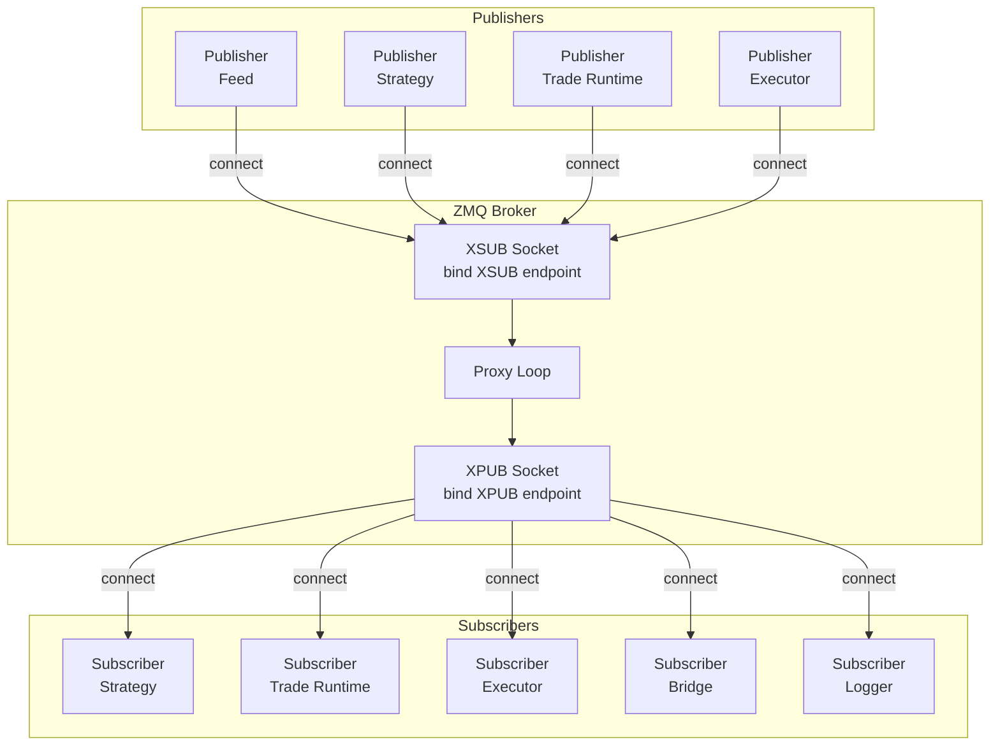
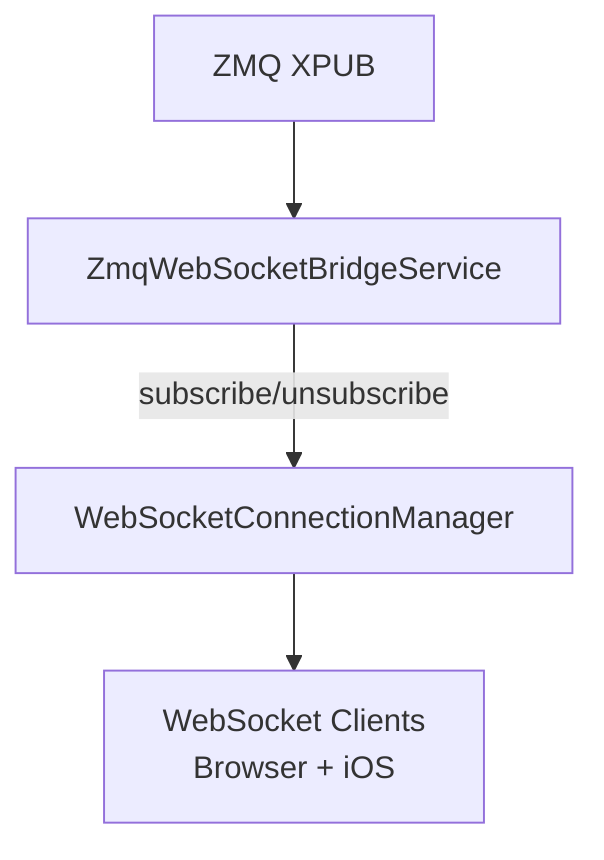

# Messaging (ZeroMQ)

Snapper uses ZeroMQ for inter-process communication in a pub/sub architecture.
The central component is an XPUB/XSUB broker that routes messages.

## Architecture



## XPUB/XSUB Broker

The broker is the central message hub:

- **XSUB** — Publishers connect here.
- **XPUB** — Subscribers connect here.

The broker binds to `ZMQ_BROKER_BIND_XSUB` / `ZMQ_BROKER_BIND_XPUB` when those
bootstrap variables are set. When unset, the bind endpoints fall back to
`ZMQ_BROKER_XSUB` / `ZMQ_BROKER_XPUB`, whose local defaults are
`tcp://127.0.0.1:7500` and `tcp://127.0.0.1:7501`. Docker deployments set the
bind endpoints to routable container interfaces such as
`tcp://0.0.0.0:7500` and `tcp://0.0.0.0:7501` while clients keep using the
connect endpoints.

The broker forwards messages in both directions:

- Data: XSUB → XPUB
- Subscriptions: XPUB → XSUB

### Starting the Broker

```bash
snapper broker
```

Or programmatically:

```python
from snapper.messaging.infrastructure.broker import ZmqBrokerThread

broker = ZmqBrokerThread()
broker.start()
# ...
broker.stop()
```

## Topics

Topic format varies by category (see per-category tables below).

### Market Data

| Topic | Description |
| ----- | ----------- |
| `market.kraken.BTC-USD.candles.1h` | Hourly BTC/USD candles from Kraken |
| `market.kraken.BTC-USD.ticks` | BTC/USD ticks from Kraken |
| `market.kraken_equities.MNQU6-CME.candles.1d` | Daily Nasdaq-100 Micro futures candles from Kraken Equities (note: live `market.*` topics exclude `polygon` — Polygon is replay-only via `market.paper.polygon.…`) |

### Signals

| Topic | Description |
| ----- | ----------- |
| `signals.paper.BTC-USD.rsi_btc_1h` | Paper trading signals |
| `signals.kraken.BTC-USD.live` | Live signals from Kraken |

### Orders & Executions

| Topic | Description |
| ----- | ----------- |
| `orders.commands.kraken.BTC-USD.submit` | Order requests for Kraken |
| `orders.commands.kraken.BTC-USD.cancel` | Cancel requests for an existing Kraken order |
| `orders.commands.kraken.BTC-USD.replace` | Replace/modify requests; executors currently reject with a lightweight `rejected` replace event because atomic replace is not implemented |
| `orders.events.kraken.BTC-USD.executed` | Order executions from Kraken |
| `orders.events.kraken.BTC-USD.submitted` | Order submitted events |
| `orders.events.kraken.BTC-USD.accepted` | Order accepted events |
| `orders.events.kraken.BTC-USD.rejected` | Order rejected events |
| `orders.events.kraken.BTC-USD.cancelled` | Order cancelled events |
| `orders.events.kraken.BTC-USD.expired` | Order expired events |
| `orders.events.kraken.BTC-USD.replaced` | Order replaced events |
| `orders.events.kraken.BTC-USD.unknown` | Ambiguous submit outcome; non-terminal until venue verification resolves it |

`TradeCommand`, `VenueEvent`, and `TradeProjectionCheckpoint` are durable
database artifacts used by the trade runtime. They are not additional ZMQ topics.

### Portfolio Account Invalidation

| Topic | Description |
| ----- | ----------- |
| `portfolio.accounts.{wallet_public_id}` | Thin `AccountStateChangedEventData` invalidation emitted after a venue-account snapshot or reconciliation evaluation commits |

The payload carries wallet, exchange, mode, commit kind, and the standard
provenance envelope; it deliberately carries no balances or reconciliation
view. Browser clients subscribe to `portfolio.accounts.`, invalidate active
portfolio-account queries, and rebuild the fail-closed projection through
`GET /api/portfolio/accounts`. A 60-second safety-net poll heals dropped or
missed frames. Subscription requires `read:account_state`, and bridge fan-out
applies the same per-frame accessible-wallet filter as the REST endpoint.
Malformed frames and topic/payload wallet mismatches fail closed.

### System

| Topic | Description |
| ----- | ----------- |
| `system.heartbeats.executor.{exchange}` | Executor heartbeat for the single-wallet template path (4 segments) |
| `system.heartbeats.executor.{exchange}.{wallet_short}` | Per-wallet executor heartbeat (5 segments). `wallet_short` is the **last** 12 lowercase hex characters of the wallet UUID (see `snapper.core.wallet_short`) |
| `system.heartbeats.strategy.{name}` | Strategy heartbeat (e.g. `strategy.rsi_btc_1h`) |
| `system.heartbeats.feed.{exchange}` | Feed heartbeat (e.g. `feed.kraken`, `feed.paper.kraken`) |
| `system.heartbeats.marketdata.{exchange}` | Synthetic exchange-silence heartbeat from the API-side market-data watchdog; WARNING bursts on whole-exchange candle silence drive the `critical_system_error` alert pipeline (distinct from `feed` on purpose so its WARNING frames satisfy the 3-consecutive gate) |
| `system.heartbeats.ai_delegate.global` | Synthetic AI-delegate liveness and response heartbeat; WARNING bursts report no live delegate or a recent unanswered review through the existing `critical_system_error` pipeline |
| `system.heartbeats.host.disk` | API host disk-pressure heartbeat from `SystemMetricsSnapshotter` |
| `system.egress.snapshot` | Read-only process-local egress pool snapshot for API aggregation |
| `system.egress.transfer` | Read-only snapper-egress WireGuard transfer samples for API route load |
| `system.settings` | Configuration change notifications |
| `system.symbol_aliases` | Symbol cache invalidation |

Heartbeat `component` values use dot notation matching the topic path after
`system.heartbeats.`: `executor.kraken`, `executor.kraken.019d6ca45f2e`,
`strategy.rsi_btc_1h`, `feed.kraken`, `feed.paper.kraken`, `marketdata.kraken`,
`ai_delegate.global`, `host.disk`.
The per-wallet executor heartbeat envelope additionally carries
`meta.wallet_public_id` so
subscribers that prefix-match the 4-segment parent topic can still
disambiguate by reading the payload.

The host disk heartbeat reuses the existing `critical_system_error`
pipeline. The snapshotter publishes HEALTHY, WARNING, and ERROR frames
every tick when the API publisher is wired; the notify rule owns the
three-consecutive non-HEALTHY gate, per-admin fan-out, rolling cooldown,
and dedup.

Pool-bearing processes publish `system.egress.snapshot` on the heartbeat
cadence with an `EgressPoolSnapshotEventData` payload. The payload
carries `container` (`<role>@<hostname>`) and `snapshot`, where
`snapshot` is the process-local `EgressPoolStatusSnapshot`, including
per-route `connections` rows for open WebSocket host counts and capped
REST last-seen hostnames. Only hostnames are emitted; URL paths, query
strings, headers, bodies, and authentication material are stripped before
the snapshot leaves the process. The API process subscribes to the exact
topic, caches the latest frame per container by local receive time, and
merges those snapshots into `GET /api/health/egress` without changing
routing decisions.

The `snapper-egress` sidecar publishes `system.egress.transfer` on the
same cadence with an `EgressTransferEventData` payload. Each interface row
contains `interface`, `socks5_listen_port`, cumulative `rx_bytes` and
`tx_bytes`, optional byte-per-second rates, `latest_handshake_at`,
`counter_reset`, and `sampled_at`. The API caches the latest sample per
interface by receive time and joins transfer data onto
`GET /api/health/egress` routes by SOCKS5 listener port. Ambiguous port
joins are left null.

Executor heartbeats derive `status` from supervised-loop health instead of
reporting a fixed healthy value. ERROR fires on an active loop death streak
of at least 600 s, no successful reconciliation pass for 900 s, or an order
command in flight for 600 s; WARNING fires on 2+ deaths within an active
streak, reconciliation progress age of at least 300 s, a command in flight
for 120 s, an unhealed accept-event backlog, or parked ambiguous submits
awaiting venue verification. A death streak counts as active only while its
last death is younger than 300 s, so a loop that died once and then
self-healed never ages into a false alarm. `lag_ms` carries the
reconciliation progress age and `meta.status_reasons` lists the
human-readable reasons; if the status computation itself raises, the frame
still publishes as WARNING with the failure recorded in `status_reasons` —
a broken computation can cause neither heartbeat absence nor a false
healthy report. Executor heartbeats also carry venue REST reconciliation
health in `meta.venue_recon_failure_count`, `meta.venue_rest_reachable`,
`meta.venue_health_halt_recommended`, and `meta.last_venue_recon_error`.
After three consecutive venue reconciliation failures, the coordinator
uses the heartbeat to halt known real shard keys for the matching
exchange/wallet scope and to drop new cold-path signals for that scope.

The launcher also publishes on the per-wallet executor topics: when a
per-wallet executor exhausts its restart budget and is parked, the launcher
emits bursts of three synthetic ERROR heartbeats on the instance's own
topic, spaced 2 s apart so every frame clears the bridge's
per-subscription forwarding throttle, re-bursting hourly while the name
stays parked. These frames are recognizable by `meta.synthetic: true`,
`meta.origin: "launcher"`, and `meta.reason: "restart_budget_exhausted"`;
they drive the existing critical-system-error alert pipeline without any
new topic family. A successful restart or stop unparks the name and cancels
the burst mid-flight.

### Admin

Cross-cutting administrative notifications fanned out to every
backend subscriber that cares about user/operator state changes.

| Topic | Description |
| ----- | ----------- |
| `admin.user_deactivated` | A user (or AI delegate) was deactivated; immediate revocation hook for in-process token caches, WebSocket close fanout, and APNs push fan-out via the notify sidecar. Auth listeners also poll the DB-backed `users.is_active=False` registry as broker-outage fallback |
| `admin.scope_granted` | `create_grant` published a new active scope row (instrument-exclusive grant just inserted) |
| `admin.scope_handed_over` | `handover` finalized a scope handover (old row closed, new row open, both committed) |
| `admin.scope_revoked` | `revoke_grant` closed an active scope row; revoke hook for any subscriber holding cached principal state |

Shape: `admin.{resource}` — exactly 2 segments. The validator only
enforces the 2-segment shape; the `resource` token itself is not
character-class-checked, so consumers must use the payload's
`type` discriminator as the authoritative routing hint.

### Accruals

Funding / rollover / borrow ledger entries that affect mark-to-market.

| Topic | Description |
| ----- | ----------- |
| `accruals.kraken_futures.BTC-USD-PERP.funding` | Perpetual funding |
| `accruals.kraken.EUR-USD.rollover` | FX rollover |
| `accruals.kraken.BTC-USD.borrow` | Borrow interest |

Shape: `accruals.{exchange}.{instrument}.{accrual_type}` (4 segments).
`accrual_type` must be one of `funding`, `rollover`, `borrow`.

### Alerts

Per-user alert fanout. The notify (APNs) sidecar consumes domain topics
(`orders.events.`, `plans.decisions.`, `system.heartbeats.`, and
`bus.portfolio_drift_episode`), persists
each alert, publishes it as an `AlertEventData` frame on this topic
family before the APNs fanout, and also delivers iOS pushes in-process;
the WS bridge is the consumer, forwarding frames to authenticated
WebSocket clients with per-user scope enforcement. A periodic database
scan in the same sidecar recovers open drift episodes whose real-time
`bus.portfolio_drift_episode` frame was lost. It uses the same owner
resolution, alert-row builder, and `drift.<episode_public_id>` identity as
the bus rule; the insert claim is transaction-serialized so the two paths
cannot double-page.

| Topic | Description |
| ----- | ----------- |
| `alerts.<user_public_id>.order_fill_full` | Order filled in full |
| `alerts.<user_public_id>.order_rejected` | Venue rejected the order |
| `alerts.<user_public_id>.order_unknown` | Order submit outcome ambiguous — parked as non-terminal UNKNOWN pending venue verification (safety-critical; user-scoped with admin fan-out for strategy orders) |
| `alerts.<user_public_id>.position_stop_loss_fired` | Stop-loss fired on an open position |
| `alerts.<user_public_id>.margin_warning` | Margin warning |
| `alerts.<user_public_id>.critical_system_error` | Critical system error |
| `alerts.<user_public_id>.drift` | Portfolio drift episode opened or resolved; open pages are safety-critical and deduplicated by episode public ID |

Shape: `alerts.{user_public_id}.{alert_type}` (3 segments). `user_public_id`
must be a UUID7; `alert_type` is the discriminated union in the
`AlertType` Literal — the validator pulls the set via
`typing.get_args(AlertType)` so adding a new alert type to the
schema flows through automatically.

### Plan Decisions

Bracket / trailing-stop / execution-plan decisions, emitted by the
`PlanExecutorService` through a durable outbox written in the same
transaction as each `ExecutionPlanDecision` SCD2 insert. The service
attempts the ZMQ publish immediately, marks the outbox row `sent` after
success, and retries pending rows with capped exponential backoff from a
background drain loop after broker outages; the same drain also runs once
at startup, so decisions that never published before a restart replay
from their durable rows. A row whose third publish attempt fails is
marked `failed` terminally. The notify sidecar subscribes to turn
stop-loss / trailing-stop fires into iOS pushes (take-profit fires are
explicitly excluded as non-loss outcomes).

| Topic | Description |
| ----- | ----------- |
| `plans.decisions.<plan_public_id>` | One topic per execution plan; payload carries the decision frame |

Shape: `plans.decisions.{plan_public_id}` (3 segments) with `plan_public_id`
in UUID7 form.

### AI Reviews

Outbound delegate-consultation frames for the human-in-the-loop review
queue. The bridge applies a per-frame scope filter so only the selected
AI delegate receives frames for wallets and instruments covered by its
live scope grant. Non-delegate WebSocket principals fail closed for this
topic family even if they somehow request a subscription.

| Topic | Description |
| ----- | ----------- |
| `ai_reviews.<user_public_id>.<strategy_public_id>.request` | Strategy is asking for review |
| `ai_reviews.<user_public_id>.<strategy_public_id>.decision_ack` | Operator's decision acknowledged |
| `ai_reviews.<user_public_id>.<strategy_public_id>.caps_violation` | Caps violation after approval |

Shape: `ai_reviews.{user_public_id}.{strategy_public_id}.{suffix}` (4 segments).
Both ID segments are UUID7; `suffix` is one of the three frame
discriminators above. The payload must include string
`wallet_public_id` and `instrument_public_id` values so the bridge can
check the delegate's grant before forwarding.

### AI Research

`ai_research.` is the registered WebSocket subscription root for research-round
wakes. It belongs to its own `ai_research` authorization category and requires
`submit:market_view`. An `AI_RESEARCHER` can subscribe to this root but cannot
subscribe to `ai_reviews.`, whose combined `read:signals` and `create:orders`
gate remains reserved for decision-capable principals. Concrete research frame
shape is `ai_research.{round_public_id}.request` (3 segments), where the round
identifier is UUID7 and `request` is the only valid suffix. The
`ai_research.request` payload repeats `round_public_id` and carries the
server-owned `trigger`. The round is already committed before this best-effort
wake is published.

### Backtest

Per-run lifecycle and progress events.

| Topic | Description |
| ----- | ----------- |
| `backtest.<wallet_public_id>.<run_public_id>.started` | Run kicked off |
| `backtest.<wallet_public_id>.<run_public_id>.progress` | Periodic progress tick |
| `backtest.<wallet_public_id>.<run_public_id>.milestone` | Engine progress milestone — payload's `milestone` field is one of `25pct`/`50pct`/`75pct` (`BacktestProgressMilestone` Literal) |
| `backtest.<wallet_public_id>.<run_public_id>.completed` | Run finished |
| `backtest.<wallet_public_id>.<run_public_id>.failed` | Run failed |
| `backtest.<wallet_public_id>.<run_public_id>.cancelled` | Run cancelled |

Shape: `backtest.{wallet_public_id}.{run_public_id}.{event}` (4 segments).
`wallet_public_id` and `run_public_id` are UUID7; `event` is drawn from
`BacktestProgressEvent` in [data.py](../src/snapper/messaging/schemas/data.py)
— the validator's `BACKTEST_EVENTS` set is derived via
`typing.get_args(BacktestProgressEvent)` so the wire schema and the
validator share one source of truth. Subscription-only prefixes
(`backtest.`, `backtest.{wallet}.`, `backtest.{wallet}.{run}.`) are
accepted on the `subscribe.py` / `bridge.py` paths.

### Bus

Internal cross-service event bus over the shared broker.

| Topic | Description |
| ----- | ----------- |
| `bus.delegate_offline` | Delegate session torn down |
| `bus.ai_review_decision` | AI review decision recorded — fast-path fanout to the in-process AI review bus listener that resolves the strategy's await future (WS fanout of the operator's ack is the separate external `ai_reviews.<user>.<strategy>.decision_ack` topic). The matching `bus.ai_review_request` topic is intentionally NOT published today |
| `bus.caps_violation_after_ai_approve` | Caps violation post-approval |
| `bus.portfolio_drift_episode` | Notify-only committed drift episode `opened` / `resolved` transition; emitted after reconciliation commit and never used to trade, rebase, or mutate portfolio truth |

Shape: `bus.{name}` (2 segments) where `name` matches
`[a-z][a-z0-9_]*` (snake_case). The payload's
`StrictDataSchema.type` discriminator is the authoritative routing
hint; the validator only enforces structural shape so the schema
layer can reject unknown payload types.

### Process Manager Events

Snapshot + per-run events emitted by `ProcessLauncherService` whenever
the configured set of processes changes or a run transitions. Frontend
subscribes via `wsDispatcher` and uses these to invalidate React Query
caches (no REST polling).

| Topic | Description |
| ----- | ----------- |
| `processes.events.summary.<instance_id>` | Full snapshot of every configured process's current status (start/stop/crash/completion transitions) |
| `processes.events.configured.<instance_id>` | Snapshot of currently-known process names. Emits in four places: `create_process_config` (persisted-config-row create), `spawn_per_wallet_executors` (per-wallet executor instances appear), `update_process_config` (desired-state mutation), and `update_process_config_parameters` (strategy scope editor). It does NOT fire on persisted-row delete or on per-wallet teardown today. The snapshot's `process_names` is the union of persisted config names and `instance_configs.keys()`. |
| `processes.events.runs.<process_name>` | Per-run lifecycle transitions: `running` / `succeeded` / `failed` / `cancelled` |
| `strategies.events.list.<instance_id>` | Snapshot of canonical class paths for every STRATEGY-role process config (drives the Strategies view) |

Shape: 4 segments. The instance-id / process-name tail must match
`[A-Za-z][A-Za-z0-9_-]*` (regex `_PROCESSES_TOPIC_NAME_PATTERN`).
Numeric `SNAPPER_COORDINATOR_INSTANCE_ID` values are converted to
topic-safe slugs by `ProcessLauncherService.coordinator_topic_slug()`;
the default instance therefore emits on `coord-0`, and instance 7 emits
on `coord-7`. The launcher emits these best-effort: if no
`MessagePublisher` is wired the helper no-ops, and send failures are
logged without corrupting process state.

The desired-state control plane adds two further ZMQ topic families that
are validated by `validate_topic` but deliberately kept off WS RBAC (the
payload HMAC signature, not a topic ACL, is the trust boundary). After a
`PATCH /api/processes/{name}/desired-state`, the API coordinator publishes
a signed `ProcessCommandData` nudge on `processes.commands.<coordinator>`
(3 segments) so the owning coordinator reconciles immediately, and that
coordinator replies with `ProcessCommandAckData` on
`processes.events.command_ack.<coordinator>` (4 segments) so the API's
blocking PATCH resolves against the ack (falling back to the periodic
reconcile when no publisher/registry is wired or the ack times out).

## Message Data Classes

All messages use typed Data classes (Pydantic) from `snapper.messaging.schemas.data`.
Every Data class inherits from `StrictDataSchema` and carries:

| Field | Type | Description |
| ----- | ---- | ----------- |
| `public_id` | string | UUID7 external identifier, stable across REST and WS |
| `type` | string | Literal type discriminator |
| `timestamp` | datetime | Message creation time |
| `session_id` | string | UUID7 of the producer process session (required at construction) |
| `sequence_id` | int | Monotonic counter per topic within the session (required at construction) |
| `topic` | string \| None | Routing key stamped onto the payload by `publish_to()` at the publish call site; `None` on REST-only items and control frames |

`session_id` and `sequence_id` are allocated by producers from a shared
`SequenceTracker` before the payload is constructed. `MessagePublisher.send()`
serializes and forwards the already-complete payload without modifying provenance.
Consumers can use these fields to detect message loss and producer restarts.

`messaging.schemas.messages` remains the parser/registry module: it
exposes `parse_message()`, `MessageParseError`, `GapEnvelope`,
`MarketDataMessage`, and `MESSAGE_TYPE_MAP`.

### TickData

```python
from datetime import UTC, datetime

from snapper.messaging.schemas.data import TickData

tick = TickData(
    public_id="019e1a2b-0000-7000-8000-000000000101",
    session_id="019e1a2b-0000-7000-8000-000000000001",
    sequence_id=1,
    timestamp=datetime.now(UTC),
    instrument="BTC-USD",
    exchange="kraken",
    bid=41990.0,
    ask=42010.0,
    last=42000.0,
    volume=0.5,
)
```

**Fields:**

| Field | Type | Description |
| ----- | ---- | ----------- |
| `type` | string | `"tick"` |
| `public_id` | string | UUID7 external identifier |
| `instrument` | string | Instrument symbol |
| `exchange` | string | Exchange name |
| `bid` | float \| None | Best bid price |
| `ask` | float \| None | Best ask price |
| `last` | float \| None | Last traded price |
| `volume` | float | Volume |
| `is_delayed` | bool | Whether the feed delivers exchange-delayed ticks (e.g. ~10 min for TradFi index futures); strategies must gate on this before treating the price as current |
| `is_extended_hours` | bool \| None | Whether the tick occurred during an extended-hours TradFi session; `None` means the feed does not distinguish extended-hours ticks |
| `timestamp` | datetime | Timestamp |
| `session_id` | string | Producer session (inherited) |
| `sequence_id` | int | Monotonic counter per topic or logical stream (inherited) |

### CandleData

```python
from datetime import UTC, datetime

from snapper.messaging.schemas.data import CandleData

candle = CandleData(
    public_id="019e1a2b-0000-7000-8000-000000000102",
    session_id="019e1a2b-0000-7000-8000-000000000001",
    sequence_id=2,
    timestamp=datetime.now(UTC),
    instrument="BTC-USD",
    exchange="kraken",
    timeframe="1h",
    open_at=datetime(2026, 1, 18, 12, 0, tzinfo=UTC),
    open=42000.0,
    high=42500.0,
    low=41800.0,
    close=42300.0,
    volume=1234.56,
)
```

**Fields:**

| Field | Type | Description |
| ----- | ---- | ----------- |
| `type` | string | `"candle"` |
| `public_id` | string | UUID7 external identifier |
| `instrument` | string | Symbol |
| `exchange` | string | Exchange |
| `timeframe` | string | Timeframe (`1m`, `5m`, `1h`, etc.) |
| `open_at` | datetime | Exchange-provided candle interval start time |
| `open` | float | Open price |
| `high` | float | High |
| `low` | float | Low |
| `close` | float | Close price |
| `volume` | float | Volume |
| `vwap` | float \| null | Volume-weighted average price (optional) |
| `trades` | int \| null | Number of trades in the candle (optional) |
| `complete` | bool | Whether the bar's window has closed. `false` marks a provisional intra-minute update of a still-forming bar (the "living" candle a UI redraws in place); `true` marks the final bar. Defaults `true`. Native 1m bars derive it best-effort from the timeframe window; synthesized bars carry the aggregator's trustworthy-boundary flag. |
| `timestamp` | datetime | Timestamp |

### SignalData

```python
from datetime import UTC, datetime

from snapper.messaging.schemas.data import SignalData

signal = SignalData(
    public_id="019e1a2b-0000-7000-8000-000000000201",
    session_id="019e1a2b-0000-7000-8000-000000000010",
    sequence_id=1,
    timestamp=datetime.now(UTC),
    instrument="BTC-USD",
    exchange="paper",
    side="buy",
    strength=0.85,
    reason="RSI <= 30",
    strategy_name="rsi_btc_1h",
    price=42000.0,
    fired_at=datetime.now(UTC),
)
```

**Fields:**

| Field | Type | Description |
| ----- | ---- | ----------- |
| `type` | string | `"signal"` |
| `public_id` | string | UUID7 external identifier |
| `instrument` | string | Symbol |
| `exchange` | string | Target exchange |
| `side` | string | `"buy"` or `"sell"` |
| `strength` | float | Signal strength 0.0-1.0 |
| `reason` | string | Reason |
| `strategy_name` | string | Strategy name (required for paper exchange signals) |
| `price` | float \| None | Suggested entry/exit price (optional) |
| `fired_at` | datetime | Domain time when signal was generated |
| `timestamp` | datetime | System timestamp |
| `paired_group_id` | string \| None | Paired-execution group identifier; unset for standalone signals |
| `paired_group_size` | int \| None | Number of legs in the group (must be >= 2) |
| `paired_group_index` | int \| None | This leg's position in the group (`0 <= index < size`) |
| `paired_group_policy` | string \| None | Coordination policy: `simultaneous` or `sequential_handoff` |
| `paired_group_key` | string \| None | Canonical sorted `{exchange}:{instrument}:{mode}` leg-set key |
| `wallet_public_id` | string | Owning wallet public id (empty string when unscoped) |
| `operator_public_id` | string \| None | Operator scope |
| `user_public_id` | string \| None | User scope |
| `ai_review_public_id` | string \| None | Citation of an approved AI delegate review (CONSULT outcome), threaded into the attribution-aware caps gate |
| `ai_review_dispatch_version` | int \| None | Companion dispatch version for the bridge dedup contract (carried transport-only) |

Paper signals (`exchange == "paper"`) require `strategy_name` to be set. The schema
enforces this invariant at construction time so invalid paper signals cannot be created.

The paired-group descriptor is fail-closed and all-or-nothing: a model
validator requires either every `paired_group_*` field unset (a standalone
signal) or all five set together, with `paired_group_size >= 2`,
`0 <= paired_group_index < paired_group_size`, and a non-empty
`paired_group_key`. The descriptor (without `paired_group_key`) is also
carried transport-only on the downstream order schemas —
`OrderRequestData`, `OrderData`, `ExecutionData`, and `OrderEventData` —
so subscribers can attribute order flow to its paired group.

### OrderRequestData

```python
from datetime import UTC, datetime

from snapper.messaging.schemas.data import OrderRequestData

order = OrderRequestData(
    public_id="019e1a2b-0000-7000-8000-000000000301",
    session_id="019e1a2b-0000-7000-8000-000000000020",
    sequence_id=1,
    timestamp=datetime.now(UTC),
    instrument="BTC-USD",
    exchange="kraken",
    client_order_id="ord_123",
    side="buy",
    order_type="limit",
    price=42000.0,
    quantity=0.1,
    strategy_id="rsi_btc_1h",
    mode="live",
)
```

`order_type` carries the core order-type vocabulary — `market`, `limit`,
`stop`, or `stop_limit` (the `OrderType` Literal). Venue wire spellings
such as `stop-loss` / `stop-loss-limit` never appear in
`orders.commands.*` or `orders.events.*` payloads: the executor
translates to each venue's wire contract at the venue boundary,
immediately before the exchange call. `stop_price` is the trigger
price, required for `stop` / `stop_limit` orders — before any venue
send, the executor refuses a stop-typed request without a trigger (and
any order type outside the core vocabulary), publishing a definitive
`rejected` and recording a durable `order_rejected` venue event.

### ExecutionData

```python
from datetime import UTC, datetime

from snapper.messaging.schemas.data import ExecutionData

execution = ExecutionData(
    public_id="019e1a2b-0000-7000-8000-000000000401",
    session_id="019e1a2b-0000-7000-8000-000000000030",
    sequence_id=1,
    timestamp=datetime.now(UTC),
    instrument="BTC-USD",
    exchange="kraken",
    client_order_id="ord_123",
    exchange_order_id="KRAKEN-456",
    side="buy",
    price=42000.0,
    size=0.1,
    last_size=0.1,
    last_price=42000.0,
    fee=0.001,
    fee_asset="USD",
    status="filled",
    executed_at=datetime.now(UTC),
)
```

### OrderData

`OrderData` is the canonical event for order state. It carries the request-time
margin metadata (`leverage`, `reduce_only`) all the way to subscribers and the
REST `/orders` endpoint, so the frontend can render shorts and reduce-only
intent.

```python
from datetime import UTC, datetime

from snapper.messaging.schemas.data import OrderData

order_status = OrderData(
    public_id="019e1a2b-0000-7000-8000-000000000501",
    session_id="019e1a2b-0000-7000-8000-000000000020",
    sequence_id=2,
    timestamp=datetime.now(UTC),
    instrument="BTC-USD",
    exchange="kraken",
    client_order_id="ord_123",
    exchange_order_id="KRAKEN-456",
    side="sell",
    order_type="limit",
    size=0.1,
    filled_size=0.0,
    status="accepted",
    price=42000.0,
    created_at=datetime.now(UTC),
    leverage=3,
    reduce_only=False,
)
```

### HeartbeatData

```python
from datetime import UTC, datetime

from snapper.messaging.schemas.data import HeartbeatData

heartbeat = HeartbeatData(
    public_id="019e1a2b-0000-7000-8000-000000000601",
    session_id="019e1a2b-0000-7000-8000-000000000001",
    sequence_id=1,
    timestamp=datetime.now(UTC),
    component="zmq_broker",
    status="healthy",
    sequence=1,
    lag_ms=5,
)
```

### ProcessSummaryEventData

Full snapshot published on `processes.events.summary.<instance_id>`
whenever the launcher detects a status transition. Frontend replaces
its React Query cache entry wholesale — no diff reconciliation.

**Fields:**

| Field | Type | Description |
| ----- | ---- | ----------- |
| `type` | string | `"process_summary_event"` |
| `coordinator` | string | Topic-safe slug of the emitting node (default `coord-0`); mirrors the topic suffix so consumers can attribute rows to the coordinator that sampled them |
| `coordinator_label` | string \| None | Human-readable container label (`API` / `Feed` / `Strategies`) derived from the emitting node's autostart profile, `None` for the single-container `ALL` profile; lets consumers render a friendly name instead of the raw `coord-<id>` slug |
| `processes` | list[`ProcessSummaryItem`] | Unordered snapshot of per-process rows (configured first in repository row order, then runtime per-wallet instances — consumers must not rely on this order) |
| `snapshot_at` | datetime | Bus time the snapshot was assembled |

`ProcessSummaryItem` fields: `name`, `running`, `enabled`, `role`,
`lifecycle`, `active_public_id`, `rss_bytes` (int | None, subprocess
resident set size in bytes; `None` for thread-mode/unsampled
processes), `cpu_percent` (float | None, whole-process CPU% which
can exceed 100 on multi-threaded children; `None` under the same
conditions and `0.0` on the first sample after a restart), and
`owned` (bool, default False; True when the emitting node's autostart
profile runs this process or it is locally running — lets consumers
attribute a not-running process to the container that owns it by
profile rather than to whichever node most recently listed it). PID /
command / exit_code are intentionally absent — they only exist for
native subprocesses, so detailed status is fetched via REST when needed.

### ProcessConfiguredEventData

Published on `processes.events.configured.<instance_id>` from four
launcher sites: `create_process_config` (persisted-config-row
create), `spawn_per_wallet_executors` (per-wallet executor
instances appear), `update_process_config` (desired-state
enabled/restart_nonce writes), and `update_process_config_parameters`
(strategy scope editor). The launcher does NOT emit on persisted-row
delete or on per-wallet teardown today. `process_names` is the
sorted union of persisted config names AND
`instance_configs.keys()` at snapshot time.

**Fields:**

| Field | Type | Description |
| ----- | ---- | ----------- |
| `type` | string | `"process_configured_event"` |
| `process_names` | list[string] | All configured process names at snapshot time |
| `snapshot_at` | datetime | Bus time the snapshot was assembled |

### ProcessRunEventData

A single process-run lifecycle transition. Per-run (not snapshot) so
consumers can append to their run-history view without re-fetching.

**Fields:**

| Field | Type | Description |
| ----- | ---- | ----------- |
| `type` | string | `"process_run_event"` |
| `process_name` | string | Owning process |
| `run_id` | string | Stable identifier for this run |
| `status` | string | `running` / `succeeded` / `failed` / `cancelled` (mirrors `ProcessRunStatusEnum.value`) |
| `started_at` | datetime | Bus time the run kicked off |
| `completed_at` | datetime \| None | Bus time the run finished; `None` while in flight |
| `exit_code` | int \| None | Native subprocess exit code; `None` for async-task processes (the launcher folds non-zero exits into the run record's `error` field) and `None` while in flight |

### StrategyListEventData

Published on `strategies.events.list.<instance_id>` whenever a
STRATEGY-role process config is created or its start/stop state
transitions. The launcher derives the payload from **persisted**
process configs filtered by `role == STRATEGY` — NOT from the
in-memory `StrategyFactory.STRATEGY_CLASSES` registry (which is
static after import time). Frontend uses this to refresh the
Strategies view without REST polling.

**Fields:**

| Field | Type | Description |
| ----- | ---- | ----------- |
| `type` | string | `"strategy_list_event"` |
| `strategy_classes` | list[string] | Sorted canonical class paths of every active STRATEGY-role process config |
| `snapshot_at` | datetime | Bus time the snapshot was assembled |

## Publisher

### MessagePublisher (recommended)

`MessagePublisher` sends fully constructed payloads to an explicit `stream_key`.
Producers allocate `session_id` and `sequence_id` from a shared `SequenceTracker`
before constructing the payload, then pass both the topic and payload to
`MessagePublisher.send()`.

```python
import zmq.asyncio
from snapper.messaging.infrastructure.validated_socket import ValidatedPublisher, apply_hwm, HWM_MARKET_DATA
from snapper.messaging.infrastructure.publisher import MessagePublisher, SequenceTracker
from snapper.messaging.topics.builders import topic_for_message

ctx = zmq.asyncio.Context()
raw_socket = ctx.socket(zmq.PUB)
apply_hwm(raw_socket, sndhwm=HWM_MARKET_DATA)
raw_socket.connect("tcp://127.0.0.1:7500")

tracker = SequenceTracker()
publisher = MessagePublisher(ValidatedPublisher(raw_socket), tracker)

topic = topic_for_message(candle_data)

await publisher.send(topic, candle_data)
publisher.close()
```

For brevity, the example assumes `candle_data` was already constructed with
`session_id` and `sequence_id` allocated from `tracker`.

One `SequenceTracker` per component process; all `MessagePublisher` instances within that
component share it. Counters survive socket reconnects — only a full component restart
creates a new session.

#### Per-Topic Counters

`SequenceTracker` maintains monotonic counters keyed by **ZMQ topic** (e.g.
`market.kraken.BTC-USD.candles.1m`, `orders.events.kraken.BTC-USD.executed`).
Each topic has its own independent counter. Producers allocate provenance using
the final ZMQ topic string and then pass that same topic to
`MessagePublisher.send()`.

For DB-only writes that do not flow over ZMQ (instruments, users, settings seed
data), the counter key is the destination table name as a logical identifier.

For WS control and REST middleware paths, logical channel names are used:
`server.control`, `server.telemetry`, `rest.control`, `rest.telemetry`.

For paper market data or other cases where the topic cannot be derived from the
payload alone, pass an explicit `topic` override:

```python
topic = "market.paper.kraken.BTC-USD.ticks"
await publisher.send(topic, tick_data)
```

### ValidatedPublisher (low-level)

Direct access to the socket wrapper without `StrictDataSchema` serialization helpers:

```python
import zmq.asyncio
from snapper.messaging.infrastructure.validated_socket import ValidatedPublisher, apply_hwm, HWM_MARKET_DATA

ctx = zmq.asyncio.Context()
raw_socket = ctx.socket(zmq.PUB)
apply_hwm(raw_socket, sndhwm=HWM_MARKET_DATA)
raw_socket.connect("tcp://127.0.0.1:7500")
publisher = ValidatedPublisher(raw_socket)

topic = "market.kraken.BTC-USD.candles.1h"
payload = candle_data.publish_to(topic)
await publisher.send_multipart(topic, payload)
publisher.close()
```

## Subscriber

Subscribing to messages via validated socket wrapper around a raw ZMQ SUB socket:

```python
import zmq.asyncio
from snapper.messaging.infrastructure.validated_socket import ValidatedSubscriber, apply_hwm, HWM_MARKET_DATA
from snapper.messaging.schemas.messages import parse_message

ctx = zmq.asyncio.Context()
raw_socket = ctx.socket(zmq.SUB)
apply_hwm(raw_socket, rcvhwm=HWM_MARKET_DATA)
raw_socket.connect("tcp://127.0.0.1:7501")  # broker XPUB
subscriber = ValidatedSubscriber(raw_socket)
subscriber.subscribe("market.kraken.BTC-USD.")

while True:
    topic, payload = await subscriber.recv_multipart()
    envelope = parse_message(payload.decode())
    print(f"Received {envelope.type} on {topic}")
```

## Market Data Publisher

Built-in publisher for exchange data:

```bash
snapper feed --symbols "BTC-USD,ETH-USD"
```

Programmatically:

```python
from snapper.messaging.publishers.kraken import KrakenMarketDataPublisher

async def run_feed():
    publisher = KrakenMarketDataPublisher(symbols=["BTC-USD", "ETH-USD"])
    await publisher.start()
```

### Candle Identity Cache

On startup the publisher loads the latest candle `public_id` per
(instrument, timeframe) pair from the database into an in-memory cache.
The startup load is bounded to a recent `open_at` window
(`_CANDLE_ID_CACHE_LOOKBACK`, 2 days) so the warm-up rides the
`(instrument, open_at)` index instead of scanning the full (multi-hundred-
million-row) candles table — an unbounded scan otherwise blocked the
publisher's startup for minutes before its WebSocket connected. Bounding
it is safe: only the *current* open interval needs identity continuity,
and intervals older than the window are closed (no further updates).
When a new tick arrives for an existing candle interval (`open_at` matches),
the cached `public_id` is reused so the same logical candle keeps a stable
identity across ZMQ, WebSocket, and the database.  When `open_at` advances
to a new interval (or falls outside the warm-up window), a fresh UUID7 is
minted and the cache entry is replaced. This avoids any DB reads on the
hot path.

### Higher-Timeframe Candle Synthesis

When more than one timeframe is configured (`timeframes` setting, e.g.
`["1m", "1h", "1d"]`), the publisher subscribes to the venue's `1m` stream
**only** and synthesizes every higher timeframe client-side from the finalized
1m candles. Each synthesized bar is published on the same topic family as a
native candle (`market.{exchange}.{instrument}.candles.{timeframe}`), so
subscribers cannot tell a synthesized `1h`/`1d` bar from a venue-native one.

Key properties:

- **UTC boundaries** — every timeframe aligns to UTC (`1d` closes at `00:00`
    UTC, fixed intervals to `floor(unix / interval) * interval`). This matches
    Kraken's native OHLC boundaries and the Polygon historical corpus, so live
    bars line up with backtest/warm-up data.
- **Finalize once** — the venue emits many in-progress frames for the open
    minute; a minute is folded into the higher timeframes exactly once, with its
    final value, when a later minute is observed (per symbol).
- **Emit on close** — a higher-TF bar is published only when its window has
    closed (a finalized 1m at or after the window end). `open_at` is the window
    START; consumers must treat `closed_at = open_at + timeframe` as the true
    close — do not act on a bar before then.
- **Persisted (provenance-tagged)** — synthesized bars are published to ZMQ and,
    when a higher timeframe is configured for persistence (off by default —
    `timeframes` defaults to `["1m"]`), also written to the `candles` table tagged
    `source='synthesized'` and carrying the aggregator's `complete`
    trustworthy-boundary flag, under the SAME persist policy
    (`_should_persist_row`) as the `1m` stream. Provenance is `source ∈
    {native, calculated, synthesized}` + `complete` (a trustworthy-boundary
    bool, NOT a full-minute-coverage assertion). `native` = venue-precomputed
    upstream OHLC (Kraken spot `ohlc:1m`, Polygon history, Kraken
    futures/equities 1m REST-aggregate backfills); `calculated` = Snapper-built
    live 1m from the trade/quote stream (Kraken futures/equities, Walutomat —
    tagged from migration 0012 forward); `synthesized` = higher-TF rollups. The candle READ path single-source cutover
    is gated by the `candle_single_source` setting (default OFF): while OFF, the
    `/api/candles` smart route still derives `5m/15m/30m` on-read from the 1m
    cache; when ON, those frames serve single-source from the persisted plane
    (`get_candles`), retiring the on-read `derive_snaps` rollup and closing the
    dual-source hazard. Enable it only after the persisted plane is populated and
    `verify-candle-coverage` passes (else the read would be empty/short). `1m`
    stays cache-served and `1h/4h/1d` are already DB-served regardless.
- **Native 1m persistence is final-only by default** — every native 1m frame is
    published to ZMQ (the living candle), but the `NativeCandleFinalizer` holds
    the in-progress minute and persists exactly ONE `complete=True` bar per
    window — on the next minute's first frame (boundary), or via a 30s wall-clock
    flush for an illiquid/stalled symbol, or on shutdown drain. This eliminates
    the intra-minute SCD2 "temporary candle" churn. Operator caveat: a 1m bar's
    DB row therefore lags the live minute by up to one flush interval (~35s); the
    cache/`/api/candles` live reads are ZMQ-fed and unaffected, and on a hard
    crash the current held minute self-heals on restart (the venue re-sends it).
    Set `persist_intermediate_candles=true` to also persist the in-progress
    `complete=false` frames (superseded by the final).
- **Restart rebuild** — on startup the open window of each higher timeframe is
    rebuilt from the persisted `1m` history (excluding the current open minute,
    which the live stream finalizes), so a mid-window restart does not truncate
    that window's bar. The seed reads each row's durable `complete` flag (not a
    write-time heuristic) to decide finality, so a finalized illiquid bar sealed
    with a pre-close write timestamp is correctly seeded.
- **Forward-fill (opt-in, default off)** — with `candle_forward_fill` enabled, a
    time-driven flush (every 30s) seals a wall-clock-ended window that no later
    1m arrived to close, and forward-fills empty windows with a flat bar
    (`open = high = low = close = vwap = prior close`, `volume = 0`, `trades = 0`)
    so a thin instrument still yields a contiguous series. It operates only on the
    live region (windows that opened at or after the publisher's live epoch), so
    seeded/restart windows stay owned by the data path, and a late 1m for an
    already-sealed window is dropped (counted in `late_rolls_after_close`), never
    re-emitted. Enable it ONLY where the warm-up corpus is contiguous at the
    timeframe — 24/7 crypto qualifies; session-based equities (and 24/5 FX without
    verified weekend rows) must leave it off, or the live series would carry bars
    the strategy was never validated on. This is ENFORCED per venue: the global
    `candle_forward_fill` setting is gated by each publisher's
    `_supports_forward_fill()` (only the kraken-spot publisher returns true), so on
    any other venue — or in paper replay — forward-fill is forced OFF with a
    warning even if the flag is set. The flush wall-clock also applies a small
    grace so a just-ended minute is not sealed before the venue can deliver its
    final frame.
- **Native-feed replacement (kraken spot)** — kraken spot is the one venue with a
    native higher-TF OHLC feed; synthesizing those timeframes from 1m REPLACES it
    (a deliberate one-mechanism choice — the rolled-up VWAP/trades approximate the
    native bar). The publisher logs a one-time warning naming the replaced
    timeframes so the fidelity tradeoff is not silent.
- **Paper replay** — the paper publisher synthesizes higher timeframes from the
    replayed `1m` history exactly as a live publisher does (so backtest bars match
    forward-test bars and no persisted higher-TF rows are required), but anchors
    the aggregator's live epoch at the REPLAY START rather than wall-clock now — so
    historical windows are trustworthy and emitted instead of being suppressed as
    pre-epoch. Paper does not run the restart seed (the full replay rebuilds every
    window) and never forward-fills (it is not a continuous-corpus live feed).

### Micro-Batch DB Persistence

DB writes are decoupled from the ZMQ publish path via dedicated per-stream
writer tasks. The producer loops (candles, ticks, trades) are ingest-only:
each drains its exchange subscription iterator, publishes to ZMQ, and
enqueues the resulting row onto a bounded per-stream write queue. A
dedicated writer task per stream consumes its queue with a long-lived
database session, accumulating rows and flushing on a size or age
threshold — DB commit latency never blocks the producer loop:

- **Size trigger**: candles flush at 100 rows, ticks/trades at 500 rows
- **Age trigger**: all streams flush after 50 ms since the first batch item
- **Publish-first**: ZMQ delivery happens before DB persistence; subscribers
    receive data without waiting for the database

Thresholds are configurable via `write_buffer_flush_ms`,
`write_buffer_candle_max_rows`, `write_buffer_tick_max_rows`,
and `write_buffer_trade_max_rows` settings (cached at publisher start,
require process restart to change).

The write queues are bounded (20 000 rows for ticks and candles, 5 000 for
trades) with drop-oldest overflow: when a queue is full, the enqueue helper
evicts the oldest queued row to make room for the new one and emits a
rate-limited `WARNING` with the drop count. This is a persistence backlog,
not data loss on the wire — subscribers already received the evicted rows
over ZMQ; only their DB persistence is skipped.

If a writer task's database session is lost mid-flush, the task holds its
unflushed rows, reopens the session with capped exponential backoff (1 s
doubling up to 30 s), and resumes draining — queued and in-flight rows
survive session loss.

On shutdown (launcher cancellation or direct stop), remaining rows are
flushed by the writer drain loops, which keep draining the queue and the
in-flight batch after the running flag goes false until both are empty;
`stop()` joins each queue before awaiting its writer task. The producer
loop's `asyncio.wait` poll still uses a persistent future that is never
cancelled on timeout, preserving the underlying exchange subscription
iterator — the age-based flush itself is driven by the writer task's
batch timer.

Candle flushes that hit an `IntegrityError` (e.g. out-of-order timestamps)
fall back to row-by-row retry, isolating the bad row without losing the
rest of the batch.  The repository `upsert_candles()` contract is unchanged.

Per-stream flush error counters (`_flush_errors`) drive the heartbeat
`status` field: `"warning"` if any stream has errors, `"healthy"` otherwise.
Counters reset to zero on the next successful flush of that same stream.

## Order Executor

Service executing orders:

```bash
snapper executor -e kraken
```

Executor:

1.  Subscribes to `orders.commands.{exchange}.{instrument}.submit`,
    `.cancel`, and `.replace` topics, plus `system.symbol_aliases` and
    `system.settings`
2.  Receives `OrderRequestData` and `OrderCancelData` from the durable
    trade outbox, and accepts direct `OrderReplaceData` command frames
    from compatible publishers
3.  Executes order via exchange API
4.  Persists `VenueEvent` rows for accepted (`order_accepted`), fill
    (`fill_observed`), terminal (`order_terminal`), rejected
    (`order_rejected`), ambiguous-submit (`order_submit_unknown`),
    breaker-open (`order_breaker_open`), and interlock-blocked
    (`order_interlock_blocked`) observations
5.  Publishes `ExecutionData`, `OrderData`, or lightweight `OrderEventData`

Before the venue order-placement call, each submit passes the pre-placement
safety checks. The duplicate-submit guard drops outbox replays of an
already-evidenced `client_order_id`, checking the live pending entry, the
unhealed-accept queue, and the durable `has_order_submit_evidence` probe
(which excludes `order_rejected` rows so a legitimate retry after a
definitive reject still flows). A failed durable probe is fail-closed — the
command is dropped as if duplicate — and dropped duplicates publish nothing,
with two exceptions: a replay whose durable evidence includes
`order_breaker_open` or `order_interlock_blocked` reruns that terminal
disposition described below instead of dropping silently, so an executor
crash mid-disposition cannot leave the engine's intent held forever. The
staleness gate then handles commands older than the dispatch TTL
(`TRADE_COMMAND_DISPATCH_TTL_S`, default 30 s,
measured from the published frame's `signaled_at`, which the outbox derives
from the durable trade-command row's `created_at`) with venue-truth-backed
outcomes: a single client-id lookup runs first; an order found on the venue is
adopted as accepted, an unverifiable venue (lookup unsupported or unreachable)
makes the frame drop silently, and only a verified absence publishes
`rejected` and records an `order_rejected` venue event — the durable row is
written only after a confirmed publish, so a failed publish leaves the command
for the reconciliation loop to release durably.

When a submit fails ambiguously (the order may exist on the venue), the
executor never fabricates a rejection. It parks the pending entry and
verifies venue truth by client id via `find_order_by_client_id`: a found
order is adopted as accepted, while a definitive rejection requires two
consecutive authoritative not-found answers — a lookup that could not be
checked never counts as the venue saying no. If verification cannot
resolve, the executor publishes `OrderData` on
`orders.events.{exchange}.{instrument}.unknown` (non-terminal; the engine
holds its in-flight guard) and the reconciliation loop re-verifies parked
entries each cycle until the order resolves to accepted or rejected.

A submit refused because the venue circuit breaker is open gets a distinct
disposition instead of a fabricated venue rejection: the executor records a
durable `order_breaker_open` venue event (counted as duplicate-submit
evidence, so a late redispatch of the same command never resubmits), marks
the durable command FAILED, and only then publishes `rejected` with
`reason="circuit_breaker_open"` in the `OrderData` payload — subscribers
can distinguish the local infrastructure refusal from a venue rejection.
If any step fails, the pending entry is parked and the reconciliation loop
reruns the sequence; the engine releases its in-flight intent only on the
confirmed publish.

A live-trading interlock gates every non-paper submit before the venue
order-placement call (`snapper.messaging.executors.base`). The discriminator is the
executor's own venue — never the caller-supplied `order.mode`, which a
client could forge — so paper venues always pass. For any other venue the
`live_trading_mode` DB setting is read **fresh per submit** (deliberately
bypassing the ZMQ-refreshed settings cache, so a lost `system.settings`
broadcast cannot leave a stale kill-switch): only `enabled` proceeds,
while `halted`, `reduce_only` (which blocks like `halted` today), and a
missing or unreadable value (surfaced as `live_trading_mode_unavailable`)
all fail closed. A block runs a distinct disposition mirroring the
breaker-open path — a durable `order_interlock_blocked` venue event
(counted as duplicate-submit evidence; a redispatch reruns this terminal
disposition instead of reaching order placement), the
durable command CASed to FAILED, and only then a published `rejected` — so
a replayed frame can never execute after the mode later flips to
`enabled`. If any step fails the entry is parked for the reconciliation
loop to rerun.

Fills arrive on the venue's private execution WebSocket stream. A
supervisor task owns the stream's lifecycle: any termination — SDK
reconnect-budget exhaustion during an outage, a raised error, even a
clean generator return — counts as death and triggers a respawn with
capped jittered backoff (1 s doubling to 60 s; a stream that survived
5 minutes resets the backoff), so a dead stream can no longer leave
fills permanently dark while the process keeps reporting healthy.
Before each respawn the supervisor runs a best-effort reconciliation
pass that heals the dark-window fill gap first, and the resubscribe is
idempotent: both Kraken clients suppress subscribe-time snapshots (spot
requests `snap_orders`/`snap_trades` as explicit false, futures drops
`fills_snapshot` frames), so neither a respawn nor an in-budget SDK
reconnect that replays the cached subscription can re-deliver
already-booked fills. Venues without WebSocket executions skip the
stream entirely; the periodic reconciliation loop is their only fill
source.

Fill booking is atomic per order: a lock on the pending entry
serializes the dedupe gate, delta computation, durable `fill_observed`
write, execution publish, watermark advances, and lifecycle removal
across the live stream task, reconciliation correctives, and cancel
handling. Duplicates are dropped via an exec-id LRU plus a
cumulative-monotonic guard; the committed cumulative advances only
after a successful publish, so a fill whose publish failed is absorbed
by the venue's redelivery or by the next fill's cumulative-anchored
delta and published deltas always sum to venue truth.

Failed `VenueEvent` persistence is fail-closed on the fill path: the
`fill_observed` write precedes the execution publish, and a write failure
aborts the publish. The accepted path differs because the order is already
live on the venue: the `accepted` status is published anyway, the failed
`order_accepted` write is parked in `_unhealed_accept_events`, and the
reconciliation loop retries the durable write each cycle until it heals.

Replace commands are parsed and wallet-scoped like submit/cancel commands, but
no exchange client implements atomic replace today; the executor logs the
request and publishes a lightweight `OrderEventData(event="rejected")` on
`orders.events.{exchange}.{instrument}.rejected` so callers can use an
explicit cancel + new-order workflow.

The trade runtime subscribes to `orders.events.*` to keep `TradeService` and
`BalanceService` in sync during normal operation. `VenueEvent` rows are used as
the durable recovery and reconciliation backbone. At startup the
executor recovers open orders from those rows and the `executions` log
(rows exist only for successfully published fills):
recorded-but-unpublished fills are republished under their original
exec ids (every consumer dedupes by exec id), and the remaining
venue-ahead gap is emitted as corrective fills with deterministic
synthetic ids — fills that landed while the executor was down are
projected instead of being silently re-baselined away (see
docs/operations.md → Recovery-time corrective fills). Corrective fills
carry real venue fees: the venue's cumulative commission is tracked per
fee currency against what was already published, and each corrective's
`fee`/`fee_asset` carries exactly the not-yet-attributed remainder, so
per-fill live fees are never re-charged. A corrective emits fee-less only
when the venue exposes no usable fee source, or after the bounded
deferral for a transiently unavailable source expires with a CRITICAL
log.

Because parked entries are in-memory, the executor's reconciliation loop
also closes restart gaps against venue truth: open venue orders carrying
our client order ids but missing from pending state are adopted under the
original request rebuilt from the durable command row, and dispatched
commands with no resolving venue evidence are verified by client id — a
found order is adopted, while repeated authoritative absence (only with
the dispatch TTL enabled, and bounded by an age cutoff) publishes
`rejected`. Adoption-shaped `accepted` events carry `reason="adopted"` in
the `OrderData` payload — the engine uses it to re-arm its in-flight
guard for the adopted order — and a failed adoption publish is parked
and retried by the reconciliation loop until it lands. Subscribers may
therefore see `accepted` or `rejected` events for orders the current
executor process never submitted.

`PlanExecutorService` (see docs/architecture.md → Execution Plans) also
subscribes to `orders.events.` and `market.` on the broker XPUB, routes
`ExecutionData` → fill propagation, `OrderData` → plan status
transitions, and `TickData` → evaluator dispatch. Plan cancels flow
through the same `TradeCommand` outbox as submits, with
`command_type="cancel"` branching `_outbox_publish` to emit
`OrderCancelData` on `orders.commands.{exchange}.{instrument}.cancel`.

## ZMQ-WebSocket Bridge

Bridge between ZMQ and WebSocket clients (browser and iOS):



Bridge automatically:

- Subscribes to ZMQ topics when WebSocket client subscribes
- Validates each inbound ZMQ message as JSON and runs `GapDetector.check()` before forwarding
- Drops messages with malformed JSON (logged as `WARNING`; counted in `invalid_messages` per topic)
- Applies per-frame scope filters for `ai_reviews.*`, `orders.events.*`,
  `portfolio.accounts.*`, and `alerts.*`; account invalidations require the
  exact typed schema, a UUID7 wallet topic, and topic-payload wallet equality,
  while every malformed scoped frame fails closed before fan-out
- Forwards messages via `_forward_to_clients` with per-subscription backpressure
- Throttles forwarding per subscriber with the matching `TOPIC_REGISTRY`
  interval; account invalidations use a 500 ms per-wallet window with one
  trailing delivery of the newest suppressed frame
- Drops market data when a client exceeds `MAX_PENDING_MESSAGES_MARKET` (100)
- Disconnects slow clients on trade topics when exceeding `MAX_PENDING_MESSAGES_TRADE` (1000)
- Unsubscribes when last client disconnects
- Records control events (subscribe errors, client disconnects) to the `control` table

## Gap Detection

`GapDetector` tracks `session_id` and `sequence_id` partitioned by the
tuple `(received_topic, wallet_public_id)` — wallet scoping avoids
false gaps when interleaved per-wallet streams share a topic — and emits
log messages when it finds sequence gaps or producer session resets.

```python
from snapper.messaging.infrastructure.gap_detector import GapDetector

detector = GapDetector()
detector.check(received_topic, session_id, sequence_id, wallet_public_id=wallet_public_id)
```

Rules:

- Messages without provenance (`session_id == ""` or `sequence_id == 0`) are **rejected**
  with a `WARNING` log and a `rejected_unstamped` counter increment. This makes unstamped
  traffic observable rather than silently passing through.
- First message on a `(topic, wallet_public_id)` stream: sets baseline. If
  `sequence_id > 1` the subscriber joined mid-stream (logged `INFO`).
- Same `(topic, wallet_public_id)` stream, new `session_id`: producer restarted
  (logged `INFO`, counter resets).
- In-order message (`sequence_id == expected`): accepted silently.
- Gap (`sequence_id > expected`): logs `WARNING` with the missing range, then advances.
- Duplicate / reorder (`sequence_id < expected`): logs `DEBUG`, state unchanged.

`GapDetector.check()` returns `True` when the message carries valid provenance and was
processed, `False` when rejected as unstamped.

`GapDetector` is wired into the ZMQ-WebSocket bridge and into subscriber loops inside the
executor, trade runtime coordinator, and strategy `_listen_loop()`.

## Message Logger

Debug tool for monitoring ZMQ traffic:

```bash
snapper zmq-logger --payload --audit-file logs/zmq.jsonl
```

Logs all messages passing through the broker.

## Configuration

Endpoints in `.env`:

```bash
ZMQ_BROKER_XSUB=tcp://127.0.0.1:7500
ZMQ_BROKER_XPUB=tcp://127.0.0.1:7501
```

## Throttling

TopicSchema defines throttling per topic:

```python
TopicSchema(
    pattern="market.",
    category="market",
    throttle_ms=100,  # Max 10 msg/s
)
```

## Message Validation

ValidatedPublisher and ValidatedSubscriber validate **topic strings**, not
message payloads.  `ValidatedPublisher.send_multipart()` calls
`validate_topic()` before sending; `ValidatedSubscriber.subscribe()` calls
`validate_subscription_pattern()` before subscribing.  Both raise
`TopicValidationError` on invalid topics.

## High Water Mark (HWM) Policy

ZMQ sockets use explicit high water marks via `apply_hwm()` from
`validated_socket.py` to bound queue depth and prevent silent message loss:

| Tier | Constant | Value | Used by |
| ---- | -------- | ----- | ------- |
| Order flow | `HWM_ORDER_FLOW` | 0 (unlimited) | Executors, trade runtime coordinator |
| Broker | `HWM_BROKER` | 50 000 | XSUB (rcvhwm), XPUB (sndhwm) |
| Market data | `HWM_MARKET_DATA` | 20 000 | Publishers, strategies, bridge, settings, symbol updaters |
| Audit | `HWM_AUDIT` | 10 000 | Message logger |

`apply_hwm()` must be called **before** `connect()` or `bind()`.

## Retry and Resilience

Sockets automatically:

- Reconnect on connection loss
- Buffer messages when broker unavailable
- LINGER=0 on close (discard pending)
- HWM applied before connect/bind (see above)

## Topic Derivation

`topic_for_message()` in `snapper.messaging.topics.builders` derives the canonical ZMQ
topic from a typed Data class. Producers typically call it before
`MessagePublisher.send()`.

```python
from snapper.messaging.topics.builders import topic_for_message

topic = topic_for_message(candle_data)
await publisher.send(topic, candle_data)
```

Paper market data topics include a `source_exchange` segment that is not carried in the
payload, so they must always be published with an explicit topic override.

## WebSocket Message Provenance

All WebSocket protocol messages (authentication, subscription management, ping/pong,
errors) inherit directly from `StrictDataSchema`, so they carry the same provenance
fields as ZMQ data payloads: `public_id`, `session_id`, `sequence_id`, and `timestamp`.
Every payload item in the system — whether it flows over ZMQ, REST, or WebSocket — has
a uniform provenance envelope.

## Audit Tables: Control and Telemetry

Two destination tables provide always-available observability for non-domain traffic:

- **control** — Always-on audit for commands, authentication events, subscribe/unsubscribe
  messages, and REST mutation requests. Recording is wired in three places:
  - **WS handlers** — `_record_ws_control()` records auth, subscribe, unsubscribe,
    and error events with `transport="ws"`. Client causation linkage is extracted
    from inbound messages via `_extract_client_provenance()` and stored as
    `client_session_id` and `client_public_id` on the control row.
  - **REST middleware** — `ClientProvenanceMiddleware._record_control()` records
    every mutation (`POST` / `PUT` / `DELETE` / `PATCH` per
    `_MUTATION_METHODS`) with `transport="rest"`, redacted payload,
    outcome (`ok`/`error`/`exception`), and server-side provenance.
  - **ZMQ bridge** — `_record_bridge_control()` records subscribe errors and
    client disconnects with `transport="zmq"`.

  The REST middleware performs its control write in a `finally` block so mutations
  are recorded even when the handler raises; the WS dispatch loop records
  success/error outcomes inline and records an `exception` outcome from its
  top-level exception handler; the bridge records at its explicit
  error/disconnect sites. The write is non-blocking: any DB failure
  is logged and swallowed so the response already sent to the client is never
  invalidated.

- **telemetry** — Toggleable high-volume table for pings, heartbeats, pongs, and
  GET read requests. Recording is gated by the `TELEMETRY_RECORDING_ENABLED`
  environment variable (default `false`). When disabled, `SequenceTracker` counters
  still increment — only the DB write is skipped. Recording is wired in:
  - **WS handlers** — `_record_ws_telemetry()` records ping/pong/heartbeat events
  - **REST middleware** — `_record_telemetry()` records GET reads (health, status,
    entity endpoints)

The non-blocking audit invariant applies to both tables: audit writes never reject,
delay, or invalidate the primary request/message flow.

## Best Practices

1. **One broker per system** — All components connect to the same broker
2. **Topic hierarchy** — Use hierarchy for filtering (`market.kraken.*`)
3. **Data types** — Always use typed Data classes from `messaging.schemas.data`
4. **Provenance** — Use `MessagePublisher` (not `ValidatedPublisher` directly) so every
   message carries `session_id` and `sequence_id` for gap detection
5. **One `SequenceTracker` per component** — Create it once at `start()` and share across
   all publisher instances; restart creates a new session
6. **Heartbeats** — Keep component-specific heartbeat cadences small and regular
7. **Graceful shutdown** — Close sockets with LINGER=0
