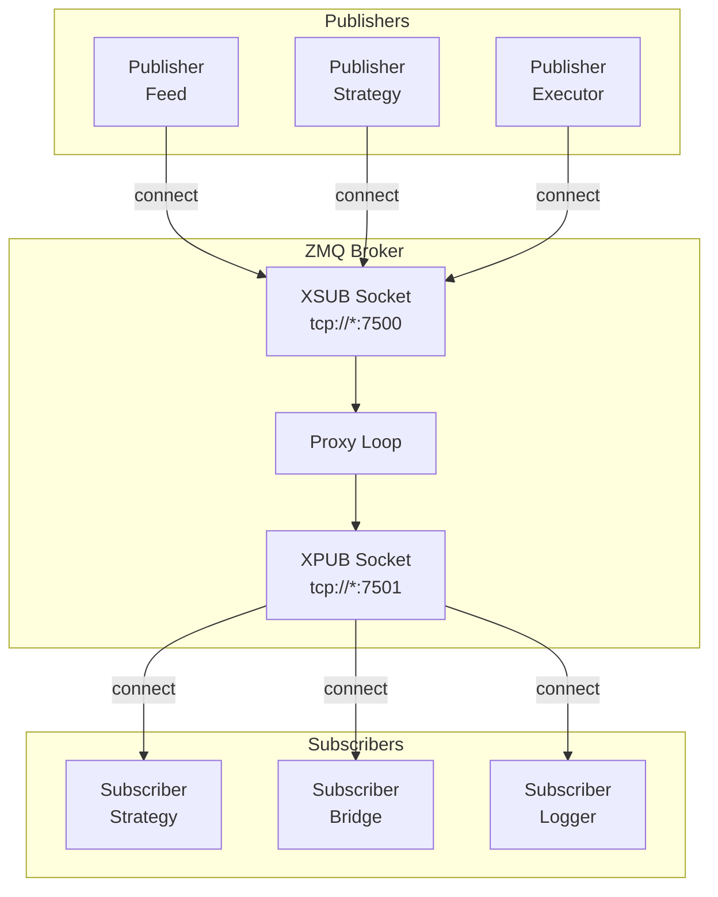
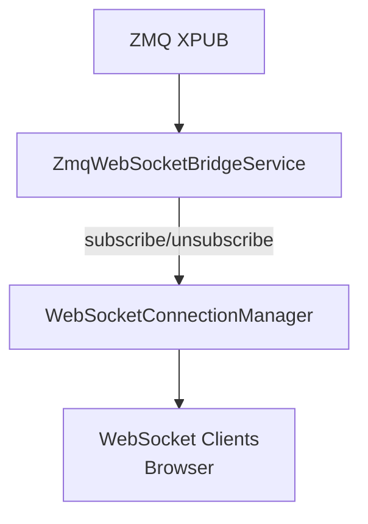

# Messaging (ZeroMQ)

Snapper uses ZeroMQ for inter-process communication in a pub/sub architecture.
The central component is an XPUB/XSUB broker that routes messages.

## Architecture



## XPUB/XSUB Broker

The broker is the central message hub:

- **XSUB** (tcp://*:7500) — Publishers connect here
- **XPUB** (tcp://*:7501) — Subscribers connect here

The broker forwards messages in both directions:

- Data: XSUB → XPUB
- Subscriptions: XPUB → XSUB

### Starting the Broker

```bash
snapper broker
```

Or programmatically:

```python
from snapper.messaging.infrastructure.broker import ZmqBrokerThread

broker = ZmqBrokerThread()
broker.start()
# ...
broker.stop()
```

## Topics

Topic format varies by category (see per-category tables below).

### Market Data

| Topic | Description |
| ----- | ----------- |
| `market.kraken.BTC-USD.candles.1h` | Hourly BTC/USD candles from Kraken |
| `market.kraken.BTC-USD.ticks` | BTC/USD ticks from Kraken |
| `market.polygon.AAPL.candles.1d` | Daily AAPL candles from Polygon |

### Signals

| Topic | Description |
| ----- | ----------- |
| `signals.paper.BTC-USD.rsi_btc_1h` | Paper trading signals |
| `signals.kraken.BTC-USD.live` | Live signals from Kraken |

### Orders & Executions

| Topic | Description |
| ----- | ----------- |
| `orders.commands.kraken.BTC-USD.submit` | Order requests for Kraken |
| `orders.events.kraken.BTC-USD.executed` | Order executions from Kraken |
| `orders.events.kraken.BTC-USD.submitted` | Order submitted events |
| `orders.events.kraken.BTC-USD.accepted` | Order accepted events |
| `orders.events.kraken.BTC-USD.rejected` | Order rejected events |
| `orders.events.kraken.BTC-USD.cancelled` | Order cancelled events |
| `orders.events.kraken.BTC-USD.expired` | Order expired events |
| `orders.events.kraken.BTC-USD.replaced` | Order replaced events |

### System

| Topic | Description |
| ----- | ----------- |
| `system.heartbeats.executor.{exchange}` | Executor heartbeat (e.g. `executor.kraken`) |
| `system.heartbeats.strategy.{name}` | Strategy heartbeat (e.g. `strategy.rsi_btc_1h`) |
| `system.heartbeats.feed.{exchange}` | Feed heartbeat (e.g. `feed.kraken`, `feed.paper.kraken`) |
| `system.settings` | Configuration change notifications |
| `system.symbol_aliases` | Symbol cache invalidation |
| `system.replay.start` | Data replay start |
| `system.replay.end` | Replay end |

Heartbeat `component` values use dot notation matching the topic path after
`system.heartbeats.`: `executor.kraken`, `strategy.rsi_btc_1h`, `feed.kraken`,
`feed.paper.kraken`.

## Message Data Classes

All messages use typed Data classes (Pydantic) from `snapper.messaging.schemas.data`.
Every Data class inherits from `StrictDataSchema` and carries:

| Field | Type | Description |
| ----- | ---- | ----------- |
| `public_id` | string | UUID7 external identifier, stable across REST and WS |
| `type` | string | Literal type discriminator |
| `timestamp` | datetime | Message creation time |
| `session_id` | string | UUID7 of the producer process session (empty for unstamped messages) |
| `sequence_id` | int | Monotonic counter per destination table within the session (0 for unstamped messages) |

`session_id` and `sequence_id` are stream-provenance fields stamped automatically by
`MessagePublisher`. Counters are keyed by destination DB table (not ZMQ topic), so all
messages landing in the same table share a gap-free sequence. Consumers can use these
fields to detect message loss and producer restarts.

The old `messaging.schemas.messages` module still exists but only contains `parse_message()` and `MessageParseError`.

### TickData

```python
from snapper.messaging.schemas.data import TickData

tick = TickData(
    instrument="BTC-USD",
    exchange="kraken",
    bid=41990.0,
    ask=42010.0,
    last=42000.0,
    volume=0.5,
    timestamp=datetime.now(UTC),
)
```

**Fields:**

| Field | Type | Description |
| ----- | ---- | ----------- |
| `type` | string | `"tick"` |
| `public_id` | string | UUID7 external identifier |
| `instrument` | string | Instrument symbol |
| `exchange` | string | Exchange name |
| `bid` | float \| None | Best bid price |
| `ask` | float \| None | Best ask price |
| `last` | float \| None | Last traded price |
| `volume` | float | Volume |
| `timestamp` | datetime | Timestamp |
| `session_id` | string | Producer session (inherited) |
| `sequence_id` | int | Per-table counter (inherited) |

### CandleData

```python
from snapper.messaging.schemas.data import CandleData

candle = CandleData(
    instrument="BTC-USD",
    exchange="kraken",
    timeframe="1h",
    open_at=datetime(2026, 1, 18, 12, 0, tzinfo=UTC),
    open=42000.0,
    high=42500.0,
    low=41800.0,
    close=42300.0,
    volume=1234.56,
    timestamp=datetime.now(UTC),
)
```

**Fields:**

| Field | Type | Description |
| ----- | ---- | ----------- |
| `type` | string | `"candle"` |
| `public_id` | string | UUID7 external identifier |
| `instrument` | string | Symbol |
| `exchange` | string | Exchange |
| `timeframe` | string | Timeframe (`1m`, `5m`, `1h`, etc.) |
| `open_at` | datetime | Exchange-provided candle interval start time |
| `open` | float | Open price |
| `high` | float | High |
| `low` | float | Low |
| `close` | float | Close price |
| `volume` | float | Volume |
| `vwap` | float \| null | Volume-weighted average price (optional) |
| `trades` | int \| null | Number of trades in the candle (optional) |
| `timestamp` | datetime | Timestamp |

### SignalData

```python
from snapper.messaging.schemas.data import SignalData

signal = SignalData(
    instrument="BTC-USD",
    exchange="paper",
    side="buy",
    strength=0.85,
    reason="RSI <= 30",
    strategy_name="rsi_btc_1h",
    price=42000.0,
    fired_at=datetime.now(UTC),
)
```

**Fields:**

| Field | Type | Description |
| ----- | ---- | ----------- |
| `type` | string | `"signal"` |
| `public_id` | string | UUID7 external identifier |
| `instrument` | string | Symbol |
| `exchange` | string | Target exchange |
| `side` | string | `"buy"` or `"sell"` |
| `strength` | float | Signal strength 0.0-1.0 |
| `reason` | string | Reason |
| `strategy_name` | string | Strategy name (required for paper exchange signals) |
| `price` | float | Price |
| `fired_at` | datetime | Domain time when signal was generated |
| `timestamp` | datetime | System timestamp |

Paper signals (`exchange == "paper"`) require `strategy_name` to be set. The schema
enforces this invariant at construction time so invalid paper signals cannot be created.

### OrderRequestData

```python
from snapper.messaging.schemas.data import OrderRequestData

order = OrderRequestData(
    instrument="BTC-USD",
    exchange="kraken",
    client_order_id="ord_123",
    side="buy",
    order_type="limit",
    price=42000.0,
    quantity=0.1,
    strategy_id="rsi_btc_1h",
    mode="live",
)
```

### ExecutionData

```python
from snapper.messaging.schemas.data import ExecutionData

execution = ExecutionData(
    instrument="BTC-USD",
    exchange="kraken",
    client_order_id="ord_123",
    exchange_order_id="KRAKEN-456",
    side="buy",
    price=42000.0,
    size=0.1,
    fee=0.001,
    fee_asset="USD",
    status="filled",
)
```

### OrderData

```python
from snapper.messaging.schemas.data import OrderData

order_status = OrderData(
    instrument="BTC-USD",
    exchange="kraken",
    client_order_id="ord_123",
    exchange_order_id="KRAKEN-456",
    side="buy",
    order_type="limit",
    size=0.1,
    filled_size=0.0,
    status="accepted",
    price=42000.0,
)
```

### HeartbeatData

```python
from snapper.messaging.schemas.data import HeartbeatData

heartbeat = HeartbeatData(
    session_id="019e1a2b-0000-7000-8000-000000000001",
    sequence_id=1,
    component="zmq_broker",
    status="healthy",
    sequence=1,
    lag_ms=5,
)
```

## Publisher

### MessagePublisher (recommended)

`MessagePublisher` stamps `session_id` and `sequence_id` on each outgoing message and
derives the ZMQ topic automatically from the message type. It wraps a `ValidatedPublisher`
and a `SequenceTracker`.

```python
import zmq.asyncio
from snapper.messaging.infrastructure.validated_socket import ValidatedPublisher, apply_hwm, HWM_MARKET_DATA
from snapper.messaging.infrastructure.publisher import MessagePublisher, SequenceTracker

ctx = zmq.asyncio.Context()
raw_socket = ctx.socket(zmq.PUB)
apply_hwm(raw_socket, sndhwm=HWM_MARKET_DATA)
raw_socket.connect("tcp://127.0.0.1:7500")

tracker = SequenceTracker()
publisher = MessagePublisher(ValidatedPublisher(raw_socket), tracker)

await publisher.publish(candle_data)
publisher.close()
```

One `SequenceTracker` per component process; all `MessagePublisher` instances within that
component share it. Counters survive socket reconnects — only a full component restart
creates a new session.

#### Per-Topic Counters

`SequenceTracker` maintains monotonic counters keyed by **ZMQ topic** (e.g.
`market.kraken.BTC-USD.candles.1m`, `orders.events.kraken.BTC-USD.executed`).
Each topic has its own independent counter. `MessagePublisher.publish()` derives
the topic via `topic_for_message(data)` and uses it as the counter key
automatically.

For DB-only writes that do not flow over ZMQ (instruments, users, settings seed
data), the counter key is the destination table name as a logical identifier.

For WS control and REST middleware paths, logical channel names are used:
`server.control`, `server.telemetry`, `rest.control`, `rest.telemetry`.

For paper market data or other cases where the topic cannot be derived from the
payload alone, pass an explicit `topic` override:

```python
await publisher.publish(tick_data, topic="market.paper.kraken.BTC-USD.ticks")
```

### ValidatedPublisher (low-level)

Direct access to the socket wrapper without provenance stamping:

```python
import zmq.asyncio
from snapper.messaging.infrastructure.validated_socket import ValidatedPublisher, apply_hwm, HWM_MARKET_DATA

ctx = zmq.asyncio.Context()
raw_socket = ctx.socket(zmq.PUB)
apply_hwm(raw_socket, sndhwm=HWM_MARKET_DATA)
raw_socket.connect("tcp://127.0.0.1:7500")
publisher = ValidatedPublisher(raw_socket)

topic = "market.kraken.BTC-USD.candles.1h"
payload = candle_data.to_json().encode()
await publisher.send_multipart(topic, payload)
publisher.close()
```

## Subscriber

Subscribing to messages via validated socket wrapper around a raw ZMQ SUB socket:

```python
import zmq.asyncio
from snapper.messaging.infrastructure.validated_socket import ValidatedSubscriber, apply_hwm, HWM_MARKET_DATA
from snapper.messaging.schemas.messages import parse_message

ctx = zmq.asyncio.Context()
raw_socket = ctx.socket(zmq.SUB)
apply_hwm(raw_socket, rcvhwm=HWM_MARKET_DATA)
raw_socket.connect("tcp://127.0.0.1:7501")  # broker XPUB
subscriber = ValidatedSubscriber(raw_socket)
subscriber.subscribe("market.kraken.BTC-USD.")

while True:
    topic, payload = await subscriber.recv_multipart()
    envelope = parse_message(payload.decode())
    print(f"Received {envelope.type} on {topic}")
```

## Market Data Publisher

Built-in publisher for exchange data:

```bash
snapper feed --symbols "BTC-USD,ETH-USD"
```

Programmatically:

```python
from snapper.messaging.publishers.kraken import KrakenMarketDataPublisher

async def run_feed():
    publisher = KrakenMarketDataPublisher(symbols=["BTC-USD", "ETH-USD"])
    await publisher.start()
```

## Order Executor

Service executing orders:

```bash
snapper executor -e kraken
```

Executor:

1.  Subscribes to `orders.commands.{exchange}.*` topics
2.  Receives OrderRequestData
3.  Executes order via exchange API
4.  Publishes ExecutionData or OrderData

## ZMQ-WebSocket Bridge

Bridge between ZMQ and WebSocket for frontend:



Bridge automatically:

- Subscribes to ZMQ topics when WebSocket client subscribes
- Validates each inbound ZMQ message as JSON and runs `GapDetector.check()` before forwarding
- Drops messages with malformed JSON (logged as `WARNING`; counted in `invalid_messages` per topic)
- Forwards messages via `_forward_to_clients` with per-subscription backpressure
- Throttles market data per subscriber (configurable `throttle_ms`)
- Drops market data when a client exceeds `MAX_PENDING_MESSAGES_MARKET` (100)
- Disconnects slow clients on trade topics when exceeding `MAX_PENDING_MESSAGES_TRADE` (1000)
- Unsubscribes when last client disconnects
- Records control events (subscribe errors, client disconnects) to the `control` table

## Gap Detection

`GapDetector` tracks `session_id` and `sequence_id` per received ZMQ topic and emits log
messages when it finds sequence gaps or producer session resets.

```python
from snapper.messaging.infrastructure.gap_detector import GapDetector

detector = GapDetector()
detector.check(received_topic, session_id, sequence_id)
```

Rules:

- Messages without provenance (`session_id == ""` or `sequence_id == 0`) are **rejected**
  with a `WARNING` log and a `rejected_unstamped` counter increment. This makes unstamped
  traffic observable rather than silently passing through.
- First message on a topic: sets baseline. If `sequence_id > 1` the subscriber joined
  mid-stream (logged `INFO`).
- Same topic, new `session_id`: producer restarted (logged `INFO`, counter resets).
- In-order message (`sequence_id == expected`): accepted silently.
- Gap (`sequence_id > expected`): logs `WARNING` with the missing range, then advances.
- Duplicate / reorder (`sequence_id < expected`): logs `DEBUG`, state unchanged.

`GapDetector.check()` returns `True` when the message carries valid provenance and was
processed, `False` when rejected as unstamped.

`GapDetector` is wired into the ZMQ-WebSocket bridge and into subscriber loops inside the
executor, trader coordinator, and strategy `_listen_loop()`.

## Message Logger

Debug tool for monitoring ZMQ traffic:

```bash
snapper zmq-logger --payload --audit-file logs/zmq.jsonl
```

Logs all messages passing through the broker.

## Configuration

Endpoints in `.env`:

```bash
ZMQ_BROKER_XSUB=tcp://127.0.0.1:7500
ZMQ_BROKER_XPUB=tcp://127.0.0.1:7501
```

## Throttling

TopicSchema defines throttling per topic:

```python
TopicSchema(
    name="market",
    pattern="market.",
    throttle_ms=100,  # Max 10 msg/s
    ...
)
```

## Message Validation

ValidatedPublisher and ValidatedSubscriber validate **topic strings**, not
message payloads.  `ValidatedPublisher.send_multipart()` calls
`validate_topic()` before sending; `ValidatedSubscriber.subscribe()` calls
`validate_subscription_pattern()` before subscribing.  Both raise
`TopicValidationError` on invalid topics.

## High Water Mark (HWM) Policy

ZMQ sockets use explicit high water marks via `apply_hwm()` from
`validated_socket.py` to bound queue depth and prevent silent message loss:

| Tier | Constant | Value | Used by |
| ---- | -------- | ----- | ------- |
| Order flow | `HWM_ORDER_FLOW` | 0 (unlimited) | Executor, trader coordinator |
| Broker | `HWM_BROKER` | 10 000 | XSUB (rcvhwm), XPUB (sndhwm) |
| Market data | `HWM_MARKET_DATA` | 5 000 | Publishers, strategies, bridge, settings, symbol updaters |
| Audit | `HWM_AUDIT` | 10 000 | Message logger |

`apply_hwm()` must be called **before** `connect()` or `bind()`.

## Retry and Resilience

Sockets automatically:

- Reconnect on connection loss
- Buffer messages when broker unavailable
- LINGER=0 on close (discard pending)
- HWM applied before connect/bind (see above)

## Topic Derivation

`topic_for_message()` in `snapper.messaging.topics.builders` derives the canonical ZMQ
topic from a typed Data class. `MessagePublisher.publish()` calls it automatically.

```python
from snapper.messaging.topics.builders import topic_for_message

topic = topic_for_message(candle_data)
```

Paper market data topics include a `source_exchange` segment that is not carried in the
payload, so they must always be published with an explicit topic override.

## WebSocket Message Provenance

All WebSocket protocol messages (authentication, subscription management, ping/pong,
errors) inherit directly from `StrictDataSchema`, so they carry the same provenance
fields as ZMQ data payloads: `public_id`, `session_id`, `sequence_id`, and `timestamp`.
Every payload item in the system — whether it flows over ZMQ, REST, or WebSocket — has
a uniform provenance envelope.

## Audit Tables: Control and Telemetry

Two destination tables provide always-available observability for non-domain traffic:

- **control** — Always-on audit for commands, authentication events, subscribe/unsubscribe
  messages, and REST mutation requests. Recording is wired in three places:
  - **WS handlers** — `_record_ws_control()` records auth, subscribe, unsubscribe,
    and error events with `transport="ws"`. Client causation linkage is extracted
    from inbound messages via `_extract_client_provenance()` and stored as
    `client_session_id` and `client_public_id` on the control row.
  - **REST middleware** — `ClientProvenanceMiddleware._record_control()` records
    every mutation (POST) with `transport="rest"`, redacted payload,
    outcome (`ok`/`error`/`exception`), and server-side provenance.
  - **ZMQ bridge** — `_record_bridge_control()` records subscribe errors and
    client disconnects with `transport="zmq"`.

  All control writes use a `finally` block so the record is persisted regardless of
  whether the request succeeded or failed. The write is non-blocking: any DB failure
  is logged and swallowed so the response already sent to the client is never
  invalidated.

- **telemetry** — Toggleable high-volume table for pings, heartbeats, pongs, and
  GET read requests. Recording is gated by the `TELEMETRY_RECORDING_ENABLED`
  environment variable (default `false`). When disabled, `SequenceTracker` counters
  still increment — only the DB write is skipped. Recording is wired in:
  - **WS handlers** — `_record_ws_telemetry()` records ping/pong/heartbeat events
  - **REST middleware** — `_record_telemetry()` records GET reads (health, status,
    entity endpoints)

The non-blocking audit invariant applies to both tables: audit writes never reject,
delay, or invalidate the primary request/message flow.

## Best Practices

1. **One broker per system** — All components connect to the same broker
2. **Topic hierarchy** — Use hierarchy for filtering (`market.kraken.*`)
3. **Data types** — Always use typed Data classes from `messaging.schemas.data`
4. **Provenance** — Use `MessagePublisher` (not `ValidatedPublisher` directly) so every
   message carries `session_id` and `sequence_id` for gap detection
5. **One `SequenceTracker` per component** — Create it once at `start()` and share across
   all publisher instances; restart creates a new session
6. **Heartbeats** — Keep component-specific heartbeat cadences small and regular
7. **Graceful shutdown** — Close sockets with LINGER=0
