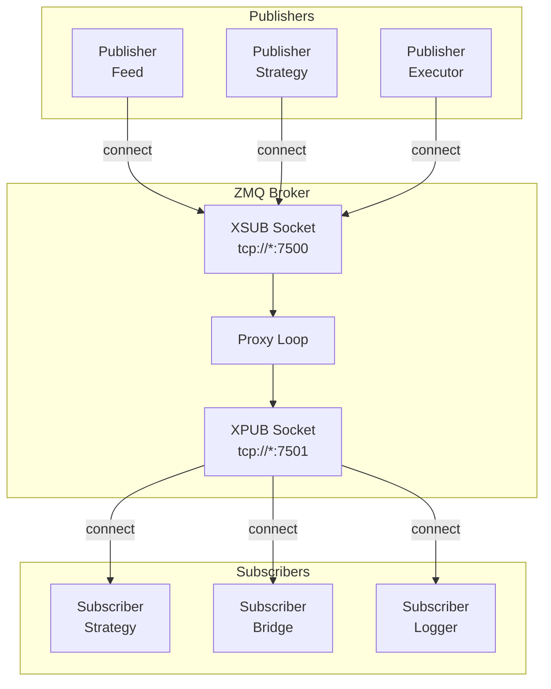
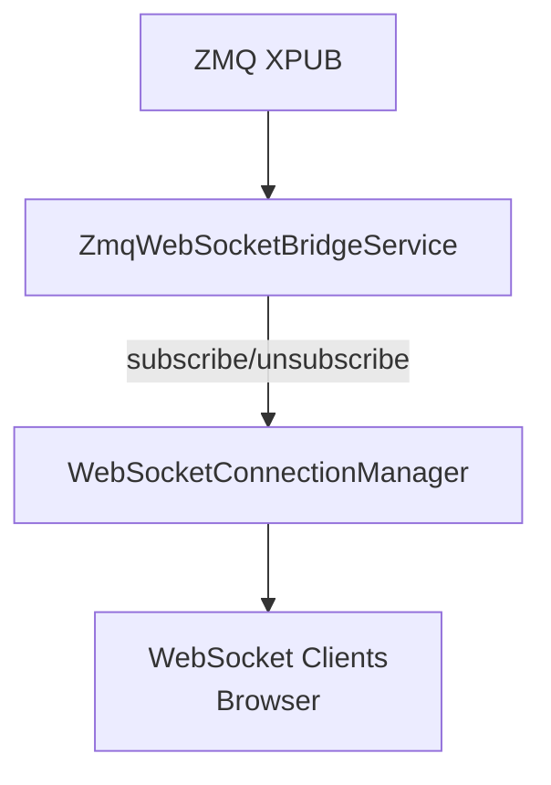

# Messaging (ZeroMQ)

Snapper uses ZeroMQ for inter-process communication in a pub/sub architecture.
The central component is an XPUB/XSUB broker that routes messages.

## Architecture



## XPUB/XSUB Broker

The broker is the central message hub:

- **XSUB** (tcp://*:7500) — Publishers connect here
- **XPUB** (tcp://*:7501) — Subscribers connect here

The broker forwards messages in both directions:

- Data: XSUB → XPUB
- Subscriptions: XPUB → XSUB

### Starting the Broker

```bash
snapper broker
```

Or programmatically:

```python
from snapper.messaging.infrastructure.broker import ZmqBrokerThread

broker = ZmqBrokerThread()
broker.start()
# ...
broker.stop()
```

## Topics

Topic format: `{category}.{exchange}.{instrument}.{type}.{timeframe}`

### Market Data

| Topic | Description |
| ----- | ----------- |
| `market.kraken.BTC-USD.candles.1h` | Hourly BTC/USD candles from Kraken |
| `market.kraken.BTC-USD.ticks` | BTC/USD ticks from Kraken |
| `market.polygon.AAPL.candles.1d` | Daily AAPL candles from Polygon |

### Signals

| Topic | Description |
| ----- | ----------- |
| `signals.paper.BTC-USD.rsi_btc_1h` | Paper trading signals |
| `signals.kraken.BTC-USD.live` | Live signals from Kraken |

### Orders & Executions

| Topic | Description |
| ----- | ----------- |
| `orders.commands.kraken.BTC-USD.submit` | Order requests for Kraken |
| `orders.events.kraken.BTC-USD.executed` | Order executions from Kraken |
| `orders.events.kraken.BTC-USD.submitted` | Order submitted events |
| `orders.events.kraken.BTC-USD.accepted` | Order accepted events |
| `orders.events.kraken.BTC-USD.rejected` | Order rejected events |
| `orders.events.kraken.BTC-USD.cancelled` | Order cancelled events |
| `orders.events.kraken.BTC-USD.expired` | Order expired events |
| `orders.events.kraken.BTC-USD.replaced` | Order replaced events |

### System

| Topic | Description |
| ----- | ----------- |
| `system.heartbeat` | Component heartbeats |
| `system.settings.changed` | Configuration changes |
| `replay.start` | Data replay start |
| `replay.end` | Replay end |

## Message Data Classes

All messages use typed Data classes (Pydantic) from `snapper.messaging.schemas.data`.
Every Data class carries `public_id: str` (UUID7), `type: Literal[...]`, and `timestamp: datetime`.

The old `messaging.schemas.messages` module still exists but only contains `parse_message()` and `MessageParseError`.

### TickData

```python
from snapper.messaging.schemas.data import TickData

tick = TickData(
    instrument="BTC-USD",
    exchange="kraken",
    bid=41990.0,
    ask=42010.0,
    last=42000.0,
    volume=0.5,
    timestamp=datetime.now(UTC),
)
```

**Fields:**

| Field | Type | Description |
| ----- | ---- | ----------- |
| `type` | string | `"tick"` |
| `public_id` | string | UUID7 external identifier |
| `instrument` | string | Instrument symbol |
| `exchange` | string | Exchange name |
| `bid` | float \| None | Best bid price |
| `ask` | float \| None | Best ask price |
| `last` | float \| None | Last traded price |
| `volume` | float | Volume |
| `timestamp` | datetime | Timestamp |

### CandleData

```python
from snapper.messaging.schemas.data import CandleData

candle = CandleData(
    instrument="BTC-USD",
    exchange="kraken",
    timeframe="1h",
    open=42000.0,
    high=42500.0,
    low=41800.0,
    close=42300.0,
    volume=1234.56,
    timestamp=datetime.now(UTC),
)
```

**Fields:**

| Field | Type | Description |
| ----- | ---- | ----------- |
| `type` | string | `"candle"` |
| `public_id` | string | UUID7 external identifier |
| `instrument` | string | Symbol |
| `exchange` | string | Exchange |
| `timeframe` | string | Timeframe (`1m`, `5m`, `1h`, etc.) |
| `open` | float | Open price |
| `high` | float | High |
| `low` | float | Low |
| `close` | float | Close price |
| `volume` | float | Volume |
| `timestamp` | datetime | Timestamp |

### SignalData

```python
from snapper.messaging.schemas.data import SignalData

signal = SignalData(
    instrument="BTC-USD",
    exchange="paper",
    side="buy",
    strength=0.85,
    reason="RSI <= 30",
    strategy_name="rsi_btc_1h",
    price=42000.0,
    fired_at=datetime.now(UTC),
)
```

**Fields:**

| Field | Type | Description |
| ----- | ---- | ----------- |
| `type` | string | `"signal"` |
| `public_id` | string | UUID7 external identifier |
| `instrument` | string | Symbol |
| `exchange` | string | Target exchange |
| `side` | string | `"buy"` or `"sell"` |
| `strength` | float | Signal strength 0.0-1.0 |
| `reason` | string | Reason |
| `strategy_name` | string | Strategy name |
| `price` | float | Price |
| `fired_at` | datetime | Domain time when signal was generated |
| `timestamp` | datetime | System timestamp |

### OrderRequestData

```python
from snapper.messaging.schemas.data import OrderRequestData

order = OrderRequestData(
    instrument="BTC-USD",
    exchange="kraken",
    client_order_id="ord_123",
    side="buy",
    order_type="limit",
    price=42000.0,
    quantity=0.1,
)
```

### ExecutionData

```python
from snapper.messaging.schemas.data import ExecutionData

execution = ExecutionData(
    instrument="BTC-USD",
    exchange="kraken",
    client_order_id="ord_123",
    exchange_order_id="KRAKEN-456",
    side="buy",
    price=42000.0,
    size=0.1,
    fee=0.001,
    fee_asset="USD",
    status="filled",
)
```

### OrderData

```python
from snapper.messaging.schemas.data import OrderData

order_status = OrderData(
    instrument="BTC-USD",
    exchange="kraken",
    client_order_id="ord_123",
    exchange_order_id="KRAKEN-456",
    side="buy",
    order_type="limit",
    size=0.1,
    filled_size=0.0,
    status="accepted",
    price=42000.0,
)
```

### HeartbeatData

```python
from snapper.messaging.schemas.data import HeartbeatData

heartbeat = HeartbeatData(
    component="zmq_broker",
    status="healthy",
)
```

## Publisher

Publishing messages via validated socket:

```python
from snapper.messaging.infrastructure.validated_socket import ValidatedPublisher
from snapper.messaging.schemas.data import CandleData

async def publish_bars():
    publisher = ValidatedPublisher()
    await publisher.connect()

    topic = "market.kraken.BTC-USD.candles.1h"
    candle = CandleData(
        instrument="BTC-USD",
        exchange="kraken",
        timeframe="1h",
        open=42000.0,
        high=42500.0,
        low=41800.0,
        close=42300.0,
        volume=1234.56,
    )

    await publisher.publish(topic, candle)
    await publisher.close()
```

## Subscriber

Subscribing to messages:

```python
from snapper.messaging.infrastructure.validated_socket import ValidatedSubscriber
from snapper.messaging.schemas.messages import parse_message

async def subscribe_to_market():
    subscriber = ValidatedSubscriber()
    await subscriber.connect()
    await subscriber.subscribe("market.kraken.BTC-USD.")

    while True:
        topic, message = await subscriber.receive()
        envelope = parse_message(message)
        print(f"Received {envelope.type} on {topic}")
```

## Market Data Publisher

Built-in publisher for exchange data:

```bash
snapper feed --symbols "BTC/USD,ETH/USD"
```

Programmatically:

```python
from snapper.messaging.publishers.kraken import KrakenMarketDataPublisher

async def run_feed():
    publisher = KrakenMarketDataPublisher(symbols=["BTC/USD", "ETH/USD"])
    await publisher.start()
```

## Order Executor

Service executing orders:

```bash
snapper executor -e kraken
```

Executor:

1.  Subscribes to `orders.{exchange}.*` topics
2.  Receives OrderRequestData
3.  Executes order via exchange API
4.  Publishes ExecutionData or OrderData

## ZMQ-WebSocket Bridge

Bridge between ZMQ and WebSocket for frontend:



Bridge automatically:

- Subscribes to ZMQ topics when WebSocket client subscribes
- Forwards messages to WebSocket clients
- Unsubscribes when last client disconnects

## Message Logger

Debug tool for monitoring ZMQ traffic:

```bash
snapper zmq-logger --payload --audit-file logs/zmq.jsonl
```

Logs all messages passing through the broker.

## Configuration

Endpoints in `.env`:

```bash
ZMQ_BROKER_XSUB=tcp://127.0.0.1:7500
ZMQ_BROKER_XPUB=tcp://127.0.0.1:7501
```

## Throttling

TopicSchema defines throttling per topic:

```python
TopicSchema(
    name="market",
    pattern="market.",
    throttle_ms=100,  # Max 10 msg/s
    ...
)
```

## Message Validation

ValidatedPublisher/Subscriber validate schemas:

```python
from snapper.messaging.topics.schemas import validate_message_schema

is_valid = validate_message_schema("market.kraken.BTC-USD.candles.1h", message)
```

## Retry and Resilience

Sockets automatically:

- Reconnect on connection loss
- Buffer messages when broker unavailable
- LINGER=0 on close (discard pending)

## Best Practices

1.  **One broker per system** — All components connect to the same broker
2.  **Topic hierarchy** — Use hierarchy for filtering (`market.kraken.*`)
3.  **Data types** — Always use typed Data classes from `messaging.schemas.data`
4.  **Heartbeats** — Send heartbeats every 30s from components
5.  **Graceful shutdown** — Close sockets with LINGER=0
