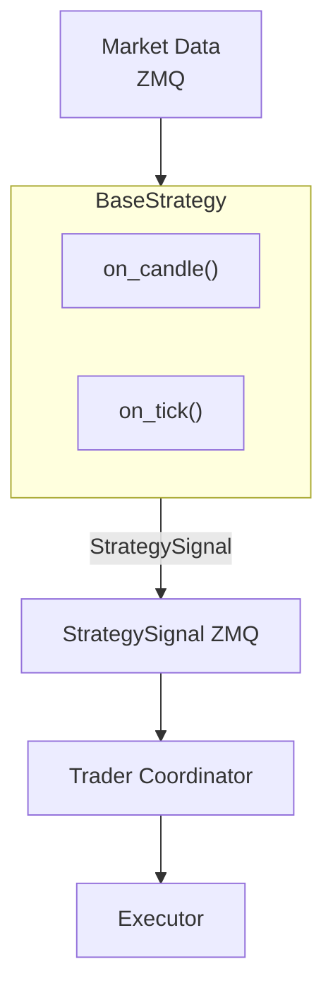
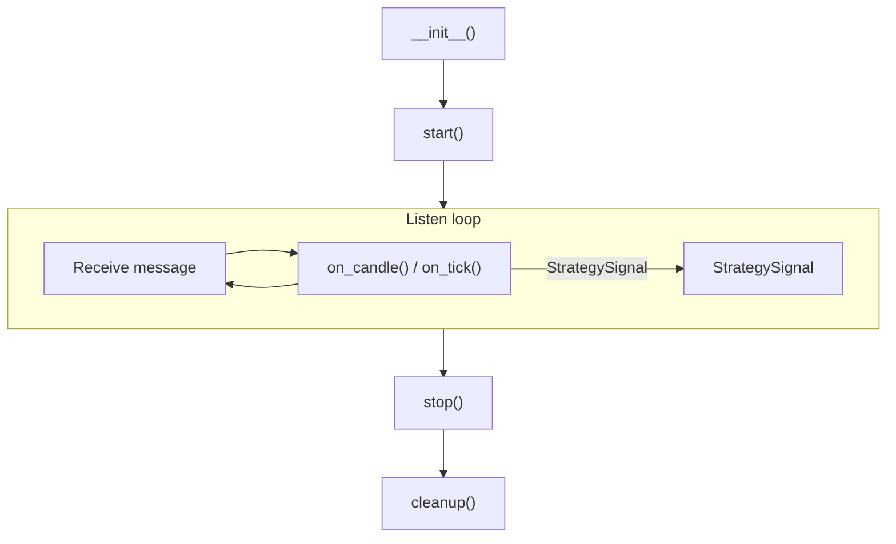

# Trading Strategies

Snapper provides a framework for creating trading strategies based on
ZeroMQ messaging. Strategies subscribe to market data and publish signals.

## Strategy Architecture



## Creating Strategies

### Basic Structure

```python
from snapper.strategies.base import BaseStrategy, StrategySignal, StrategyConfig
from snapper.strategies.decorators import register_strategy, create_strategy_process
from snapper.messaging.schemas.data import CandleData


@register_strategy("MyStrategy")
@create_strategy_process(
    process_name="my_strategy_btc",
    default_config={
        "name": "my_strategy_btc",
        "inputs": ["market.kraken.BTC-USD.candles.1h"],
        "outputs": ["BTC-USD"],
        "exchange": "paper",
        "params": {
            "threshold": 0.5,
            "period": 14,
        },
    },
)
class MyStrategy(BaseStrategy):
    """Strategy description in docstring."""

    def __init__(self, config: StrategyConfig) -> None:
        """Initialize strategy."""
        super().__init__(config)
        self.threshold = self.params.get("threshold", 0.5)
        self.period = self.params.get("period", 14)

    async def on_candle(self, instrument: str, candle: CandleData) -> StrategySignal | None:
        """Process candle and generate signal."""
        candles = self.candle_buffer.get(instrument, [])
        if len(candles) < self.period:
            return None

        closes = [c.close for c in candles]
        current_price = closes[-1]

        if self._should_buy(closes):
            return StrategySignal(
                instrument=instrument,
                side="buy",
                strength=1.0,
                price=current_price,
                reason="Buy condition met",
            )

        if self._should_sell(closes):
            return StrategySignal(
                instrument=instrument,
                side="sell",
                strength=1.0,
                price=current_price,
                reason="Sell condition met",
            )

        return None

    def _should_buy(self, closes: list[float]) -> bool:
        """Buy condition logic."""
        return False

    def _should_sell(self, closes: list[float]) -> bool:
        """Sell condition logic."""
        return False

    async def reset(self) -> None:
        """Reset strategy state (for replay)."""
        pass
```

## Decorators

### `@register_strategy(name)`

Registers strategy class in factory under given name.

```python
@register_strategy("RSIReversion")
class RSIReversion(BaseStrategy):
    ...
```

### `@create_strategy_process(process_name, default_config)`

Creates process wrapper for strategy and registers in process manager.

```python
@create_strategy_process(
    process_name="strategy_rsi_eth",
    default_config={
        "name": "rsi_eth_1h",
        "inputs": ["market.kraken.ETH-USD.candles.1h"],
        "outputs": ["ETH-USD"],
        "exchange": "paper",
        "params": {"period": 14, "upper": 70, "lower": 30},
    },
)
class RSIReversion(BaseStrategy):
    ...
```

## Strategy Configuration

### StrategyConfig

| Field | Type | Description |
| ----- | ---- | ----------- |
| `name` | string | Unique strategy instance name |
| `strategy_class` | string | Strategy class name |
| `inputs` | list[str] | List of ZMQ topics to subscribe |
| `outputs` | list[str] | List of instruments for signals |
| `exchange` | string | Target exchange (`paper`, `kraken`, `zonda`, `walutomat`) |
| `params` | dict | Strategy-specific parameters |

### Input Topics

Format: `market.{exchange}.{instrument}.{type}.{timeframe}`

Examples:

- `market.kraken.BTC-USD.candles.1h` — Hourly BTC/USD candles from Kraken
- `market.kraken.ETH-USD.candles.15m` — 15-minute ETH/USD candles
- `market.polygon.AAPL.candles.1d` — Daily AAPL candles from Polygon

### Output Topics (Signals)

Generated automatically:

- Paper: `signals.paper.{instrument}.{strategy_name}`
- Live: `signals.{exchange}.{instrument}.live`

## StrategySignal Structure

```python
@dataclass
class StrategySignal:
    """Trading signal."""

    instrument: str
    side: TradeSide
    strength: float
    reason: str
    price: float
    timestamp: datetime | None
```

## Built-in Strategies

### RSIReversion

Mean-reversion strategy based on RSI.

**Parameters:**

| Parameter | Default | Description |
| --------- | ------- | ----------- |
| `period` | 14 | RSI period |
| `upper` | 70.0 | Overbought threshold (sell) |
| `lower` | 30.0 | Oversold threshold (buy) |
| `cooldown` | 2 | Candles between signals |

**Logic:**

- Buy when RSI <= lower
- Sell when RSI >= upper

```python
from snapper.strategies.rsi import RSIReversion
```

### MACDCrossover

Trend-following strategy based on MACD.

**Parameters:**

| Parameter | Default | Description |
| --------- | ------- | ----------- |
| `fast` | 12 | Fast EMA |
| `slow` | 26 | Slow EMA |
| `signal_period` | 9 | StrategySignal line period |

**Logic:**

- Buy when MACD histogram crosses from negative to positive
- Sell when histogram crosses from positive to negative

```python
from snapper.strategies.macd import MACDCrossover
```

### Cointegration

Pairs trading strategy based on cointegration.

```python
from snapper.strategies.cointegration import CointegrationPairs
```

## Data Access

### Candle Buffer

```python
async def on_candle(self, instrument: str, candle: CandleData) -> StrategySignal | None:
    candles = self.candle_buffer.get(instrument, [])

    recent = candles[-20:]

    import pandas as pd
    closes = pd.Series([c.close for c in candles])
```

### CandleData

```python
from snapper.messaging.schemas.data import CandleData
```

**Fields:**

| Field | Type | Description |
| ----- | ---- | ----------- |
| `type` | string | `"candle"` |
| `public_id` | string | UUID7 external identifier |
| `open` | float | Open price |
| `high` | float | High |
| `low` | float | Low |
| `close` | float | Close price |
| `volume` | float | Volume |
| `timestamp` | datetime | Timestamp |
| `timeframe` | string | Timeframe |
| `instrument` | string | Symbol |
| `exchange` | string | Exchange |

## Technical Indicators

### RSI

```python
from snapper.indicators.rsi import rsi
import pandas as pd

closes = pd.Series([c.close for c in candles])
rsi_values = rsi(closes, period=14)
current_rsi = rsi_values.iloc[-1]
```

### MACD

```python
from snapper.indicators.ta_lib_adapter import macd

macd_line, signal_line, histogram = macd(closes, fast=12, slow=26, signal=9)
```

### TA-Lib (via adapter)

```python
from snapper.indicators.ta_lib_adapter import rsi, macd
```

## Configuration Validation

Framework automatically validates:

1.  **Strategy name** — cannot be empty
2.  **Inputs** — at least one required
3.  **Outputs** — at least one instrument must be defined
4.  **Exchange** — must be one of: `paper`, `kraken`, `zonda`, `walutomat`
5.  **Instruments** — must be available on selected exchange
6.  **Paper/live mixing** — mixing paper inputs with live exchange not allowed

## Strategy Lifecycle



## Running Strategies

### Via Process Manager (recommended)

Strategies are automatically managed by the server:

```bash
snapper server
```

Strategies can be enabled/disabled in the dashboard.

### Standalone (for testing)

```python
import asyncio
from snapper.strategies.factory import StrategyFactory
from snapper.strategies.base import StrategyConfig

config = StrategyConfig(
    name="test_rsi",
    strategy_class="RSIReversion",
    inputs=["market.kraken.BTC-USD.candles.1h"],
    outputs=["BTC-USD"],
    exchange="paper",
    params={"period": 14, "upper": 70, "lower": 30},
)

factory = StrategyFactory()
strategy = factory.create_strategy(config)

async def main():
    await strategy.start()

asyncio.run(main())
```

## Testing Strategies

### Unit Tests

```python
import pytest
from snapper.strategies.rsi import RSIReversion
from snapper.strategies.base import StrategyConfig
from snapper.messaging.schemas.data import CandleData


@pytest.fixture
def rsi_strategy() -> RSIReversion:
    config = StrategyConfig(
        name="test_rsi",
        strategy_class="RSIReversion",
        inputs=["market.kraken.BTC-USD.candles.1h"],
        outputs=["BTC-USD"],
        exchange="paper",
        params={"period": 14, "upper": 70, "lower": 30},
    )
    return RSIReversion(config)


async def test_buy_signal_on_low_rsi(rsi_strategy: RSIReversion) -> None:
    # Prepare data with low RSI
    ...
    signal = await rsi_strategy.on_candle("BTC-USD", candle)
    assert signal is not None
    assert signal.side == "buy"
```

### Backtesting

Use replay data from paper topics:

```python
default_config={
    "inputs": ["replay.BTC-USD.candles.1h"],
    "exchange": "paper",
    ...
}
```
