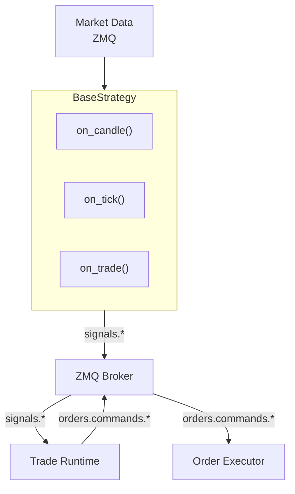
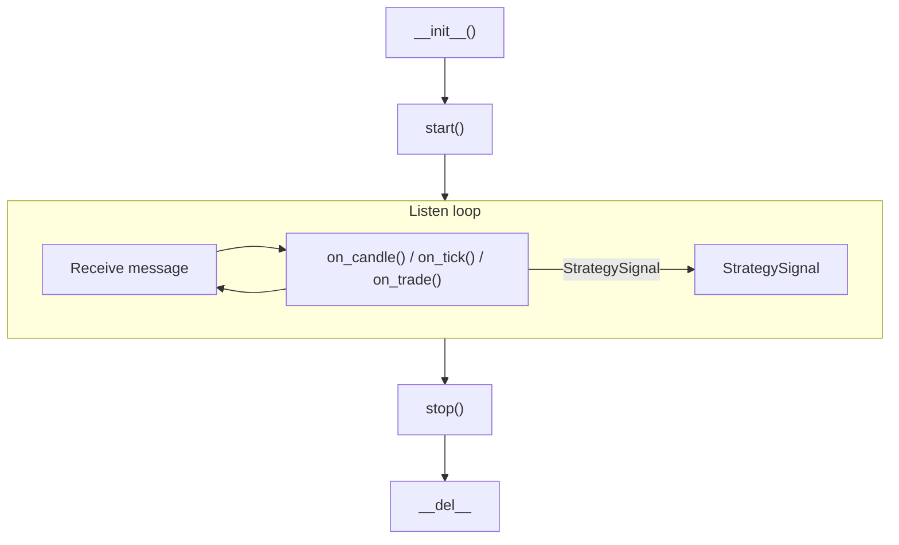

# Trading Strategies

Snapper provides a framework for creating trading strategies based on
ZeroMQ messaging. Strategies subscribe to market data and publish signals.
Strategies produce intent only; the trade runtime owns order lifecycle,
positions, and balance projections.

## Strategy Architecture



## Creating Strategies

### Basic Structure

```python
from snapper.strategies.base import BaseStrategy, StrategySignal, StrategyConfig
from snapper.strategies.decorators import register_strategy, create_strategy_process
from snapper.messaging.schemas.data import CandleData


@register_strategy("MyStrategy")
@create_strategy_process(
    process_name="my_strategy_btc",
    default_config={
        "name": "my_strategy_btc",
        "inputs": ["market.kraken.BTC-USD.candles.1h"],
        "outputs": ["BTC-USD"],
        "exchange": "paper",
        "params": {
            "threshold": 0.5,
            "period": 14,
        },
    },
)
class MyStrategy(BaseStrategy):
    """Strategy description in docstring."""

    def __init__(self, config: StrategyConfig) -> None:
        """Initialize strategy."""
        super().__init__(config)
        self.threshold = self.params.get("threshold", 0.5)
        self.period = self.params.get("period", 14)

    async def on_candle(self, instrument: str, candle: CandleData) -> StrategySignal | None:
        """Process candle and generate signal."""
        candles = self.candle_buffer.get(instrument, [])
        if len(candles) < self.period:
            return None

        closes = [c.close for c in candles]
        current_price = closes[-1]

        if self._should_buy(closes):
            return StrategySignal(
                instrument=instrument,
                side="buy",
                strength=1.0,
                price=current_price,
                reason="Buy condition met",
            )

        if self._should_sell(closes):
            return StrategySignal(
                instrument=instrument,
                side="sell",
                strength=1.0,
                price=current_price,
                reason="Sell condition met",
            )

        return None

    def _should_buy(self, closes: list[float]) -> bool:
        """Buy condition logic."""
        return False

    def _should_sell(self, closes: list[float]) -> bool:
        """Sell condition logic."""
        return False

    async def reset(self) -> None:
        """Reset strategy state (for replay)."""
        pass
```

## Decorators

### `@register_strategy(name)`

Registers strategy class in factory under given name.

```python
@register_strategy("RSIReversion")
class RSIReversion(BaseStrategy):
    ...
```

### `@create_strategy_process(process_name, default_config)`

Creates process wrapper for strategy and registers in process manager.

```python
@create_strategy_process(
    process_name="strategy_rsi_eth_1h",
    default_config={
        "name": "rsi_eth_1h",
        "inputs": ["market.kraken.ETH-USD.candles.1h"],
        "outputs": ["ETH-USD"],
        "exchange": "paper",
        "params": {"period": 14, "upper": 70.0, "lower": 30.0, "cooldown": 2},
    },
)
class RSIReversion(BaseStrategy):
    ...
```

## Strategy Configuration

### StrategyConfig

| Field | Type | Description |
| ----- | ---- | ----------- |
| `name` | string | Unique strategy instance name |
| `strategy_class` | string | Strategy class name |
| `inputs` | list[str] | List of ZMQ topics to subscribe |
| `outputs` | list[str] | List of instruments for signals |
| `exchange` | string | Target exchange (`paper`, `kraken`, `kraken_futures`, `walutomat`) |
| `params` | dict | Strategy-specific parameters |
| `wallet_public_id` | string | Wallet that will execute orders for this strategy. Still defaults to empty and is NOT validated by `StrategyConfig` itself (the dataclass keeps an empty default pending the NOT NULL tightening migration). Process routes validate active operator/wallet grant coverage when both this field and `operator_public_id` are populated; a wallet without an operator is rejected. The non-empty requirement applies at runtime via the caps guard for any strategy that uses `create_ai_review_and_await()` — see "AI delegate consultation" below. |
| `operator_public_id` | string | Trading-identity operator that owns this strategy instance. Empty default; validated against the launching principal's `operator_public_ids` when populated, and used with `wallet_public_id` for active grant and live-output coverage checks. |

### Candle history warm-up (A3-smoke)

A strategy that needs historical bars before it can compute indicators overrides
`required_candle_history() -> int` (e.g. `CointegrationPairs` returns its
`lookback_window`). When that value is > 0, `BaseStrategy.start()` prefills the
candle buffer from history BEFORE subscribing to the live feed, so the strategy is
indicator-ready from a cold start instead of waiting that many live periods (a
restart re-warms the same way).

Warm-up is **DB-first** (Phase 3 slice 5) and **opt-in + crypto-scoped**: it reads
the persisted `1d` plane (`get_candles` under the leg's live venue) so the warmed
series is continuous with the live synthesized 1d bars and the read path is
single-source. Only when the persisted plane is short for some leg (e.g. before
the operator has applied the daily backfill) does it fall back to the local
Polygon **crypto daily** cache as a non-canonical bootstrap (logged as such).

- Set `params["warmup_market_type"] = "crypto"` to enable it (without it, warm-up
  is skipped and the buffer fills live-only). This keeps a non-crypto strategy
  from ever loading a crypto ticker.
- Set `params["buffer_size"]` (default 100) `>=` the lookback, or warm-up is
  skipped with a warning (no silent under-warm).
- Optional `params["polygon_cache_root"]` (default `data/polygon/cache`) — the
  bootstrap fallback root, used only when the DB is short.
- Only `1d` candle inputs are warmed (others rely on live fill).
- **Aligned all-or-nothing for multi-leg strategies**: a pair (e.g. cointegration)
  is warmed only if every leg shares at least the required number of common UTC
  days; on any shortfall NO leg is warmed (symmetric live-only fill), so the
  spread can never start date-misaligned. A warm-up error never crashes startup.

Note: warm-up does NOT arm a strategy. For the FET/RENDER daily cointegration
forward-test, the spread's per-leg positional alignment is a separate hard
pre-arming gate (it must align legs by `open_at`, not list position) — see the A3
plan.

### AI delegate consultation

Strategies that consult an AI delegate via
`create_ai_review_and_await()` and then forward the approved
outcome to `emit_signal(outcome=...)` MUST set
`StrategyConfig.wallet_public_id` to a non-empty value. The
trader-coordinator's caps gate
(`TradingCapsEnforcer.guard_with_ai_review_attribution`)
fail-closes early when the engine submission's
`wallet_public_id` is empty:

```text
CapsViolationError: missing_wallet_for_ai_review_attribution
    submission.wallet_public_id required for the strategy AI gate;
    engine state must populate wallet on the submission before
    invoking this guard
```

The error is loud and operator-actionable: it identifies the
exact missing config field. Without `wallet_public_id`, the
engine cannot map the AI delegate's approved trade to a wallet
for cap evaluation (per-user notional / open-orders / quantity
caps key on wallet+user). Pure non-AI strategies that never
invoke `create_ai_review_and_await()` continue to run without a
wallet; they bypass caps via `guard_service_principal()` per the
existing audit-bypass contract.

The `ai_review_public_id` carried on the published `SignalData`
is transport-only end-to-end through the ZMQ wire. The
companion `ai_review_dispatch_version` (dedup key) is also
transport-only — the strategy citation validator does not
compare it; the bus publisher reads `dispatch_version` from the
cited row at publish time so downstream caps-violation fanout
events are always tagged with the row-of-record version.

### Input Topics

Common formats:

- `market.{exchange}.{instrument}.candles.{timeframe}` — Candle streams
- `market.{exchange}.{instrument}.ticks` — Tick streams
- `market.{exchange}.{instrument}.trades` — Trade streams
- `market.paper.{source_exchange}.{instrument}.{type}` — Paper replay streams from a historical source

Examples:

- `market.kraken.BTC-USD.candles.1h` — Hourly BTC/USD candles from Kraken
- `market.kraken.ETH-USD.ticks` — ETH/USD ticks from Kraken
- `market.paper.polygon.AAPL.trades` — Paper replay of AAPL trade tape from Polygon

### Output Topics (Signals)

Generated automatically:

- Paper: `signals.paper.{instrument}.{strategy_name}`
- Live: `signals.{exchange}.{instrument}.live`

## StrategySignal Structure

```python
@dataclass
class StrategySignal:
    """Trading signal."""

    instrument: str
    side: TradeSide
    strength: float
    reason: str
    price: float
    timestamp: datetime | None = None
```

## Built-in Strategies

### RSIReversion

Mean-reversion strategy based on RSI.

**Parameters:**

| Parameter | Default | Description |
| --------- | ------- | ----------- |
| `period` | 14 | RSI period |
| `upper` | 70.0 | Overbought threshold (sell) |
| `lower` | 30.0 | Oversold threshold (buy) |
| `cooldown` | `0` (class fallback) / `2` (registered process preset) | Candles between signals |

**Logic:**

- Buy when RSI <= lower **or** RSI was at or below `lower` on the
  previous candle (`r_prev <= lower`) and price has since reversed
  upward.
- Sell when RSI >= upper **or** RSI was at or above `upper` on the
  previous candle (`r_prev >= upper`) and price has since reversed
  downward.
- The previous-threshold + reversal branch lets the strategy
  capture exits that miss the strict edge-touch but confirm via
  price action.

```python
from snapper.strategies.rsi import RSIReversion
```

### MACDCrossover

Trend-following strategy based on MACD.

**Parameters:**

| Parameter | Default | Description |
| --------- | ------- | ----------- |
| `fast` | 12 | Fast EMA |
| `slow` | 26 | Slow EMA |
| `signal_period` | 9 | StrategySignal line period |

**Logic:**

- Buy when MACD histogram crosses from negative to positive
- Sell when histogram crosses from positive to negative

```python
from snapper.strategies.macd import MACDCrossover
```

### Cointegration

Pairs trading strategy based on cointegration. Trades the spread
between two cointegrated instruments, entering when the z-score
crosses `entry_threshold` and exiting on mean reversion past
`exit_threshold`.

The spread aligns the two legs **by `open_at`** (the days both legs have a bar),
never by list position — a live feed delivering one leg's bar before the other
cannot desync the regression. A signal fires only when the triggering candle is
**both legs' current bar** (`open_at == latest common day == latest seen`), so the
z-score and both legs' order prices are always the same executable day; the
completing (second-arriving) leg of each period carries the signal. At most one
signal is emitted per day, and no signal fires on a day at/under the warm-up
high-water mark (prefilled history is context, not tradeable). This matches the
date-aligned daily backtest.

```python
from snapper.strategies.cointegration import CointegrationPairs
```

`CointegrationPairs` is the canonical 2-leg consumer of
`MultiLegSpreadMixin` — its 2-leg invariants are enforced by
`self._init_legs(expected_count=2)` and `instrument1` / `instrument2`
are backwards-compatible aliases for `self.legs[0]` / `self.legs[1]`.
It declares `PAIRED_EXECUTION_POLICY = SIMULTANEOUS`, so its
entry/exit pairs emit as one synchronized paired-execution group.
See the next section for the generalized N-leg API.

**Parameters:**

| Parameter | Default | Description |
| --------- | ------- | ----------- |
| `beta` | 0.05 | Hedge ratio between legs (long leg − beta × short leg) |
| `entry_threshold` | 2.0 | Z-score threshold for entry (in standard deviations) |
| `exit_threshold` | 0.5 | Z-score threshold for mean-reversion exit |
| `lookback_window` | 50 | Window length for rolling spread statistics |
| `min_data_points` | 30 | Minimum buffered candles before any signal is emitted |

Two processes register this class out of the box:
`strategy_cointegration_btc_eth` trades hourly BTC-USD/ETH-USD paper
candles with the defaults above, and
`strategy_cointegration_fet_render` is a forward-test preset that
trades daily FET-USD/RENDER-USD paper candles with a screened hedge
ratio (`beta=0.257463`, `lookback_window=60`). It opts into the
A3-smoke Polygon crypto daily warm-up and sets `buffer_size=100`, so a
fresh default process can prefill the 60-bar spread window when the
local cache is present.

## Proprietary strategies

When the proprietary submodule is present, additional strategy classes
live under `proprietary/src/strategies`. They are registered by their
modules and use the same `BaseStrategy` and process-wrapper contracts as
open-source strategies. Ignore `proprietary/plans` and
`proprietary/memory` historical notes unless a current README explicitly
points to them as live docs.

### SPYBTCMomentum

`SPYBTCMomentum` is a cross-asset momentum strategy: completed/current
SPY hourly movement drives same-direction BTC signals. It does **not**
trade a correlation spread and does **not** emit SPY orders.

The default paper process subscribes to 1-minute SPY and BTC candles,
aggregates both into hourly bars, and emits at most one BTC signal per
UTC hour during the configured US session window. A positive SPY return
above `spy_threshold` emits `BUY` on BTC; a negative SPY return below
`-spy_threshold` emits `SELL` on BTC. Signal price comes from the
current BTC hourly aggregate.

**Parameters:**

| Parameter | Default | Description |
| --------- | ------- | ----------- |
| `spy_threshold` | `0.002` | Absolute SPY hourly return threshold before a BTC signal can fire. |
| `us_session_start_utc` | `14` | Inclusive UTC hour at which signals may start. |
| `us_session_end_utc` | `21` | Exclusive UTC hour at which signals stop. |
| `spy_instrument` | `SPY` | Instrument identifier used to route incoming SPY candles. |
| `btc_instrument` | `BTC-USD` | Target BTC instrument emitted in `StrategySignal.instrument`. |

### ParlayCascade

`ParlayCascade` is a sequential N-leg compounding strategy. It uses
`MultiLegSpreadMixin` for the ordered leg roster, but it does not open
all legs at once. It starts on leg 0 only after the trailing-window drift
gate clears, then advances through the configured legs one at a time.

Each active leg exits by one of three paths:

1.  Favourable move reaches `tp_pct`: exit the current leg. If another
    leg remains, the callback returns `[exit_current, enter_next]` so the
    handoff uses the multi-leg list return contract.
2.  Adverse move reaches `sl_pct`: exit the current leg, mark the
    cascade busted, and start the cooldown.
3.  `max_bars_per_leg` candles elapse: exit the current leg as a
    timeout bust and start the cooldown.

The `min_edge_bps` gate is measured over `lookback_window` candles on
leg 0. For long entries, positive drift is favourable; for short
entries, the sign is flipped so positive still means "edge in our
favor". After a bust, `cooldown_bars` candles must drain before the next
attempt can start. A successful full cascade moves to complete state
without cooldown and then returns to idle on the next eligible cycle.

**Parameters:**

| Parameter | Default | Description |
| --------- | ------- | ----------- |
| `tp_pct` | `0.01` | Per-leg take-profit threshold as a fraction. Must be positive. |
| `sl_pct` | `0.01` | Per-leg stop-loss threshold as a fraction. Must be positive. |
| `max_bars_per_leg` | `24` | Per-leg timeout in candles. Must be positive. |
| `entry_side` | `buy` | Direction used for every leg entry; `sell` inverts favourable/adverse tests. |
| `lookback_window` | `20` | Number of trailing candles used by the drift edge gate. |
| `min_edge_bps` | `5.0` | Minimum favourable drift, in basis points, required before leg 0 can enter. |
| `cooldown_bars` | `4` | Number of candles to wait after a bust before another attempt. |

## Multi-leg / N-leg basket strategies

Snapper ships a reusable mixin for strategies that emit synchronized
signals across N legs (pair-trades, baskets, calendar spreads,
cross-exchange arb). The 2-leg cointegration strategy is the
canonical consumer; the same mixin generalizes to N ≥ 2.

```python
from snapper.strategies.multi_leg import MultiLegSpreadMixin, resolve_legs
```

### Two invocation shapes

`resolve_legs(config, expected_count=None)` accepts either:

1.  **Live ZMQ process** — `inputs` is a length-N list of market-data
    candle topics, one per leg. Leg instruments are parsed from each
    topic via `parse_market_topic`.

    ```python
    config = StrategyConfig(
        name="basket_btc_eth_sol",
        inputs=[
            "market.paper.kraken.BTC-USD.candles.1h",
            "market.paper.kraken.ETH-USD.candles.1h",
            "market.paper.kraken.SOL-USD.candles.1h",
        ],
        outputs=["BTC-USD", "ETH-USD", "SOL-USD"],
        ...
    )
    legs = resolve_legs(config, expected_count=3)
    ```

2.  **Direct-DB backtest** — `DirectDbEngine` synthesises a single
    `candles.{exchange}.synthetic.{timeframe}` input and passes the
    leg instruments through `outputs`.

    ```python
    config = StrategyConfig(
        name="basket_btc_eth_sol",
        inputs=["candles.kraken.synthetic.1h"],
        outputs=["BTC-USD", "ETH-USD", "SOL-USD"],
        ...
    )
    legs = resolve_legs(config, expected_count=3)
    ```

`resolve_legs` raises `ValueError` if neither shape matches or if
`expected_count` is set and the resolved tuple has the wrong length.

### Mixin API

Subclassing both `BaseStrategy` and `MultiLegSpreadMixin` gives you:

| Attribute / method | Purpose |
| ------------------ | ------- |
| `self.legs: tuple[str, ...]` | Resolved leg instruments in declaration order. Populated by `self._init_legs(expected_count=N)` from `__init__`. |
| `self._partner_legs(current)` | Tuple of leg names other than `current`, in declaration order. |
| `self._partner_prices(current)` | `{leg: last_close}` for partners with at least one buffered candle. Partners with empty buffers are omitted (same warmup gate as 2-leg cointegration). |
| `self._build_partner_signals(current, builder)` | Pure builder: calls `builder(leg, last_close)` for each buffered partner and returns the resulting `list[StrategySignal]`. The host strategy concatenates these after its primary signal and returns `[primary, *partners]` from `on_candle`; `BaseStrategy` emits every leg atomically (see "Signal pairing semantics"). No side-channel queue. |

### Worked example — 3-leg equal-weight basket

The strategy builds its partner legs with `_build_partner_signals` and
returns the whole group as `[primary, *partners]` from `on_candle`.
`BaseStrategy` group-validates and emits every leg atomically on BOTH
the live/paper path and the backtest path (`process_time_batch`), so the
synchronized N-leg rebalance behaves identically across paths.

```python
from snapper.messaging.schemas.data import CandleData
from snapper.core.types import PairedExecutionPolicyEnum, TradeSide
from snapper.strategies.base import BaseStrategy, StrategyConfig, StrategySignal
from snapper.strategies.base import StrategySignalResult
from snapper.strategies.decorators import register_strategy, create_strategy_process
from snapper.strategies.multi_leg import MultiLegSpreadMixin


@register_strategy("EqualWeightBasket")
@create_strategy_process(
    process_name="basket_btc_eth_sol",
    default_config={
        "name": "basket_btc_eth_sol",
        "inputs": [
            "market.paper.kraken.BTC-USD.candles.1h",
            "market.paper.kraken.ETH-USD.candles.1h",
            "market.paper.kraken.SOL-USD.candles.1h",
        ],
        "outputs": ["BTC-USD", "ETH-USD", "SOL-USD"],
        "exchange": "paper",
        "params": {"lookback_window": 50, "z_entry": 2.0, "z_exit": 0.5},
    },
)
class EqualWeightBasket(BaseStrategy, MultiLegSpreadMixin):
    """Z-score each leg vs the basket mean and rebalance when it diverges."""

    PAIRED_EXECUTION_POLICY = PairedExecutionPolicyEnum.SIMULTANEOUS

    def __init__(self, config: StrategyConfig) -> None:
        super().__init__(config)
        self.lookback_window = int(self.params.get("lookback_window", 50))
        self.z_entry = float(self.params.get("z_entry", 2.0))
        self.z_exit = float(self.params.get("z_exit", 0.5))
        self._init_legs(expected_count=3)

    async def on_candle(
        self, instrument: str, candle: CandleData
    ) -> StrategySignalResult:
        partner_prices = self._partner_prices(instrument)
        if len(partner_prices) < len(self.legs) - 1:
            return None

        basket_mean = (candle.close + sum(partner_prices.values())) / len(self.legs)
        z = (candle.close - basket_mean) / basket_mean

        if abs(z) < self.z_entry:
            return None

        side: TradeSide = "sell" if z > 0 else "buy"
        primary = StrategySignal(
            instrument=instrument,
            side=side,
            strength=min(1.0, abs(z) / self.z_entry),
            price=candle.close,
            reason=f"basket_z={z:+.2f}",
        )
        opposite: TradeSide = "buy" if side == "sell" else "sell"
        partners = self._build_partner_signals(
            instrument,
            lambda leg, price: StrategySignal(
                instrument=leg,
                side=opposite,
                strength=primary.strength,
                price=price,
                reason=f"basket_partner_of_{instrument}",
            ),
        )
        return [primary, *partners]
```

### Signal pairing semantics

A strategy callback (`on_candle` / `on_tick` / `on_trade`) returns its
legs directly: `None`, a single `StrategySignal`, or a
`list[StrategySignal]` in the order the strategy chooses. There is no
side-channel queue. `BaseStrategy` normalizes the return to a list and
runs a **fail-closed group preflight** at the callback boundary before
anything is published or recorded:

- every entry must be a `StrategySignal`;
- no two legs may share an instrument;
- every leg's instrument must map to a configured output topic;
- a multi-leg group on a **live** (non-paper) exchange is rejected
  outright unless `PAIRED_EXECUTION_GUARD_ENABLED` is true — the
  fail-closed gate that keeps real-money spreads dark until the
  paired-execution guard is deliberately switched on.

If any check fails the whole group is rejected (the call raises) and
**nothing is emitted** — a malformed multi-leg return can never leave one
leg of a spread naked. On success, `_listen_loop` emits each leg in order
and `process_time_batch` records each leg, so the live/paper path and the
backtest path behave identically: the full N-leg basket is one
synchronized group.

Every multi-leg strategy **must declare a coordination policy** via the
`PAIRED_EXECUTION_POLICY` class attribute
(`PairedExecutionPolicyEnum.SIMULTANEOUS` for same-instant spreads, as
`CointegrationPairs` declares, or `SEQUENTIAL_HANDOFF` for
exit-then-enter chains); emitting a `list[StrategySignal]` without one
raises `ValueError`. On emission `BaseStrategy` stamps the group with a
shared `paired_group_id` (uuid7), `paired_group_size`, per-leg
`paired_group_index`, the declared `paired_group_policy`, and a
canonical `paired_group_key` — the descriptors the paired-execution
guard correlates on.

> **Scope — emission, not venue atomicity.** This wires up paired
> *emission*: both legs are published together or not at all. It does
> NOT provide venue-level execution atomicity. If one leg rejects,
> partially fills, or fills late, exposure is still possible because the
> two legs are independent sends to independent executors/coordinators
> (and at N≥2 instances the legs can be owned by *different*
> coordinators, since the shard key includes the instrument). Venue-side
> atomicity is the **paired-execution guard**'s job: group-id
> correlation through an arming barrier, halt-both-shards on one-leg
> failure/timeout, and compensating reduce-only flattens. The guard is
> implemented but ships dark — with `PAIRED_EXECUTION_GUARD_ENABLED`
> false (the default) `BaseStrategy` refuses to emit live multi-leg
> groups entirely, while paper multi-leg is always allowed. Operator
> surface: `GET /api/paired-execution/incidents` and
> `POST /api/paired-execution/groups/{id}/terminalize` — see
> [docs/paired-execution.md](paired-execution.md).

### When NOT to use the mixin

- Single-leg strategies (RSI, MACD, VWAP) — there are no partners
  to pair with; subclassing the mixin adds no value.
- Strategies whose legs use heterogeneous timeframes — `legs` assumes
  one timeframe per strategy process. Run one process per timeframe
  and coordinate via signals.
- Calendar spreads where one leg trades on a derived feed
  (e.g. funding-rate vs spot) — the input topic shape doesn't fit
  `resolve_legs`; subclass `BaseStrategy` directly.

## Data Access

### Candle Buffer

```python
async def on_candle(self, instrument: str, candle: CandleData) -> StrategySignal | None:
    candles = self.candle_buffer.get(instrument, [])

    recent = candles[-20:]

    import pandas as pd
    closes = pd.Series([c.close for c in candles])
```

### CandleData

```python
from snapper.messaging.schemas.data import CandleData
```

**Fields:**

| Field | Type | Description |
| ----- | ---- | ----------- |
| `type` | string | `"candle"` |
| `instrument` | string | Trading pair symbol (e.g. `BTC-USD`) |
| `exchange` | string | Source exchange |
| `timeframe` | string | Candle duration (`1m`, `1h`, `1d`, ...) |
| `open_at` | datetime | Exchange-provided candle interval start time |
| `open` | float | Opening price |
| `high` | float | High price |
| `low` | float | Low price |
| `close` | float | Closing price |
| `volume` | float | Total traded volume |
| `vwap` | float \| None | Volume-weighted average price (optional) |
| `trades` | int \| None | Number of trades in the candle (optional) |
| `complete` | bool | `True` marks the final bar for its window; `False` marks a provisional intra-minute update of a still-forming "living" bar (default `True`) |

> Note: strategies receiving non-final bars (`complete == False`) may want
> to gate signal logic on `candle.complete` so they act only on closed
> candles and ignore provisional intra-minute updates.

## Technical Indicators

### RSI

```python
from snapper.indicators.rsi import rsi
import pandas as pd

closes = pd.Series([c.close for c in candles])
rsi_values = rsi(closes, period=14)
current_rsi = rsi_values.iloc[-1]
```

### MACD

```python
from snapper.indicators.ta_lib_adapter import macd

macd_line, signal_line, histogram = macd(closes, fast=12, slow=26, signal=9)
```

### TA-Lib (via adapter)

```python
from snapper.indicators.ta_lib_adapter import rsi, macd
```

## Configuration Validation

Framework automatically validates:

1.  **Strategy name** — cannot be empty
2.  **Inputs** — at least one required
3.  **Outputs** — at least one instrument must be defined
4.  **Exchange** — must be one of: `paper`, `kraken`, `kraken_futures`, `walutomat`
5.  **Instruments** — must be available on selected exchange
6.  **Paper/live mixing** — mixing paper inputs with live exchange not allowed

## Strategy Lifecycle



`BaseStrategy` does not expose a separate `cleanup()` hook —
teardown happens in `stop()` (cancel heartbeat + listen tasks,
unsubscribe inputs, close the ZMQ publisher + context) and the
implicit `__del__` (cancel any surviving tasks, close
subscriber/publisher sockets, terminate the ZMQ context).

## Running Strategies

### Via Process Manager (recommended)

Strategies are automatically managed by the server:

```bash
snapper server
```

Strategies can be enabled/disabled in the dashboard.

### Standalone (for testing)

```python
import asyncio
from snapper.strategies.factory import StrategyFactory
from snapper.strategies.base import StrategyConfig

# Importing the strategy module fires the @register_strategy
# side effect that populates the factory's registry. Snapper's
# strategies/__init__.py is intentionally empty (no re-exports
# per project convention), so each concrete strategy must be
# imported by hand before the factory can resolve it by name.
import snapper.strategies.rsi  # noqa: F401  # register RSIReversion

config = StrategyConfig(
    name="test_rsi",
    strategy_class="RSIReversion",
    inputs=["market.kraken.BTC-USD.candles.1h"],
    outputs=["BTC-USD"],
    exchange="paper",
    params={"period": 14, "upper": 70, "lower": 30},
)

factory = StrategyFactory()
strategy = factory.create_strategy(config)

async def main() -> None:
    # `BaseStrategy.start()` is non-blocking — it wires sockets and
    # spawns the listen + heartbeat tasks, then returns. Keep the
    # event loop alive while the background tasks process data.
    await strategy.start()
    try:
        await asyncio.Event().wait()  # block until Ctrl-C / cancel
    finally:
        await strategy.stop()

asyncio.run(main())
```

## Testing Strategies

### Unit Tests

```python
import pytest
from snapper.strategies.rsi import RSIReversion
from snapper.strategies.base import StrategyConfig
from snapper.messaging.schemas.data import CandleData


@pytest.fixture
def rsi_strategy() -> RSIReversion:
    config = StrategyConfig(
        name="test_rsi",
        strategy_class="RSIReversion",
        inputs=["market.kraken.BTC-USD.candles.1h"],
        outputs=["BTC-USD"],
        exchange="paper",
        params={"period": 14, "upper": 70, "lower": 30},
    )
    return RSIReversion(config)


async def test_buy_signal_on_low_rsi(rsi_strategy: RSIReversion) -> None:
    # Prepare data with low RSI
    ...
    signal = await rsi_strategy.on_candle("BTC-USD", candle)
    assert signal is not None
    assert signal.side == "buy"
```

### Backtesting

For `BacktestConfig` runs, `direct_db` instantiates strategies with a
synthetic input prefix (`candles.{exchange}.synthetic.{timeframe}`),
while `zmq_replay` publishes
`market.{exchange}.{instrument}.candles.{timeframe}` on a private
broker. The separate `paper_feed_publisher` replay process is the path
that uses the dedicated `market.paper.{source_exchange}...` topic shape:

```python
default_config={
    "inputs": ["market.paper.kraken.BTC-USD.candles.1h"],
    "exchange": "paper",
    ...
}
```

`replay.*` is not a valid ZMQ topic — `BaseStrategy._listen_loop`
filters incoming frames to `market.*` and routes them through
`BaseStrategy._dispatch_market_data`. The canonical builder is
`market_topic(...)` in `src/snapper/messaging/topics/builders.py`;
paper topics are built by passing `exchange="paper"` together with
the venue under `source_exchange=...` (there is no separate
`paper_market_topic` symbol).

## Trailing Stop Plans

Trailing stops are server-side evaluated execution plans that ratchet a
stop price as the market moves favorably and fire a market close when
the stop is breached. Attach a trailing stop to an open
`position_cycle` via `POST /api/trailing-stops` (see `docs/api.md`).

### Parameters

| Field | Type | Bounds | Meaning |
|---|---|---|---|
| `trailing_pct` | float | `0 < x < 100` | Distance from peak price, as percentage. `5.0` means "trigger 5 % below the highest favorable price seen". |
| `min_lock_pct` | float | `0 <= x < 100` (default 0) | Profit threshold the market must cross before the trailing stop arms. `0` means "arm immediately on attach"; `5.0` means "wait until price has moved 5 % in your favor before tracking a stop". |

### Behavior

- **Peak ratchet:** every tick where the last price moves favorably
  updates the peak; the stop level recomputes as
  `peak * (1 - trailing_pct/100)` for longs or
  `peak * (1 + trailing_pct/100)` for shorts.
- **Stop monotonicity:** for longs, the stop only moves UP (never
  down); for shorts the stop only moves DOWN. An adverse tick never
  loosens the stop.
- **min_lock dead zone:** while `min_lock_pct > 0` and the market has
  not yet crossed that threshold, the trailing stop is attached and
  armed but NOT tracking — a close is NOT emitted no matter how far
  the price moves against you. A decision warning is logged on the
  `trailing_stop_created` row at create time.
- **Single trailing stop per cycle:** enforced by the partial unique
  index `uq_ep_active_trailing_stop_per_cycle`. A second create on
  the same open cycle returns HTTP 409.
- **Cycle close sweeps the plan:** if the cycle closes externally
  (reconciliation flat, manual close, bracket fill),
  `_sweep_cycle_closures()` cancels the trailing stop on the next
  clock tick.
- **Checkpoint persistence:** `peak_price` and `current_stop` are
  persisted every 10 s via the plan-executor checkpoint loop. On
  restart, state is restored and `peak_price` is floored at
  `entry_price` (long: `max(peak, entry)`; short: `min(peak, entry)`).
- **Downtime semantics:** if the service is down when the true market
  price crosses the stop, the stop fires on the first tick received
  after restart. There is no placed order on the exchange — the
  evaluator is purely server-side.

### Interaction with brackets

A position cycle may carry both a `bracket` and a `trailing_stop`
plan at the same time (the two partial unique indexes are disjoint
per `plan_type`). Whichever fires first closes the cycle; the other
is swept by the cycle-close handler.

### Limitations

- `entry_price` and `total_quantity` are frozen at attach time.
  Dollar-cost averaging (scaling into a position) requires
  `POST /cancel` + re-attach after the new average is known.
- No exchange-side native trailing stops — every decision is made by
  `PlanExecutorService` against live ticks.
- Futures only (same capability gate as brackets:
  `supports_reduce_only`). Not supported on Kraken spot.
- No breakeven-move feature (ratchet stop to entry after N % profit).
- No time-based activation (arm after N minutes regardless of price).
- Live rollout gated on the same follow-ups (wallet-safe
  routing + orphan-cycle admin) that brackets depend on.

## Cross-asset market-data pattern

Snapper enables strategies to subscribe to a market-data-only feed
(``SymbolExchangeCapability.can_trade=False``) and emit signals whose
target is an execution-capable instrument on a different venue.
Kraken FCM index futures (``kraken_equities``) are the primary driver:
they publish ~10-minute-delayed candles + ticks but have no order API.

### Rules

- Strategies MAY subscribe to any combination of ``can_market_data=True``
  topics regardless of the ``can_trade`` state of the source instrument.
- Every emitted ``StrategySignal.instrument`` MUST point at an
  ``can_trade=True`` instrument on the strategy's configured ``exchange``.
  Snapper's order-entry capability guard
  (``snapper.server._capability_guard.require_tradable``) rejects
  submits against ``can_trade=False`` pairs with HTTP 422
  ``error_code='instrument_market_data_only'`` — the signal would be
  dropped before reaching the venue.
- Tick-driven strategies that consume delayed feeds MUST gate on
  ``TickData.is_delayed=True`` before treating the price as current.
  Candle-driven cross-asset strategies inherit the source-feed latency
  implicitly; document the lag in the live runbook.
- Output-coverage enforcement at startup is conditional: when both
  ``operator_public_id`` and ``wallet_public_id`` are populated on
  the process config, ``_enforce_strategy_outputs_covered`` checks
  that every instrument in ``StrategyConfig.outputs`` falls within
  the operator's active scope grants. The empty-default path
  (neither field set) is permitted for backwards compatibility, and
  operator-only launches skip the output-coverage check.

### Reference implementation

See ``src/snapper/strategies/examples/tradfi_observe_crypto_execute.py``
for a minimal EMA-crossover strategy that observes
``MNQU6-CME`` on ``kraken_equities`` and targets ``BTC-USD`` on
``kraken``. The file is NOT registered with the process registry —
it ships as a copy-paste starting point. Activation steps live in the
module docstring; ``tests/meta/test_reference_strategy_not_registered.py``
enforces the non-registration invariant so future maintainers cannot
accidentally promote the illustration into a live process.
