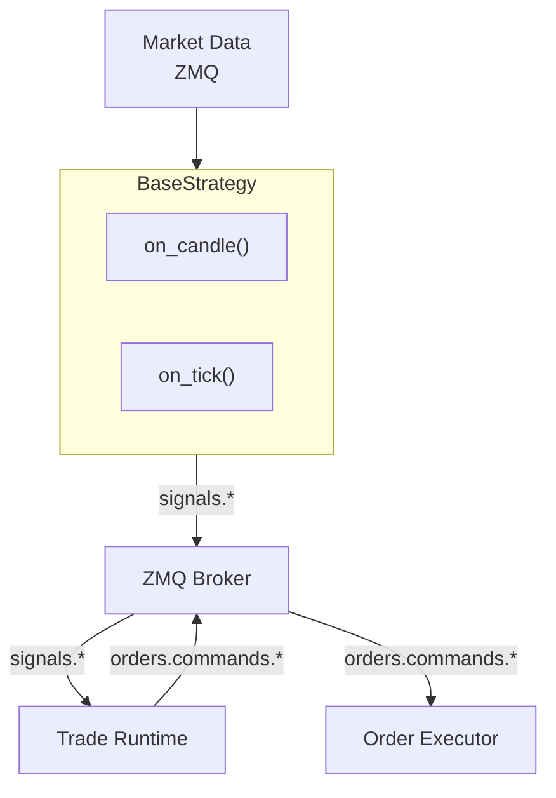
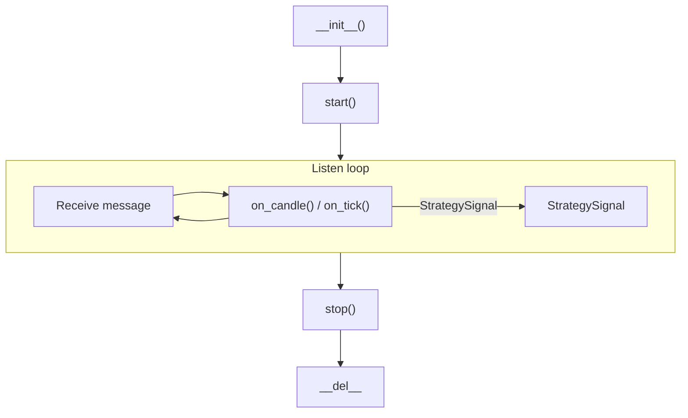

# Trading Strategies

Snapper provides a framework for creating trading strategies based on
ZeroMQ messaging. Strategies subscribe to market data and publish signals.
Strategies produce intent only; the trade runtime owns order lifecycle,
positions, and balance projections.

## Strategy Architecture



## Creating Strategies

### Basic Structure

```python
from snapper.strategies.base import BaseStrategy, StrategySignal, StrategyConfig
from snapper.strategies.decorators import register_strategy, create_strategy_process
from snapper.messaging.schemas.data import CandleData


@register_strategy("MyStrategy")
@create_strategy_process(
    process_name="my_strategy_btc",
    default_config={
        "name": "my_strategy_btc",
        "inputs": ["market.kraken.BTC-USD.candles.1h"],
        "outputs": ["BTC-USD"],
        "exchange": "paper",
        "params": {
            "threshold": 0.5,
            "period": 14,
        },
    },
)
class MyStrategy(BaseStrategy):
    """Strategy description in docstring."""

    def __init__(self, config: StrategyConfig) -> None:
        """Initialize strategy."""
        super().__init__(config)
        self.threshold = self.params.get("threshold", 0.5)
        self.period = self.params.get("period", 14)

    async def on_candle(self, instrument: str, candle: CandleData) -> StrategySignal | None:
        """Process candle and generate signal."""
        candles = self.candle_buffer.get(instrument, [])
        if len(candles) < self.period:
            return None

        closes = [c.close for c in candles]
        current_price = closes[-1]

        if self._should_buy(closes):
            return StrategySignal(
                instrument=instrument,
                side="buy",
                strength=1.0,
                price=current_price,
                reason="Buy condition met",
            )

        if self._should_sell(closes):
            return StrategySignal(
                instrument=instrument,
                side="sell",
                strength=1.0,
                price=current_price,
                reason="Sell condition met",
            )

        return None

    def _should_buy(self, closes: list[float]) -> bool:
        """Buy condition logic."""
        return False

    def _should_sell(self, closes: list[float]) -> bool:
        """Sell condition logic."""
        return False

    async def reset(self) -> None:
        """Reset strategy state (for replay)."""
        pass
```

## Decorators

### `@register_strategy(name)`

Registers strategy class in factory under given name.

```python
@register_strategy("RSIReversion")
class RSIReversion(BaseStrategy):
    ...
```

### `@create_strategy_process(process_name, default_config)`

Creates process wrapper for strategy and registers in process manager.

```python
@create_strategy_process(
    process_name="strategy_rsi_eth_1h",
    default_config={
        "name": "rsi_eth_1h",
        "inputs": ["market.kraken.ETH-USD.candles.1h"],
        "outputs": ["ETH-USD"],
        "exchange": "paper",
        "params": {"period": 14, "upper": 70.0, "lower": 30.0, "cooldown": 2},
    },
)
class RSIReversion(BaseStrategy):
    ...
```

## Strategy Configuration

### StrategyConfig

| Field | Type | Description |
| ----- | ---- | ----------- |
| `name` | string | Unique strategy instance name |
| `strategy_class` | string | Strategy class name |
| `inputs` | list[str] | List of ZMQ topics to subscribe |
| `outputs` | list[str] | List of instruments for signals |
| `exchange` | string | Target exchange (`paper`, `kraken`, `kraken_futures`, `walutomat`) |
| `params` | dict | Strategy-specific parameters |
| `wallet_public_id` | string | Wallet that will execute orders for this strategy. Still defaults to empty and is NOT validated by `StrategyConfig` itself (the dataclass keeps an empty default pending the NOT NULL tightening migration). The non-empty requirement applies only at runtime via the caps guard for any strategy that uses `create_ai_review_and_await()` — see "AI delegate consultation" below. |
| `operator_public_id` | string | Trading-identity operator that owns this strategy instance. Empty default; validated against the launching principal's `operator_public_ids` when populated. |

### AI delegate consultation

Strategies that consult an AI delegate via
`create_ai_review_and_await()` and then forward the approved
outcome to `emit_signal(outcome=...)` MUST set
`StrategyConfig.wallet_public_id` to a non-empty value. The
trader-coordinator's caps gate
(`TradingCapsEnforcer.guard_with_ai_review_attribution`)
fail-closes early when the engine submission's
`wallet_public_id` is empty:

```text
CapsViolationError: missing_wallet_for_ai_review_attribution
    submission.wallet_public_id required for the strategy AI gate;
    engine state must populate wallet on the submission before
    invoking this guard
```

The error is loud and operator-actionable: it identifies the
exact missing config field. Without `wallet_public_id`, the
engine cannot map the AI delegate's approved trade to a wallet
for cap evaluation (per-user notional / open-orders / quantity
caps key on wallet+user). Pure non-AI strategies that never
invoke `create_ai_review_and_await()` continue to run without a
wallet; they bypass caps via `guard_service_principal()` per the
existing audit-bypass contract.

The `ai_review_public_id` carried on the published `SignalData`
is transport-only end-to-end through the ZMQ wire. The
companion `ai_review_dispatch_version` (dedup key) is also
transport-only — the strategy citation validator does not
compare it; the bus publisher reads `dispatch_version` from the
cited row at publish time so downstream caps-violation fanout
events are always tagged with the row-of-record version.

### Input Topics

Common formats:

- `market.{exchange}.{instrument}.candles.{timeframe}` — Candle streams
- `market.{exchange}.{instrument}.ticks` — Tick streams
- `market.{exchange}.{instrument}.trades` — Trade streams

Examples:

- `market.kraken.BTC-USD.candles.1h` — Hourly BTC/USD candles from Kraken
- `market.kraken.ETH-USD.ticks` — ETH/USD ticks from Kraken
- `market.polygon.AAPL.trades` — AAPL trade tape from Polygon

### Output Topics (Signals)

Generated automatically:

- Paper: `signals.paper.{instrument}.{strategy_name}`
- Live: `signals.{exchange}.{instrument}.live`

## StrategySignal Structure

```python
@dataclass
class StrategySignal:
    """Trading signal."""

    instrument: str
    side: TradeSide
    strength: float
    reason: str
    price: float
    timestamp: datetime | None
```

## Built-in Strategies

### RSIReversion

Mean-reversion strategy based on RSI.

**Parameters:**

| Parameter | Default | Description |
| --------- | ------- | ----------- |
| `period` | 14 | RSI period |
| `upper` | 70.0 | Overbought threshold (sell) |
| `lower` | 30.0 | Oversold threshold (buy) |
| `cooldown` | `0` (class fallback) / `2` (registered process preset) | Candles between signals |

**Logic:**

- Buy when RSI <= lower **or** RSI was at or below `lower` on the
  previous candle (`r_prev <= lower`) and price has since reversed
  upward.
- Sell when RSI >= upper **or** RSI was at or above `upper` on the
  previous candle (`r_prev >= upper`) and price has since reversed
  downward.
- The previous-threshold + reversal branch lets the strategy
  capture exits that miss the strict edge-touch but confirm via
  price action.

```python
from snapper.strategies.rsi import RSIReversion
```

### MACDCrossover

Trend-following strategy based on MACD.

**Parameters:**

| Parameter | Default | Description |
| --------- | ------- | ----------- |
| `fast` | 12 | Fast EMA |
| `slow` | 26 | Slow EMA |
| `signal_period` | 9 | StrategySignal line period |

**Logic:**

- Buy when MACD histogram crosses from negative to positive
- Sell when histogram crosses from positive to negative

```python
from snapper.strategies.macd import MACDCrossover
```

### Cointegration

Pairs trading strategy based on cointegration. Trades the spread
between two cointegrated instruments, entering when the z-score
crosses `entry_threshold` and exiting on mean reversion past
`exit_threshold`.

```python
from snapper.strategies.cointegration import CointegrationPairs
```

`CointegrationPairs` is the canonical 2-leg consumer of
`MultiLegSpreadMixin` — its 2-leg invariants are enforced by
`self._init_legs(expected_count=2)` and `instrument1` / `instrument2`
are backwards-compatible aliases for `self.legs[0]` / `self.legs[1]`.
See the next section for the generalized N-leg API.

**Parameters:**

| Parameter | Default | Description |
| --------- | ------- | ----------- |
| `beta` | 0.05 | Hedge ratio between legs (long leg − beta × short leg) |
| `entry_threshold` | 2.0 | Z-score threshold for entry (in standard deviations) |
| `exit_threshold` | 0.5 | Z-score threshold for mean-reversion exit |
| `lookback_window` | 50 | Window length for rolling spread statistics |
| `min_data_points` | 30 | Minimum buffered candles before any signal is emitted |

## Multi-leg / N-leg basket strategies

Snapper ships a reusable mixin for strategies that emit synchronized
signals across N legs (pair-trades, baskets, calendar spreads,
cross-exchange arb). The 2-leg cointegration strategy is the
canonical consumer; the same mixin generalizes to N ≥ 2.

```python
from snapper.strategies.multi_leg import MultiLegSpreadMixin, resolve_legs
```

### Two invocation shapes

`resolve_legs(config, expected_count=None)` accepts either:

1.  **Live ZMQ process** — `inputs` is a length-N list of market-data
    candle topics, one per leg. Leg instruments are parsed from each
    topic via `parse_market_topic`.

    ```python
    config = StrategyConfig(
        name="basket_btc_eth_sol",
        inputs=[
            "market.paper.kraken.BTC-USD.candles.1h",
            "market.paper.kraken.ETH-USD.candles.1h",
            "market.paper.kraken.SOL-USD.candles.1h",
        ],
        outputs=["BTC-USD", "ETH-USD", "SOL-USD"],
        ...
    )
    legs = resolve_legs(config, expected_count=3)
    ```

2.  **Direct-DB backtest** — `DirectDbEngine` synthesises a single
    `candles.{exchange}.synthetic.{timeframe}` input and passes the
    leg instruments through `outputs`.

    ```python
    config = StrategyConfig(
        name="basket_btc_eth_sol",
        inputs=["candles.kraken.synthetic.1h"],
        outputs=["BTC-USD", "ETH-USD", "SOL-USD"],
        ...
    )
    legs = resolve_legs(config, expected_count=3)
    ```

`resolve_legs` raises `ValueError` if neither shape matches or if
`expected_count` is set and the resolved tuple has the wrong length.

### Mixin API

Subclassing both `BaseStrategy` and `MultiLegSpreadMixin` gives you:

| Attribute / method | Purpose |
| ------------------ | ------- |
| `self.legs: tuple[str, ...]` | Resolved leg instruments in declaration order. Populated by `self._init_legs(expected_count=N)` from `__init__`. |
| `self._partner_legs(current)` | Tuple of leg names other than `current`, in declaration order. |
| `self._partner_prices(current)` | `{leg: last_close}` for partners with at least one buffered candle. Partners with empty buffers are omitted (same warmup gate as 2-leg cointegration). |
| `self._emit_partner_signals(current, builder)` | Calls `builder(leg, last_close)` for each buffered partner and queues the result via `self.emit_paired_signal`. The backtest batch processor (`process_time_batch`) drains every queued entry in the same timestep; the live `_listen_loop` does NOT drain the queue (see "Signal pairing semantics"). |

### Worked example — 3-leg equal-weight basket

The partner-leg emission below (`_emit_partner_signals`) is drained
only by the backtest engine. Run this strategy through `process_time_batch`
(direct-DB or ZMQ replay) to exercise the synchronized N-leg rebalance;
the live `_listen_loop` would drop the partner legs (see "Signal pairing
semantics").

```python
from snapper.messaging.schemas.data import CandleData
from snapper.strategies.base import BaseStrategy, StrategyConfig, StrategySignal
from snapper.strategies.decorators import register_strategy, create_strategy_process
from snapper.strategies.multi_leg import MultiLegSpreadMixin


@register_strategy("EqualWeightBasket")
@create_strategy_process(
    process_name="basket_btc_eth_sol",
    default_config={
        "name": "basket_btc_eth_sol",
        "inputs": [
            "market.paper.kraken.BTC-USD.candles.1h",
            "market.paper.kraken.ETH-USD.candles.1h",
            "market.paper.kraken.SOL-USD.candles.1h",
        ],
        "outputs": ["BTC-USD", "ETH-USD", "SOL-USD"],
        "exchange": "paper",
        "params": {"lookback_window": 50, "z_entry": 2.0, "z_exit": 0.5},
    },
)
class EqualWeightBasket(BaseStrategy, MultiLegSpreadMixin):
    """Z-score each leg vs the basket mean and rebalance when it diverges."""

    def __init__(self, config: StrategyConfig) -> None:
        super().__init__(config)
        self.lookback_window = int(self.params.get("lookback_window", 50))
        self.z_entry = float(self.params.get("z_entry", 2.0))
        self.z_exit = float(self.params.get("z_exit", 0.5))
        self._init_legs(expected_count=3)

    async def on_candle(self, instrument: str, candle: CandleData) -> StrategySignal | None:
        partner_prices = self._partner_prices(instrument)
        if len(partner_prices) < len(self.legs) - 1:
            return None

        basket_mean = (candle.close + sum(partner_prices.values())) / len(self.legs)
        z = (candle.close - basket_mean) / basket_mean

        if abs(z) < self.z_entry:
            return None

        side: TradeSide = "sell" if z > 0 else "buy"
        primary = StrategySignal(
            instrument=instrument,
            side=side,
            strength=min(1.0, abs(z) / self.z_entry),
            price=candle.close,
            reason=f"basket_z={z:+.2f}",
        )
        opposite: TradeSide = "buy" if side == "sell" else "sell"
        self._emit_partner_signals(
            instrument,
            lambda leg, price: StrategySignal(
                instrument=leg,
                side=opposite,
                strength=primary.strength,
                price=price,
                reason=f"basket_partner_of_{instrument}",
            ),
        )
        return primary
```

### Signal pairing semantics

`BaseStrategy.emit_paired_signal(signal)` enqueues partner-leg signals
on the same timestep as the primary signal returned from `on_candle`.
The drain is **backtest-only**: the batch processor
(`process_time_batch`, used by the direct-DB and ZMQ replay backtest
paths) drains the queue immediately after the primary signal, so on
those paths the full N-leg basket is processed as one synchronized
rebalance — no race between legs.

The live/paper production `BaseStrategy._listen_loop` does NOT drain
the pending-signal queue: it emits only the single signal returned by
`on_candle`. Paired live emission is not yet wired, so partner-leg
signals queued via `emit_paired_signal` / `_emit_partner_signals` are
dropped when a multi-leg strategy runs live. Treat the basket/N-leg
pairing API as backtest-only until live draining is implemented.

`on_tick` callbacks do not use the pairing queue; tick-level pairing
must be implemented explicitly by the strategy.

### When NOT to use the mixin

- Single-leg strategies (RSI, MACD, VWAP) — there are no partners
  to pair with; subclassing the mixin adds no value.
- Strategies whose legs use heterogeneous timeframes — `legs` assumes
  one timeframe per strategy process. Run one process per timeframe
  and coordinate via signals.
- Calendar spreads where one leg trades on a derived feed
  (e.g. funding-rate vs spot) — the input topic shape doesn't fit
  `resolve_legs`; subclass `BaseStrategy` directly.

## Data Access

### Candle Buffer

```python
async def on_candle(self, instrument: str, candle: CandleData) -> StrategySignal | None:
    candles = self.candle_buffer.get(instrument, [])

    recent = candles[-20:]

    import pandas as pd
    closes = pd.Series([c.close for c in candles])
```

### CandleData

```python
from snapper.messaging.schemas.data import CandleData
```

**Fields:**

| Field | Type | Description |
| ----- | ---- | ----------- |
| `type` | string | `"candle"` |
| `instrument` | string | Trading pair symbol (e.g. `BTC-USD`) |
| `exchange` | string | Source exchange |
| `timeframe` | string | Candle duration (`1m`, `1h`, `1d`, ...) |
| `open_at` | datetime | Exchange-provided candle interval start time |
| `open` | float | Opening price |
| `high` | float | High price |
| `low` | float | Low price |
| `close` | float | Closing price |
| `volume` | float | Total traded volume |
| `vwap` | float \| None | Volume-weighted average price (optional) |
| `trades` | int \| None | Number of trades in the candle (optional) |

## Technical Indicators

### RSI

```python
from snapper.indicators.rsi import rsi
import pandas as pd

closes = pd.Series([c.close for c in candles])
rsi_values = rsi(closes, period=14)
current_rsi = rsi_values.iloc[-1]
```

### MACD

```python
from snapper.indicators.ta_lib_adapter import macd

macd_line, signal_line, histogram = macd(closes, fast=12, slow=26, signal=9)
```

### TA-Lib (via adapter)

```python
from snapper.indicators.ta_lib_adapter import rsi, macd
```

## Configuration Validation

Framework automatically validates:

1.  **Strategy name** — cannot be empty
2.  **Inputs** — at least one required
3.  **Outputs** — at least one instrument must be defined
4.  **Exchange** — must be one of: `paper`, `kraken`, `kraken_futures`, `walutomat`
5.  **Instruments** — must be available on selected exchange
6.  **Paper/live mixing** — mixing paper inputs with live exchange not allowed

## Strategy Lifecycle



`BaseStrategy` does not expose a separate `cleanup()` hook —
teardown happens in `stop()` (cancel heartbeat + listen tasks,
unsubscribe inputs, close the ZMQ publisher + context) and the
implicit `__del__` (cancel any surviving tasks, close
subscriber/publisher sockets, terminate the ZMQ context).

## Running Strategies

### Via Process Manager (recommended)

Strategies are automatically managed by the server:

```bash
snapper server
```

Strategies can be enabled/disabled in the dashboard.

### Standalone (for testing)

```python
import asyncio
from snapper.strategies.factory import StrategyFactory
from snapper.strategies.base import StrategyConfig

# Importing the strategy module fires the @register_strategy
# side effect that populates the factory's registry. Snapper's
# strategies/__init__.py is intentionally empty (no re-exports
# per project convention), so each concrete strategy must be
# imported by hand before the factory can resolve it by name.
import snapper.strategies.rsi  # noqa: F401  # register RSIReversion

config = StrategyConfig(
    name="test_rsi",
    strategy_class="RSIReversion",
    inputs=["market.kraken.BTC-USD.candles.1h"],
    outputs=["BTC-USD"],
    exchange="paper",
    params={"period": 14, "upper": 70, "lower": 30},
)

factory = StrategyFactory()
strategy = factory.create_strategy(config)

async def main() -> None:
    # `BaseStrategy.start()` is non-blocking — it wires sockets and
    # spawns the listen + heartbeat tasks, then returns. Keep the
    # event loop alive while the background tasks process data.
    await strategy.start()
    try:
        await asyncio.Event().wait()  # block until Ctrl-C / cancel
    finally:
        await strategy.stop()

asyncio.run(main())
```

## Testing Strategies

### Unit Tests

```python
import pytest
from snapper.strategies.rsi import RSIReversion
from snapper.strategies.base import StrategyConfig
from snapper.messaging.schemas.data import CandleData


@pytest.fixture
def rsi_strategy() -> RSIReversion:
    config = StrategyConfig(
        name="test_rsi",
        strategy_class="RSIReversion",
        inputs=["market.kraken.BTC-USD.candles.1h"],
        outputs=["BTC-USD"],
        exchange="paper",
        params={"period": 14, "upper": 70, "lower": 30},
    )
    return RSIReversion(config)


async def test_buy_signal_on_low_rsi(rsi_strategy: RSIReversion) -> None:
    # Prepare data with low RSI
    ...
    signal = await rsi_strategy.on_candle("BTC-USD", candle)
    assert signal is not None
    assert signal.side == "buy"
```

### Backtesting

Use replay data from the dedicated `paper.{source_exchange}` market
sub-prefix — the strategy listens to the same `market.*` shape as
in live mode, only the source exchange is swapped for `paper`:

```python
default_config={
    "inputs": ["market.paper.kraken.BTC-USD.candles.1h"],
    "exchange": "paper",
    ...
}
```

`replay.*` is not a valid ZMQ topic — `BaseStrategy._listen_loop`
filters incoming frames to `market.*` and routes them through
`BaseStrategy._dispatch_market_data`. The canonical builder is
`market_topic(...)` in `src/snapper/messaging/topics/builders.py`;
paper topics are built by passing `exchange="paper"` together with
the venue under `source_exchange=...` (there is no separate
`paper_market_topic` symbol).

## Trailing Stop Plans

Trailing stops are server-side evaluated execution plans that ratchet a
stop price as the market moves favorably and fire a market close when
the stop is breached. Attach a trailing stop to an open
`position_cycle` via `POST /api/trailing-stops` (see `docs/api.md`).

### Parameters

| Field | Type | Bounds | Meaning |
|---|---|---|---|
| `trailing_pct` | float | `0 < x < 100` | Distance from peak price, as percentage. `5.0` means "trigger 5 % below the highest favorable price seen". |
| `min_lock_pct` | float | `0 <= x < 100` (default 0) | Profit threshold the market must cross before the trailing stop arms. `0` means "arm immediately on attach"; `5.0` means "wait until price has moved 5 % in your favor before tracking a stop". |

### Behavior

- **Peak ratchet:** every tick where the last price moves favorably
  updates the peak; the stop level recomputes as
  `peak * (1 - trailing_pct/100)` for longs or
  `peak * (1 + trailing_pct/100)` for shorts.
- **Stop monotonicity:** for longs, the stop only moves UP (never
  down); for shorts the stop only moves DOWN. An adverse tick never
  loosens the stop.
- **min_lock dead zone:** while `min_lock_pct > 0` and the market has
  not yet crossed that threshold, the trailing stop is attached and
  armed but NOT tracking — a close is NOT emitted no matter how far
  the price moves against you. A decision warning is logged on the
  `trailing_stop_created` row at create time.
- **Single trailing stop per cycle:** enforced by the partial unique
  index `uq_ep_active_trailing_stop_per_cycle`. A second create on
  the same open cycle returns HTTP 409.
- **Cycle close sweeps the plan:** if the cycle closes externally
  (reconciliation flat, manual close, bracket fill),
  `_sweep_cycle_closures()` cancels the trailing stop on the next
  clock tick.
- **Checkpoint persistence:** `peak_price` and `current_stop` are
  persisted every 10 s via the plan-executor checkpoint loop. On
  restart, state is restored and `peak_price` is floored at
  `entry_price` (long: `max(peak, entry)`; short: `min(peak, entry)`).
- **Downtime semantics:** if the service is down when the true market
  price crosses the stop, the stop fires on the first tick received
  after restart. There is no placed order on the exchange — the
  evaluator is purely server-side.

### Interaction with brackets

A position cycle may carry both a `bracket` and a `trailing_stop`
plan at the same time (the two partial unique indexes are disjoint
per `plan_type`). Whichever fires first closes the cycle; the other
is swept by the cycle-close handler.

### Limitations

- `entry_price` and `total_quantity` are frozen at attach time.
  Dollar-cost averaging (scaling into a position) requires
  `POST /cancel` + re-attach after the new average is known.
- No exchange-side native trailing stops — every decision is made by
  `PlanExecutorService` against live ticks.
- Futures only (same capability gate as brackets:
  `supports_reduce_only`). Not supported on Kraken spot.
- No breakeven-move feature (ratchet stop to entry after N % profit).
- No time-based activation (arm after N minutes regardless of price).
- Live rollout gated on the same follow-ups (wallet-safe
  routing + orphan-cycle admin) that brackets depend on.

## Cross-asset market-data pattern

Snapper enables strategies to subscribe to a market-data-only feed
(``SymbolExchangeCapability.can_trade=False``) and emit signals whose
target is an execution-capable instrument on a different venue.
Kraken FCM index futures (``kraken_equities``) are the primary driver:
they publish ~10-minute-delayed candles + ticks but have no order API.

### Rules

- Strategies MAY subscribe to any combination of ``can_market_data=True``
  topics regardless of the ``can_trade`` state of the source instrument.
- Every emitted ``StrategySignal.instrument`` MUST point at an
  ``can_trade=True`` instrument on the strategy's configured ``exchange``.
  Snapper's order-entry capability guard
  (``snapper.server._capability_guard.require_tradable``) rejects
  submits against ``can_trade=False`` pairs with HTTP 422
  ``error_code='instrument_market_data_only'`` — the signal would be
  dropped before reaching the venue.
- Tick-driven strategies that consume delayed feeds MUST gate on
  ``TickData.is_delayed=True`` before treating the price as current.
  Candle-driven cross-asset strategies inherit the source-feed latency
  implicitly; document the lag in the live runbook.
- Output-coverage enforcement at startup is conditional: when both
  ``operator_public_id`` and ``wallet_public_id`` are populated on
  the process config, ``_enforce_strategy_outputs_covered`` checks
  that every instrument in ``StrategyConfig.outputs`` falls within
  the operator's active scope grants. The empty-default path
  (neither field set) is permitted for backwards compatibility, and
  operator-only launches skip the output-coverage check.

### Reference implementation

See ``src/snapper/strategies/examples/tradfi_observe_crypto_execute.py``
for a minimal EMA-crossover strategy that observes
``MNQM6-CME`` on ``kraken_equities`` and targets ``BTC-USD`` on
``kraken``. The file is NOT registered with the process registry —
it ships as a copy-paste starting point. Activation steps live in the
module docstring; ``tests/meta/test_reference_strategy_not_registered.py``
enforces the non-registration invariant so future maintainers cannot
accidentally promote the illustration into a live process.
